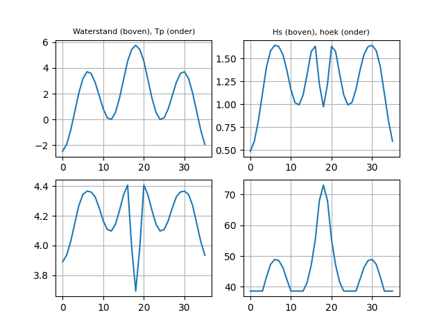
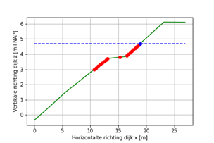
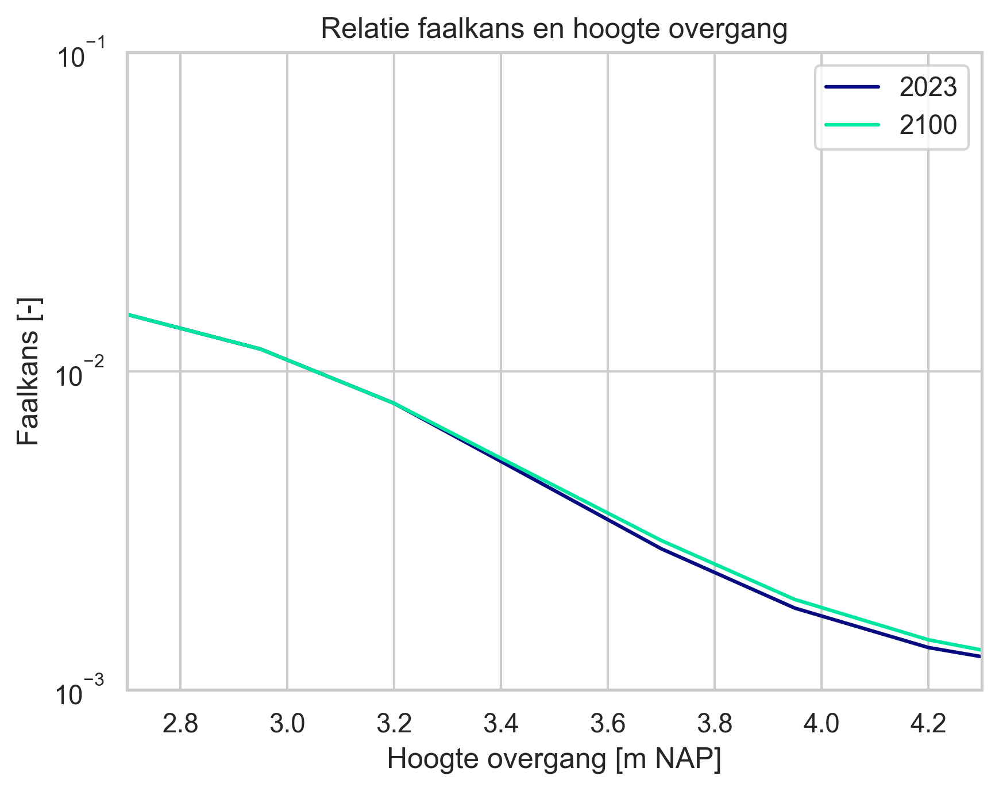
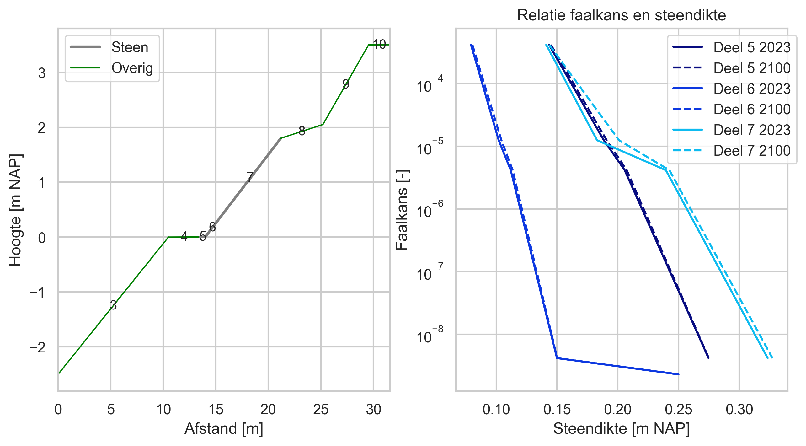

Bekledingen
=============================

Bij bekledingen worden graserosie buitentalud (GEBU) en stabiliteit zetsteen (ZST) beschouwd. Dit gebeurt in de VRTOOL voor GEBU door een relatie af te leiden tussen de hoogte van de overgang en de faalkans van de grasbekleding. Voor ZST wordt een relatie afgeleid tussen de toplaagdikte en de faalkans van de steenbekleding. Het zwaartepunt van de berekeningen ligt in de preprocessor waar deze relaties worden afgeleid. Omdat het binnen het WBI/BOI niet eenvoudig is om dergelijke relaties te bepalen is er een aparte methodiek ontwikkeld waarmee we toch iets kunnen zeggen over de faalkans van bekledingen. Daarvoor doorlopen we in de preprocessor de volgende 3 stappen:

- Afleiden van de belasting met behulp van de Q-variant
- Afleiden relatie tussen hoogte overgang en faalkans GEBU met behulp van DiKErnel 
- Afleiden relatie tussen toplaagdikte en faalkans ZST met behulp van een benaderingsmethode

Deze verschillende stappen, en hoe hiermee wordt omgegaan in de VRTOOL wordt in de volgende paragrafen nader toegelicht.

Afleiden van de belasting met behulp van de Q-variant
------------------------------------
De eerste stap is om met Hydra-Ring de golfcondities te bepalen voor de betreffende locaties. Daarvoor worden met Hydra-Ring met de Q-variant berekeningen uitgevoerd voor 4 overschrijdingskansen voor zichtjaren 2023 en 2100:

- :math:`30 * P_{ondergrens}`
- :math:`P_{ondergrens}`
- :math:`P_{signaleringswaarde}`
- :math:`P_{signaleringswaarde}/1000`

De Q-variant berekeningen worden uitgevoerd voor drie modeltypen: 

- Gras golfklap (:math:`a = 1.0, b = 0.67, c = 0.0`) 
- Gras golfoploop (:math:`a = 1.0, b = 1.7, c = 0.3`) 
- Zuilen (:math:`a = 1.0, b = 0.4, c = 0.8`)

Daarbij geldt dat elk model enkel voor het relevante bereik aan waterstanden op de bekleding wordt bepaald: gras golfklap alleen boven de bestaande overgang, gras golfoploop vanaf de bestaande overgang, en zuilen voor het hele gedeelte waar steenbekleding ligt. De waterstandsberekeningen zoals beschreven in de paragraaf `Waterstanden <Waterstanden.html>`_ worden gebruikt als invoer voor de Q-variant berekeningen.

Resultaat van deze stap is per locatie een `.json`-bestand met daarin de relatie tussen waterstanden en golfcondities (:math:`H_s`, :math:`T_p`, golfinvalshoek) voor de verschillende modeltypen en overschrijdingskansen. Deze kunnen vervolgens worden gebruikt in de volgende stappen.

Afleiden relatie hoogte overgang en faalkans GEBU
-------------------------------------------------

De resultaten van de Q-variant berekeningen (modeltypen ‘golfklap’ en ‘golfoploop’) worden eerst vertaald naar tijdsverlopen van hydraulische belastingen (waterstand, Hs, Tp en golfinvalshoek). Hier wordt de aanpak uit de “Schematiseringshandleiding Grasbekleding” aangehouden. Eerst wordt het tijdsverloop van de lokale waterstand afgeleid. Dat verschilt per watersysteem. De golfcondities uit de Q-variant berekeningen worden geprojecteerd op de waterstandsverlopen om de golfcondities in de tijd te verkrijgen. Een voorbeeld van de tijdsverlopen van hydraulische belastingen wordt in Figuur 1 weergegeven.

   Figuur 1 Voorbeeld tijdsverlopen van hydraulische belastingen voor watersysteem ‘kust’.

De tijdsverlopen van hydraulische belastingen (per locatie, per zichtjaar en per terugkeertijd) dienen als input voor berekeningen met DiKErnel. Met DiKErnel wordt de bekleding op golfklap/golfoploop voor verschillende niveaus van de overgang beoordeeld. Hier onderscheiden we 2 situaties:

* De overgang van harde bekleding naar gras ligt dicht bij de kruin (minder dan 25 cm verschil). In dat geval wordt de faalkans van de grasbekleding verwaarloosbaar verondersteld. Zelfs wanneer het gras op het buitentalud zal falen is dit waarschijnlijk zeer sterk gecorreleerd met het falen op overslag, en hoeft het dus niet expliciet te worden beschouwd.
* Wanneer de overgang lager op het talud ligt wordt afhankelijk van de combinatie van belasting en hoogte van de overgang een golfklap/golfoploop berekening uitgevoerd met DiKErnel.

Voor de DiKErnel berekeningen worden de waterstandsverlopen voor elke locatie, per zichtjaar en terugkeertijd afgeleid (conform Figuur 1). Afhankelijk van de hoogte van de overgang worden de volgende berekeningen uitgevoerd:

- Als de maximale waterstand hoger is dan de overgang, dan wordt de bekleding alleen op golfklap beoordeeld omdat dit dan altijd maatgevend is. 
- Als de overgang hoger is dan de maximale waterstand, dan wordt de bekleding alleen op golfoploop beoordeeld. In dat geval wordt één berekening met DiKErnel uitgevoerd: namelijk voor het niveau van de overgang. 

De berekeningen met DiKErnel worden voor verschillende posities op het buitentalud uitgevoerd (vanaf niveau overgang tot het boven niveau van de grasbekleding met een stap van 10 cm). Afhankelijk van de waterstand wordt dus of met golfklap, of met golfoploop gerekend. Figuur 2 geeft een voorbeeld van de te beschouwen posities op het buitentalud: in dit geval worden overgangshoogtes onder de blauwe stippellijn (maximale waterstand) op golfklap beoordeeld, en overgangshoogtes boven de blauwe stippellijn op golfoploop. DiKErnel berekent op basis hiervan voor elke situatie het schadegetal.

   Figuur 2 Voorbeeld van de te beschouwen posities (rood = golfklap, blauw = golfoploop) op het buitentalud uitgaande van hoogte overgang = 3 m+NAP en de maximale waterstand (blauw gestippelde lijn) die tussen de grenzen van de grasbekleding valt.

Op basis van de berekeningen met DiKErnel wordt per locatie en zichtjaar een relatie afgeleid tussen de hoogte van de overgang en de faalkans. Om de faalkans gegeven een overgangshoogte te bepalen wordt de relatie bepaald tussen de veiligheidsfactor van de bekleding en de terugkeertijd van de belasting. De veiligheidsfactor wordt als volgt bepaald: 
:math:`SF = 1/max(schadegetal)`, waarbij gekeken wordt naar het schadegetal over het gehele belaste talud. De bekleding voldoet niet aan de belasting als :math:`SF < 1.0`. De faalkans wordt bepaald als de terugkeertijd waarbij :math:`SF = 1.0`. Dit punt wordt vervolgens met een bi-sectie methode bepaald wat per hoogte van de overgang een faalkans geeft. Deze relatie is invoer voor de VRTOOL. Een voorbeeld is gegeven in onderstaande figuur.

   Voorbeeld van een relatie tussen de overgang en de faalkans van de grasbekleding.

Na het afleiden van de relatie wordt nog een nabewerkingsslag uitgevoerd op de resultaten. Daarbij wroden de volgende aanpassingen gedaan:
1. De waarden worden zo aangepast dat een verhoging van de overgang altijd leidt tot een lagere faalkans voor GEBU.
2. Er wordt gecorrigeerd zodanig dat de toekomstige situatie nooit beter is dan de huidige situatie.
3. De faalkans van de grasbekleding voor overgahngshoogten dicht bij de kruin (minder dan 1 cm verschil) wordt verwaarloosbaar gesteld.

Afleiden relatie toplaagdikte en faalkans steenbekleding
---------------------------------------------
Naast de faalkans van de grasbekleding wordt ook gekeken naar de stabiliteit van de steenzetting (ZST). Om de relatie tussen de toplaagdikte en de faalkans van de steenbekleding te bepalen worden Steentoetsbestanden uit LBO-1 gebruikt. Specifiek voor veiligheidsrendementanalyses is een benaderingsmethode ontwikkeld waarmee de faalkans van een steenzetting kan worden geschat op basis van de gegevens uit Steentoets. 

De basis van deze aanpak rust op de aanname dat de ratio :math:`H_s/(\Delta D)` waarbij een steenzetting ongeveer gelijk blijft, ongeacht de belasting. Dit is gevalideerd voor een aantal cases, en blijkt een redelijke aanname te zijn, hoewel in sommige gevallen de resulterende steendikte waarbij de bekleding stabiel is iets afwijkt (orde 5 centimeter). 

We kijken apart naar alle losse bekledingdelen, daarbij wordt uit de Steentoetsbestanden de :math:`ratio_{voldoet} = H_s/(\Delta D_{voldoet})` afgeleid waarmee de bekleding precies voldoet. Dat wordt gedaan door :math:`D_{voldoet}` gelijk te stellen aan de huidige dikte plus het berekende dikteoverschot. Dit wordt gedaan voor elk bekledingvlak met een steenbekleding.

Vervolgens wordt op basis van de Q-variantberekeningen (modeltype `zuilen`) de benodigde toplaagdikte afgeleid voor de verschillende terugkeertijden voor waterstandsniveaus die samenvallen met de bekleding. De toplaagdikte wordt afgeleid met de volgende formule:
:math:`D(i) = Hs(i)/(\Delta \cdot ratio_{voldoet})`
Waarbij :math:`Hs(i)` de golfhoogte bij een bepaalde terugkeertijd is. Vervolgens wordt de benodigde steendikte afgeleid door de maximale dikte voor het bereik van het bekledingdeel te nemen. Dit geeft een relatie tussen steendikte en faalkans, voor elk bekledingvak.

In onderstaande figuur is een voorbeeld resultaat weergegeven. Links is het profiel zoals gelezen uit Steentoets te zien, rechts de relaties tussen steendikte en faalkans voor verschillende vakken met een steenbekleding.

   Voorbeeld van een relatie tussen de steendikte en de faalkans van de steenbekleding. Links het profiel met verschillende bekledingdelen. Rechts de relatie tussen steendikte en faalkans voor elk steenbekledingdeel.

Net als bij de relaties voor grasbekleding worden de resultaten nabewerkt. Ook bij steenzettingen geldt dat de faalkans bij gegeven steendikte altijd moet toenemen in de tijd. Daarnaast wordt, afhankelijk van de gekozen optie voor de verbetering van de steenbekleding (vervangen of uitbreiden), de effectieve steendikte waarmee de VRTOOL rekent aangepast. Zie voor meer toelichting de paragraaf `Maatregelen dijkbekleding <../Maatregelen/Maatregelen_dijkbekleding.html>`_.

#TODO bij maatregelen: vervangen/uitbreiden toelichten.