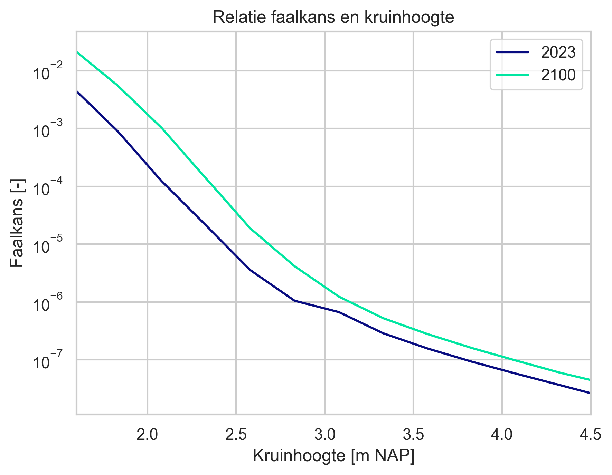

Overslag
========================

Voor het bepalen van de betrouwbaarheid voor overloop/overslag (gras erosie kruin- en binnentalud) wordt de volgende invoer gebruikt:
- Een relatie tussen kruinhoogte en betrouwbaarheidsindex β in de huidige situatie (2023)
- Een relatie tussen kruinhoogte en betrouwbaarheidsindex β in de toekomst (2100)

Deze relaties worden in de preprocessing bepaald middels Hydra-Ring. Een voorbeeld van een dergelijke relatie is weergegeven in de onderstaande figuur.

    Betrouwbaarheid van de kruin in de huidige situatie en in de toekomst

Op basis van een jaartal wordt de betrouwbaarheidsindex van een kruinhoogte geinterpoleerd in de VRTOOL. Wanneer relevant wordt de kruindaling meegenomen in deze interpolatie. Op basis hiervan kan worden bepaald wat de faalkans in de tijd is gegeven een kruinverhoging.

In de onderliggende Hydra-Ring berekeningen wordt voor elke doorsnede  een kansverdeling van het kritisch overslagdebiet gekozen. Vervolgens wordt hiermee een probabilistische GEKB-berekening conform WBI-2017 uitgevoerd. De beschikbare kansverdelingen zijn hieronder weergegeven. Aangenomen wordt dat deze kansverdeling hetzelfde blijft in de toekomst.

.. csv-table:: Kritische overslagdebieten
    :file: tables/kritische_overslagdebieten.csv
    :header-rows: 1
    :widths: 40, 10, 10, 10, 20