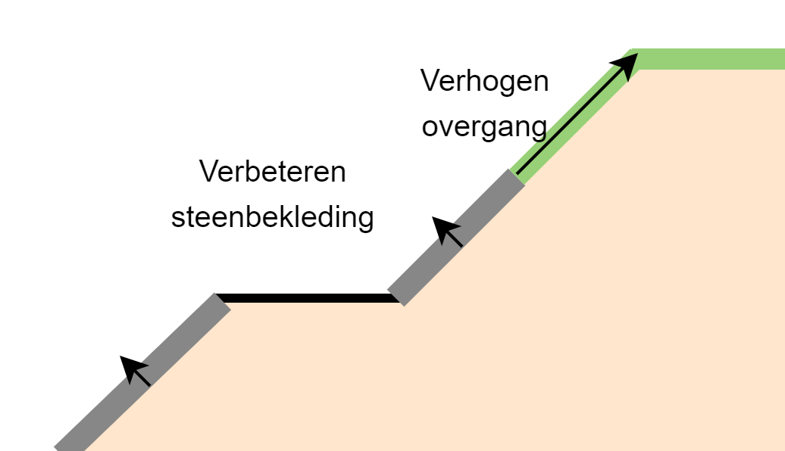

Verbeteren dijkbekleding buitentalud
====================================
Voor het verbeteren van de dijkbekleding op het buitentalud wordt gekeken naar de grasbekleding, en de diverse bekledingdelen met een steenbekleding. Er worden twee ontwerpparameters gebruikt: de dikte/veiligheid van de steenbekleding, en de hoogte van de overgang van de harde naar de grasbekleding. Een impressie is gegeven in onderstaande figuur.

   Schematische weergave van verbetering van de bekleding met daarin de verbetering van de steenbekleding en de verhoging van de overgang.

Voor de grasbekleding wordt simpelweg de overgangsconstructie verhoogd. Daarbij wordt het bovenste vlak van de steenbekleding doorgetrokken naar boven. Voor de steenbekleding wordt per bekledingdeel gekeken of er een zwaardere steenbekleding nodig is. Daarbij zijn twee opties:

* Uitbreiden: hierbij wordt het steentype hetzelfde gehouden en wordt deze op basis van de faalkans van de huidige bekleding uitgebreid.
* Vervangen: hierbij wordt het steentype aangepast naar een zwaarder type. Daarvoor wordt aangenomen dat :math:`H_{s}/ \Delta D = 4.5`

Dit moet worden ingesteld in de configuratie van de preprocessor. Niet voor alle bekledingtypen zijn beide opties mogelijk: voor sommige bekledingstypen is het niet mogelijk om de steenbekleding uit te breiden omdat dit onlogisch is. Dit speelt bijvoorbeeld bij Noorse steen. In onderstaande tabel is een overzicht gegeven van de bekledingstypen en de mogelijke opties. Wanneer een ongeldige combinatie wordt gekozen wordt een foutmelding gegeven. Wanneer wordt gekozen voor vervangen wordt als steentype Basalton weggeschreven in de database. De huidige steendikte wordt dan omgerekend naar een Basaltonzuil met een dikte die correspondeert met dezelfde faalkans. Dus wanneer een Noorse steenbekleding van 30 centimeter met :math:`H_{s}/ \Delta D = 1.5` wordt vervangen dan wordt in de database een steendikte van :math:`30 * (1.5/4.5) = 10` centimeter weggeschreven.

Bekledingtypen waarvan in de tabel is aangegeven dat de dikte niet aanpasbaar is in de VRTOOL worden genegeerd in de analyse. 

.. csv-table:: Bekledingstypen en mogelijke opties in de VRTOOL
   :file: tables/steentypen.csv
   :widths: 10, 30, 15, 10
   :header-rows: 1

Invloed op faalkansen
-------------------------
Voor de grasbekleding wordt de faalkans bepaald op basis van de hoogte van de overgang zoals toegelicht in de sectie `faalkansmodellen <../Faalkansmodellen/Dijkbekleding.html#afleiden-relatie-hoogte-overgang-en-faalkans-gebu>`_. Bij het verhogen van de overgang wordt de faalkans van de grasbekleding bepaald op basis van de relatie tussen overgangshoogte en faalkans zoals beschikbaar in de database (tabel `GrassRevetmentRelation`). Daarbij wordt aangenomen dat op het gedeelte waarover de grasbekleding wordt aangelegd een steenbekleding conform het bovenste bekledingdeel met een steenbekleding wordt aangelegd. Dus wanneer een overgang van 20 cm Basaltonzuilen 2 meter wordt verhoogd, betekent dit dat er op dat deel ook Basaltonzuilen van 20 centimeter worden geplaatst. In de VRTOOL wordt voor het verhogen van de overgang met verticale stappen van 1 meter (configureerbaar in de (tabel `StandardMeasure`) in de database) tot aan de kruin de faalkans voor een verhoogde overgang bepaald. Daarbij wordt de faalkans voor overgangen dicht bij de kruin (<25 cm eronder) verwaarloosbaar aangenomen. De faalkans van de grasbekleding zal dan meestal bepaald worden door overslag, en de mechanismen worden sterk gecorreleerd.

Voor de steenbekleding wordt gewerkt op basis van een afname van de faalkans: in 4 stappen tot een maximale faalkansafname (parameters `max_pf_factor_block` en `n_steps_block` in `StandardMeasure`) wordt gekeken welke bekledingdelen moeten worden verbeterd. Dit gebeurt op basis van de relatie tussen steendikte en faalkans voor de verschillende bekledingdelen (tabel `BlockRevetmentRelation`). Wanneer de benodigde steendikte minder dan 1 centimeter dikker is dan de huidige steendikte wordt aangenomen dat vervanging niet nodig is.

Afhankelijk van de oorspronkelijke hoogte van de overgang kan het aantal (combinaties van) maatregelen aan de bekleding fors oplopen. Daarom wordt na het bepalen van alle maatregelen een selectie gemaakt: daarin worden op basis van een Pareto front de maatregelen geselecteerd waarvoor alternatieven zijn waarbij zowel kosten als faalkans lager zijn. Deze zouden immers nooit gekozen worden in de optimalisatie. 

Kostenberekening
----------------
De kosten worden per bekledingdeel bepaald. Daarvoor worden de kentallen in de onderstaande tabel gehanteerd.

.. csv-table:: Kostenkentallen verbetering bekleding
   :file: tables/kosten_dijkbekleding.csv
   :widths: 50, 15
   :header-rows: 1 

Als eerste wordt op basis van de vaklengte en de taludhelling de totale oppervlakte van de bekleding bepaald. Afhankelijk van het type aanpassing wordt vervolgens het volgende gedaan:

* Wanneer een grasbekleding wordt aangelegd op de plaats van een oude asfaltbekleding wordt deze verwijderd en afgevoerd. Aangenomen wordt dat deze teerhoudend is. Er worden geen kosten voor aanleg van de grasbekleding gerekend. (NB: dit is onrealistisch, maar deze situatie komt eigenlijk niet of nauwelijks voor).
* Wanneer een steenbekleding wordt aangelegd op de plaats van een oude steenbekleding wordt deze verwijderd en afgevoerd. De kosten voor de nieuwe bekleding worden gebaseerd op de relatie tussen kosten en zuilhoogte zoals gegeven in de tabel. Dit is inclusief opslagfactoren, inwassen, doek en vlijlaag.
* Wanneer een steenbekleding wordt aangelegd op de plaats van een grasbekleding worden enkel kosten voor het aanbrengen van de steenbekleding in rekening gebracht. 

De gehanteerde kosten zijn inclusief opslagfactoren voor o.a. bijkomende kosten voor engineering en risico's.