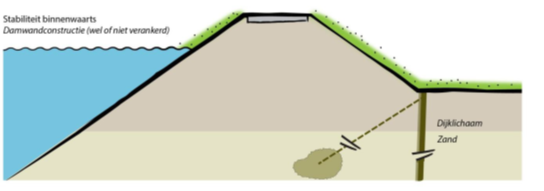

Stabiliteitsscherm
==================

Voor een stabiliteitsscherm in de teen wordt uitgegaan van een relatief lichte damwandconstructie (onverankerd, in de teen). Deze constructie is gericht op het verbeteren van de veiligheid van de diepe glijcirkels en het vergroten van de kwelweglengte. De lengte wordt bepaald door de deklaagdikte + 3 of 6 meter (beide opties worden beschouwd). 

   Stabiliteitsscherm.png

Invloed op faalkansen 
----------------------
Stabiliteit binnenwaarts
~~~~~~~~~~~~~~~~~~~~~~~~
Het effect op stabiliteit binnenwaarts wordt in rekening gebracht met een toeslag op de stabiliteitsfactor, óf door de damwand door te rekenen in D-Stability. Daarbij wordt de damwand geschematiseerd als een forbidden line. Wanneer met een toeslag wordt gerekend wordt de stabiliteitsfactor met 0.2 verhoogd bij een damwand van 3 meter onder de deklaag, en 0.4 bij 6 meter onder de deklaag. Deze waarden zijn afgeleid op basis van een gevoeligheidsanalyse op basis van een aantal cases met verschillende deklaagdiktes (zie onderstaande figuur). Er wordt aangenomen dat de damwand zelf niet faalt.

   Relatie tussen toename stabiliteit en lengte damwand waarbij dat laatste is uitgedrukt in de diepte van de wand onder de deklaag.

Wanneer een dijkgeometrie of ondergrond scenario erg afwijkt van de gebruikelijke situatie (bijvoorbeeld een dikke zandlaag boven de deklaag) geldt de bovenste aanname niet meer. Dan is het enkel mogelijk om het effect van een stabiliteitsscherm correct met D-Stability mee te nemen. Een gebruiker moet hier zelf aandacht voor hebben.

Belangrijk om op te merken is dat het stabiliteitsscherm kan worden gecombineerd met een grondversterking. Er wordt dan bijvoorbeeld 8 meter berm én een damwand van 3 meter geplaatst. Dan wordt eerst het effect van de berm in rekening gebracht, en daarna het effect van de damwand.

Piping
~~~~~~
Voor piping wordt, analoog aan de `Verticale pipingmaatregelen <Verticale Piping Maatregelen.html>_`, het effect in rekening gebracht als een reductiefactor op de pipingfaalkans. Ook hier geldt dat het effect cumulatief is met de grondversterking: eerst wordt de bermverbreding in rekening gebracht, en daarna de faalkansreductie door het scherm. Voor een scherm van 3 meter bedraagt deze factor 100, voor 6 meter 1000. Deze waarden zijn gebaseerd op de gehanteerde waarden voor een de verticale pipingmaatregelen, waarbij voor 6 meter wordt uitgegaan van hetzelfde effect als een heavescherm. 

Kostenberekening
----------------
Voor de kosten is gekeken naar de kosten van verschillende damwanden in KOSWAT (op basis van de kentallen aangeleverd door Rijkswaterstaat). Een overzicht is weergegeven in onderstaande tabel.

.. csv-table:: Kostenkentallen stabiliteitsscherm op basis van KOSWAT
   :file: tables/kosten_stabiliteitsscherm.csv
   :widths: 15, 15, 25, 25
   :header-rows: 1

Bij deze kosten is geen indexatie toegepast voor het prijspeil 2023 omdat destijds de staalprijs hard daalde. Als standaard kental is gekozen voor een lengte van 10 meter, profiel AZ26 en daarmee een vaste prijs van 690 €/m². Uitgaande van deklagen van typisch een meter of 5, komt dit redelijk overeen met beide damwandlengtes. Een toekomstige verbetering zou kunnen zijn om de kosten lengte-afhankelijk te maken.
