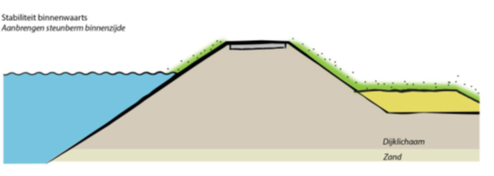
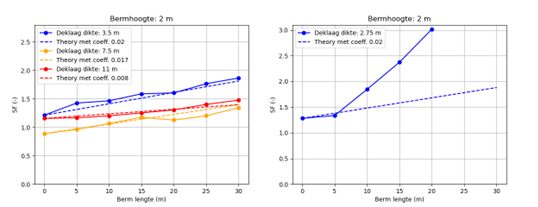
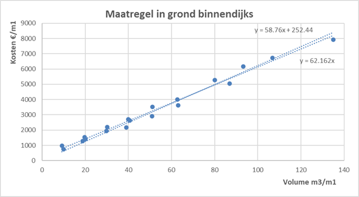

Versterking in grond
====================
De meest voorkomende dijkversterkingsmaatregel is een versterking in grond. Parameterisatie van een grondversterking gebeurt o.b.v. een kruinverhoging en/of een bermverbreding. In principe gaat een versterking binnenwaarts, maar het kan ook buitenwaarts (niet standaard). Dan wordt de kruin verlegd, en de afgegraven grond hergebruikt. De versterking wordt geparametriseerd aan de hand van een profiel met 4 of 6 punten (binnenteen, buitenteen, binnenkruin, buitenkruin, en begin en eind berm landzijde). Buitenwaartse bermen zijn niet geimplementeerd.

Bij een kruinverhoging wordt simpelweg de kruin verhoogd met de betreffende verhoging. Aangenomen wordt dat alle taluds gelijk blijven. Zie onderstaande figuur:

.. figure:: img/Verhoging.png
   :alt: Verhoging.png

   Schematische weergave van een kruinverhoging.

Bij een bermverbreding Δb wordt de berm verbreed met Δb. Dat wordt gedaan door de x-coordinaten van de Einde Berm Landzijde (EBL) en BinnenTeen (BIT) te verschuiven met Δb. Aanname is dat alle taluds verder gelijk blijven. Wanneer er geen berm aanwezig is in het originele profiel wordt een bermhoogte van 2 meter aangenomen. Standaard wordt gerekend met kruinverhogingen in stappen van 25 cm tot 2 meter, en bermverbredingen van 5, 8, 10, 12, 15, 20 en 30 meter.

   Schematische weergave van het aanbrengen van een berm.

Wanneer ook buitenwaarts versterkt kan worden wordt eerst zover mogelijk naar buiten versterkt (dit is een invoerparameter), zie onderstaande figuur:

.. figure:: img/Berm_met_kruinverlegging.png
   :alt: Berm_met_kruinverlegging.png

   Schematische weergave van een buitenwaartse versterking met een berm.

Invloed op faalkansen 
----------------------
Stabiliteit binnenwaarts
~~~~~~~~~~~~~~~~~~~~~~~~
Voor stabiliteit binnenwaarts wordt de invloed op de faalkans ofwel bepaald met een benaderingsfunctie, ofwel met D-Stability. In dat laatste geval wordt het profiel conform bovenstaande regels aangepast, en wordt de stabiliteitsfactor opnieuw berekend. Dit kan alleen via een semi-probabilistische berekening.

De benaderingsfunctie relateert de bermbreedte aan de stabiliteitsfactor. Deze functie is gebaseerd op een aantal referentieberekeningen (tijdens project SAFE, daarna aangevuld binnen het KIA-project). De benaderingsfunctie is gegeven door:

.. math::
   SF = SF_0 + f_\mathrm{berm} \cdot \Delta b

Hierbij is :math:`f_\mathrm{berm}` een factor die afhankelijk is van de dikte van de deklaag. Voor deklaagdiktes kleiner dan 7 meter wordt 0.02 gebruikt, voor deklagen dikker dan 9 meter 0.008. Daartussen wordt geinterpoleerd. De factor :math:`SF_0` is de stabiliteitsfactor in de huidige situatie. Onderstaande figuur geeft een vergelijking van de benaderingsfunctie met D-Stability berekeningen voor 3 cases (links), en voor een casus met een zandpakket boven de deklaag (rechts). In dat laatste geval gaat de glijcirkel niet door de deklaag en werkt deze niet goed. In gevallen waar de glijcirkel niet door de deklaag gaat is de benaderingsfunctie niet betrouwbaar en moet D-Stability worden gebruikt.

   Vergelijking van de benaderingsfunctie met D-Stability berekeningen. Links voor glijcirkels die door deklagen van verschillende dikte gaan. Rechts voor een sitautei met een zandpakket boven de deklaag waarbij de glijcirkel niet door de deklaag gaat.

Een belangrijke aanname in de benadering voor stabiliteit is dat de stabiliteitsfactor onafhankelijk is van de kruinhoogte. Dat impliceert dat bij kruinverhogingen deze zodanig worden aangelegd dat de stabiliteitsfactor gelijk blijft. Dit is een aanname die in de praktijk niet altijd opgaat, maar waarvoor binnen het project geen cases zijn gevonden die gebruikt konden worden om dit op een betere manier mee te nemen.

Piping
~~~~~~
Voor piping wordt de bermverbreding meegenomen als een toename van de kwelweg. De kwelweglengte L bestaat uit 3 delen: de kwelweglengte in het voorland :math:`L_1` (intredepunt tot buitenteen), de kwelweglengte van de dijkzate :math:`L_2` (buitenteen tot binnenteen) en de kwelweglengte in het achterland :math:`L_3` (binnenteen tot uittredepunt). Er geldt:

.. math::
   L_\mathrm{voor} = L_1 + L_2

   L_\mathrm{achter} = L_3

Bij een versterking in grond wordt vanaf de binnenteen binnenwaarts versterkt met een berm. Dat betekent dat :math:`L_\mathrm{voor}` wordt vergroot. Wanneer geldt dat :math:`L_\mathrm{achter} > 0` is wordt de kwelweglengte echter niet effectief langer. Bij een bermverlenging :math:`\Delta L` geldt dus:

.. math::
   L_\mathrm{voor} = L_{voor} + \Delta L
   L_\mathrm{achter} = \max(0, L_{achter} - \Delta L)

Verder geldt voor piping dat naast de waterstandsstijging ook de daling van het achterland wordt meegenomen. Deze daling wordt gegeven met :math:`dh_{exit}`. De bodemhoogte bij het uittredepunt wordt verlaagd met :math:`dh_{exit}`. Dit resulteert in een hogere stijghoogte en daarmee een hogere kans op piping.

Overslag
~~~~~~~~
Bij een verhoging van de kruin wordt de betrouwbaarheid voor overslag bepaald aan de hand van de relatie tussen kruinhoogte en betrouwbaarheidsindex β. Deze relatie wordt bepaald in de preprocessing met Hydra-Ring. De betrouwbaarheidsindex wordt geinterpoleerd op basis van de kruinhoogte, waarbij voor toekomstige jaren de kruindaling van het dijkvak in rekening wordt gebracht. Deze kruindaling is constant in de tijd (er wordt dus geen extra daling in de jaren kort na de versterking meegenomen).

Kostenberekening
----------------
De kosten van maatregelen zijn bepaald door kostenkentallen te bepalen op basis van de eenheidsprijzen van het prijsniveau 2023. Dit zijn de eenheidsprijzen die gehanteerd worden in KOSWAT, op basis van input van gegevens van Rijkswaterstaat. Bij deze herziening zijn ook de opslagfactoren (bijv. voor engineering en risico's) naar boven bijgesteld. Een overzicht van de kostenkentallen voor grondversterking is weergegeven in onderstaande tabel. Deze getallen zijn gebaseerd op basis van een aantal referentiecases. 

.. csv-table:: Kostenkentallen grondversterking
  :file: tables/kosten_grond.csv
  :widths: 50, 15, 15, 15
  :header-rows: 1

Kosten grondwerk
~~~~~~~~~~~~~~~~
Voor het grondwerk bij een binnendijkse versterking wordt de volgende formule gebruikt voor de kosten per strekkende meter :math:`C_\mathrm{in,grond}`:

.. math::
   C_\mathrm{in,grond} = C_\mathrm{start} + C_\mathrm{variabel} \cdot \text{A}

Hierin zijn :math:`C_\mathrm{start}` de startkosten in €/m' en :math:`C_\mathrm{variabel}` en de kosten per m³ aangebrachte grond. :math:`A` is de toegevoegde oppervlakte in het profiel in m². De kostenkentallen zijn inclusief de kosten voor het verwerven van (vaak dure) grond, maar exclusief uitkoop/amoveren van huizen en exclusief kosten van de vernieuwing van de weg. De gebruikte kentallen zijn gebaseerd op een analyse van een aantal cases zoals weergegeven in onderstaande figuur.

   Afleiding van kostenfunctie voor binnenwaartse versterking in grond.

Voor buitendijkse versterking wordt de volgende volgorde aangehouden: afgraven en afvoeren, hergebruiken en aanvullen en tot slot compenseren. Dat leidt tot de volgende formule voor de kosten per strekkende meter :math:`C_\mathrm{out,grond}`:

.. math::
   \begin{align*}
   C_\mathrm{out,grond} = & C_\mathrm{out,afgev} \cdot (1-f_\mathrm{reuse}) \cdot A_\mathrm{afgegraven} + \\
   &\quad C_\mathrm{out,reuse} \cdot (A_\mathrm{afgegraven} \cdot f_\mathrm{reuse}) + \\
   &\quad C_\mathrm{out,added} \cdot f_\mathrm{reuse}) \cdot (A - A_\mathrm{afgegraven} + \\
   &\quad C_\mathrm{out,afgev} \cdot f_\mathrm{compens} \cdot A \\
   \end{align*}

Daarbij geven de regels achtereenvolgens de kosten van het afvoeren van niet-herbruikbare grond, de kosten van het hergebruik van grond, de kosten van het toevoegen van grond, en de kosten van rivierkundige compensatiemaatregelen. Opgemerkt moet worden dat buitenwaarts versterken niet default wordt gebruikt in de VRTOOL. 

Kosten bebouwing en weg
~~~~~~~~~~~~~~~~~~~~~~~~
Zowel bij binnen- als buitenwaarts versterken worden na het bepalen van de kosten voor het grondwerk de kosten voor de vernieuwing van de weg en het treffen van passende maatregelen voor bebouwing opgeteld. Voor de bebouwing wordt per pand in het BAG een vast bedrag in rekening gebracht. Daarbij wordt dus geen rekening gehouden met eventuele spreiding en de grote diversiteit aan panden (van schuurtjes tot appartementencomplexen). Lokaal kan dit tot afwijkingen leiden, met name wanneer wordt uitgegaan van amoveren als hoofdoplossing. In de praktijk wordt echter vaak bij panden maatwerk getroffen in de vorm van bijvoorbeeld damwanden. Met lokale relatief lichte damwandconstructies kan dan toch een pand (of meerdere) gespaard worden. Omdat we de VRTOOL doorgaans inzetten in een stadium waar nog geen sprake is van een uitwerking van de maatregelen op dit detailniveau is gekozen voor een kostenkental van €500.000 per pand. Dit bedrag licht ongeveer op het snijpunt van amoveren en een 10 meter lange damwand bij een pandoppervlakte van 75 m².

.. figure:: img/Bebouwing_damwand_amoveren.png
   :alt: Kosten amoveren/lokale maatregel
   :align: center

   Kosten voor amoveren of lokale maatregel bij bebouwing. Voor de damwandprofielen is uitgegaan van AZ18, AZ26 en AZ36 voor de verschillende lengtes.