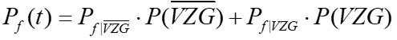
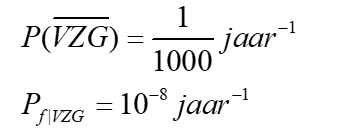
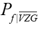

Verticale pipingoplossing
==========================

Verticaal Zanddicht Geotextiel (VZG)
====================================

Verticaal Zanddicht Geotextiel (VZG) is een innovatieve manier om ‘piping’ te voorkomen en daarmee verzakking of bezwijking van de dijk. Het geotextiel laat wel water door, maar geen zand. Het VZG wordt horizontaal vanaf de dijklichaam tot aan de zandlaag geplaatst, zie figuur hieronder.

.. figure:: VZG.png
   :alt: VZG.png

   VZG.png

Een VZG sluit falen door piping vrijwel uit, maar heeft geen invloed op stabiliteit en overslag. Voor een VZG gebruiken we onderstaande foutenboom (NB: deze is algemeen voor grondverbeteringen, maar ook voor VZG van toepassing):

.. figure:: VZG_foutenboom.png
   :alt: VZG_foutenboom.png

   VZG_foutenboom.png

De veiligheid voor piping wordt gelijkgesteld aan:

   VZG_Eq1.png

Daarbij worden de volgende kansen aangenomen:

   VZG_Eq2.png

Voor |VZG_Eq3.png| geldt de pipingfaalkans zonder VZG (dus de originele som voor het dijkvak, eventueel uitgebreid met een berm).

