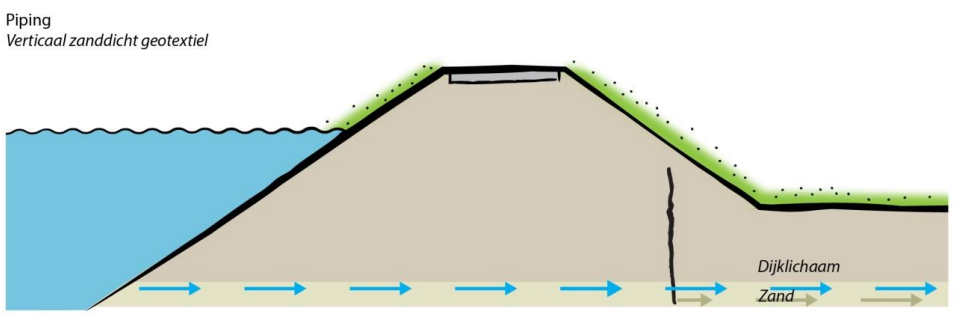
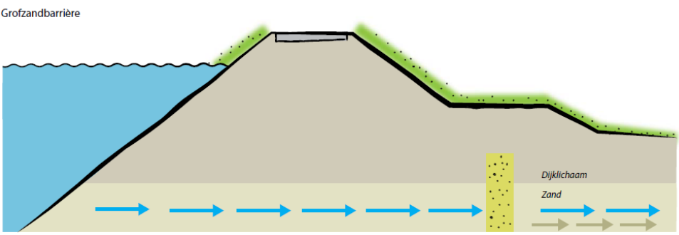
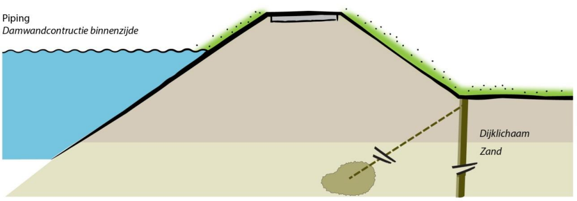

Verticale pipingoplossing
==========================
Het doel van de verticale pipingoplossing is het significant verlagen van de faalkans voor piping. In vroege versies van de VRTOOL werd dit gedaan door een Verticaal Zanddicht Geotextiel (VZG) aan te brengen. In de meer recente versies van de VRTOOL is dit veralgemeniseerd omdat VZG niet altijd goed maakbaar is, en in de praktijk ook veel andere oplossingen worden toegepast. Daarom is de verticale pipingoplossing nu een algemene maatregel die de faalkans voor piping verlaagt. De onderliggende maatregel is daarbij afhankelijk van de deklaagdikte:

* Bij deklagen tot 2 meter wordt uitgegaan van een grofzandbarriere.
* Bij deklagen tot 4 meter wordt uitgegaan van een Verticaal Zanddicht Geotextiel.
* Bij dikkere deklagen wordt uitgegaan van een heavescherm tot 6 meter onder de deklaag.

Invloed op faalkansen
---------------------
De verticale pipingoplossing heeft enkel effect op de faalkans voor piping. Daarbij geldt wel dat deze maatregel gecombineerd kan worden met een grondversterking, waarbij eerst het effect van de grondversterking in rekening wordt gebracht, en daarna het effect van de verticale pipingoplossing. De faalkansreductie voor piping wordt in rekening gebracht door middel van een reductiefactor op de pipingfaalkans van 1000. Er is dus nog steeds falen mogelijk, maar dit komt met name voort uit scenarios waarin de verticale oplossing niet goed werkt. In het verleden werd dit expliciet in rekening gebracht door een foutenboom te hanteren zoals weergegeven in onderstaande figuur. Daarin wordt zowel de kans op falen van de oplossing als de kans op piping bij functionerende oplossing expliciet meegenomen. De huidige benadering is echter eenvoudiger en geeft nagenoeg hetzelfde resultaat. 

.. figure:: img/VZG_foutenboom.png
   :alt: VZG_foutenboom.png

   Foutenboom voor het falen van een grondverbetering (uit TR grondverbeteringen). Deze is ook toepasbaar voor andere oplossingen zoals verticale pipingoplossingen.

Uiteraard is het in latere fasen van belang om de faalkans van pipingmaatregelen verder uit te werken met een daadwerkelijke foutenboom met daarin alle relevante faalmechanismen. Een reductie van de faalkans van 1000 is echter in het algemeen daarbij goed haalbaar. In termen van de foutenboom betekent dit dat (bij verwaarloosbare pipingfaalkans bij functionerende oplossing) de faalkans van de maatregel zelf (dus bijv. doorloopsheid van het VZG) ongeveer 1/1000 is.

Kostenberekening
----------------
Voor de grofzandbarriere zijn geen kostenkentallen beschikbaar. Voor het Verticaal Zanddicht Geotextiel is een kostenkental van 1.700 €/m² aangehouden. Deze waarde is ook gehanteerd in OKADER, een instrument voor beleidsanalyses en correspondeert met prijspeil 2023.

Voor het heavescherm wordt uitgegaan van een goedkope damwandconstructie (relatief beperkte lengte, onverankerd). Omdat de damwand geen functie heeft t.b.v. stabiliteit wordt daarvoor uitgegaan van een eenheidsprijs van 400 €/m². 