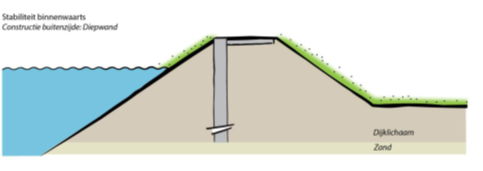

Zelfkerende constructie
========
Binnen de VRTOOL kunnen 2 typen zelfkerende constructies worden toegepast: een verankerde damwand in de kruin, en een diepwandconstructie. Deze maatregelen zijn erop gericht zelfstandig het water te kunnen keren. De effecten op de veiligheid van beide maatregelen zijn identiek, maar de kosten verschillen. Een verankerde damwand is in het algemeen goedkoper dan een diepwand, waarvan de aanleg vaak ook zeer complex is. Echter, in sommige gevallen kan door bijv. nabije bebouwing een diepwand de enige uitvoerbare maatregel zijn. Gebruikers kunnen op dergelijke locaties de damwandconstructie uit zetten (via het dashboard) zodat daar enkel een diepwand wordt toegepast.

   Illustratie van een diepwandconstructie in de kruin.

Invloed op faalkansen
----------------------

Stabiliteit binnenwaarts en piping
~~~~~~~~~~~~~~~~~~~~~~~~~~~~~~~~~~
Voor beide maatregelen en mechanismen is het effect hetzelfde. Het uitgangspunt is dat de constructie zelfkerend is, en dat deze dermate lang is dat piping uitgesloten is. De oorspronkelijke faalkansen worden daarom verlaagd met een factor :math:`10^8`. De maatregelen kunnen niet worden gecombineerd met andere maatregelen.

Overslag
~~~~~~~
Voor overslag wordt aangenomen dat de kering in 2075 voldoet aan de doorsnede-eis voor overslag (24% van de faalkansruimte). Hiervoor worden geen extra kosten meegenomen.

Kostenberekening
----------------
Voor de damwand wordt uitgegaan van een verankerd profiel AZ36, kosten 1.100 €/m². De benodigde lengte van de damwand wordt als volgt bepaald:

.. math::
   L = min((h_\mathrm{dijk} + d_\mathrm{cover}) \cdot 3, 20)

Waarbij :math:`h_\mathrm{dijk}` de hoogte van de dijk is bepaald o.b.v. de verticale afstand tussen kruin en binnenteen, en :math:`d_\mathrm{cover}` de deklaagdikte. De damwand wordt nooit langer dan 20 meter. Bij een lengte van 20 meter zijn de kosten 22.000 €/m.

Voor de diepwand wordt een kental gehanteerd horend bij een wandlengte van 20 meter en een dikte van 1 meter. De kosten bedragen dan 34.190 € per strekkende meter.

Er worden geen bijkomende kosten voor grondwerk en/of vervangen van de weg in rekening gebracht, aangezien deze onderdeel zijn van de opslagfactoren.

