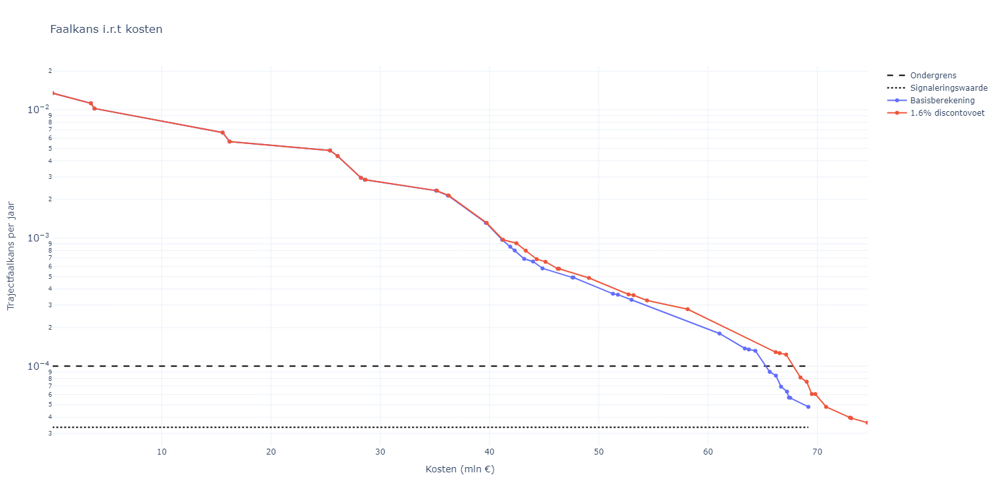
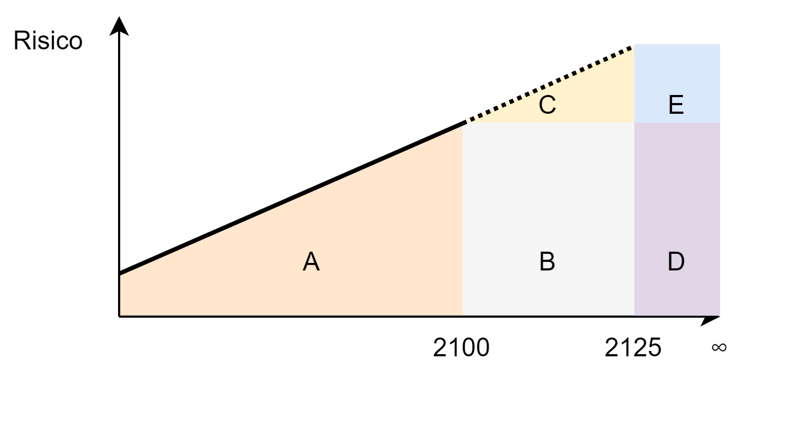

Bepaling van kosten en baten
==================================

Voor de kosten wordt de life-cycle cost (LCC) bepaald, gegeven het investeringsjaar van de maatregel. Dit is configureerbaar vanuit het dashboard, bij een Basisberekening wordt dit standaard op 2025 gezet, en voor grondversterkingen is ook 2045 een optie.

De baten worden bepaald door de risicoreductie van de maatregelen. Dit wordt bepaald door de trajectfaalkans te vermenigvuldigen met de verdisconteerde overstromingsschade. De trajectfaalkans wordt bepaald door de faalkansen van de mechanismen te combineren, en de overstromingsschade wordt bepaald op basis van de economische schade in het jaar 2050 uit de `Factsheets normering primaire waterkeringen <https://www.helpdeskwater.nl/publish/pages/132790/factsheets_compleet19122016.pdf>`_.
Voor de baten wordt gebruik gemaakt van de verdisconteerde overstromingsschade. De verdiscontering wordt gedaan met een discontovoet van 3% (zie voor meer toelichting :ref:`verdiscontering_section`. Zo is de schade :math:`S` in jaar :math:`t` gelijk aan:

.. math::
   S(t) = S(0) \cdot (1 + r)^t,

waarbij :math:`S(0)` de schade in het basisjaar is (conform de factsheet), en :math:`r` de discontovoet. Dit wordt gedaan voor een horizon van 100 jaar. Risico(reductie) na 100 jaar wordt niet meegenomen.

De kansen worden gecombineerd conform de meest recente assemblageregels uit het BOI: daarbij worden eerst de faalkansen van de vakken gecombineerd (zie ook `Bepaling trajectfaalkansen <BepalingTrajectfaalkansen.html>`_). Daarvoor wordt aangenomen dat dijkvakken voor piping en stabiliteit onafhankelijk zijn, conform de volgende formule:

.. math::
   P_{m} = 1 - \prod_{i=1}^{n} (1 - P_{m,i}),

waarbij :math:`P_{m}` de faalkans van het traject is voor mechanisme :math:`m`, en :math:`P_{m,i}` de faalkans van dijkvak :math:`i` voor mechanisme :math:`m`, en :math:`n` het aantal dijkvakken. Voor bekleding en overloop/overslag wordt aangenomen dat de vakken afhankelijk zijn, en wordt de volgende formule gehanteerd:

.. math::
   P_{m} = \max_{i=1}^{n} P_{m,i}.,

Vervolgens worden de kansen van de mechanismen als onafhankelijke kansen gecombineerd. Door deze voor elk jaar te vermenigvuldigen met de verdisconteerde overstromingsschade wordt het totale overstromingsrisico bepaald voor elke maatregel. 

.. _verdiscontering_section:

Verdiscontering van kosten en risico
-------------------------------------
    
Binnen de VRTOOL worden alle kosten verdisconteert met een discontovoet van 3%. Gezien het recente advies van de `Werkgroep Discontovoet <https://www.rwseconomie.nl/discontovoet>`_ zou deze eigenlijk moeten worden aangepast naar 1,6% voor de versterkingskosten, en 2,25% voor de risicokosten. De verschillen zijn echter beperkt. De verwachting is dat door deze aanpassing de relatieve investering in hoogte van de kering met name iets zal toenemen omdat het risico in de verre toekomst zwaarder meeweegt (en de betrouwbaarheid voor hoogte het sterkst afneemt). Daarbij moet worden opgemerkt dat nu tot 2125 wordt gerekend, op basis van een extrapolatie van de hydraulische berekeningen in 2100. Dat leidt soms tot tamelijk grote kansen in de verre toekomst die dan relatief zwaar meewegen in de huidige investering, zeker omdat gerekend wordt met een relatief zwaar klimaatscenario.

Om de invloed van de discontovoet te illustreren is traject 24-3 doorgerekend met de huidige 3%, en de nieuwe discontovoet van 1,6% (daarbij is geen onderscheid gemaakt in verdiscontering van risico en kosten). In onderstaande figuur zijn de paden voor beide oplossingen weergegeven voor het economisch optimum. Te zien is dat het verschil beperkt is. Wanneer wordt gekeken naar de maatregelen om aan de norm in 2075 te voldoen wordt het verschil nog kleiner. Typisch is zichtbaar dat met een lagere discontovoet er iets meer in piping en overslag wordt geïnvesteerd, en iets minder in stabiliteit binnenwaarts. Dat is te verklaren doordat voor piping en overslag de veiligheid afneemt in de tijd, en voor stabiliteit binnenwaarts wordt deze constant aangenomen.

Binnen de berekening wordt momenteel de risicoreductie bepaald op basis van de geextrapoleerde faalkans tot 2125. Voor overslag, bekleding en piping is deze hoger dan de faalkans in 2100 en de huidige faalkans. De onderliggende aanname is gestoeld op het feit dat door verdiscontering de bijdrage van het risico in de laatste jaren beperkt is, en het waarschijnlijk niet aantrekkelijk is dat in de huidige versterking al te reduceren. Echter, met een lagere discontovoet kan dit wat veranderen, hoewel uit de bovenstaande figuur blijkt dat dit alleszins meevalt. Richting de toekomst zijn er voor de bepaling van het risico een aantal verbeteropties, die zijn geïllustreerd in onderstaande figuur. 

Daarvan zijn er 2 opties het meest kansrijk:

1. De risicoreductie wordt bepaald op basis van de faalkans in 2125. Dit is de huidige aanpak. Dan worden delen A, B en C in de figuur meegenomen.
2. De risicoreductie wordt bepaald op basis van de faalkans in 2100. Dit vermijdt een (soms zeer nadelig uitpakkende) extrapolatie van faalkansen. Dan worden delen A en B in de figuur meegenomen.

Daarnaast kan nog besloten worden het risico op lange termijn ook nog mee te wegen. In geval van aanpak 1 betekent dit dat delen D en E ook worden meegenomen, voor aanpak 2 alleen deel D. De kans wordt dan tot in het oneindige constant verondersteld, en er wordt verdisconteerd met een oneindige tijdshorizon.

Opnieuw geldt dat de keuzes invloed hebben op de resultaten, maar deze niet fundamenteel veranderen. Aanbevolen wordt om tot een consistente keuze voor combinatie van de omgang met risico én implementatie van een nieuwe discontovoet te komen.