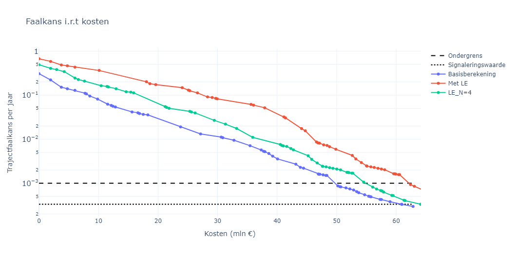

Bepaling van trajectfaalkansen
================================

Een belangrijke basis voor de veiligheidsrendementanalyses is de bepaling van de effecten van maatregelen op trajectniveau. Daarvoor worden trajectfaalkansen bepaald. Hierbij wordt voortgebouwd op de assemblageregels zoals die gehanteerd worden in het WBI/BOI, aangevuld met enkele praktische inzichten. De aanpak gehanteerd in de VRTOOL sluit aan op de `Rode Draad #10 - Assembleren <https://adviesteamdijkontwerp.nl/rode-draden/rode-draad-nr-10-assembleren/>`_ van het Adviesteam Dijkontwerp`.

Op systeemniveau wordt de faalkans van een mechansimen van een heel traject bepaald door de combinatie van grenstoestandsfuncties van de verschillende doorsneden, waarbij deze zich goed laten benaderen door onder- en bovengrenzen die corresponderen met volledige (on)afhankelijkheid tussen deze grenstoestandsfuncties (ook wel MAX en SOM in de Rode Draad genoemd):

.. math::
   P_\mathrm{SOM} = 1 - \prod_{i=1}^{n} (1 - P_{\text{vak}_i})

   P_\mathrm{MAX} = max(P_\mathrm{dsn,i})

Hierbij correspondeert :math:`P_\mathrm{SOM}` met de kans bij onafhankelijkheid tussen vakken, dit is de theoretische bovengrens van de trajectfaalkans (merk op dat een vakkans bepaald kan worden door meerdere (on)afhankelijke grenstoestandsfuncties voor verschillende doorsneden, zie daarvoor ook de volgende paragraaf). :math:`P_\mathrm{MAX}` correspondeert met de kans bij (sterke) afhankelijkheid tussen vakken. In de praktijk geldt daarbij dat :math:`P_\mathrm{SOM}` met name een goede benadering geeft bij geotechnische mechanismen, waar sterke onafhankelijkheid is door de grote ruimtelijke variabiliteit. En :math:`P_\mathrm{MAX}` geeft de beste benadering bij belastinggedreven mechanismen zoals bekledingen en overloop/overslag. In de rekenmethode van de VRTOOL wordt daarom standaard :math:`P_\mathrm{SOM}` gehanteerd voor piping en binnenwaartse stabiliteit, en :math:`P_\mathrm{MAX}` voor bekledingen en overloop/overslag. Dit is in lijn met de meest recente voorschriften voor assemblage uit het BOI en de Rode Draad.

.. note::
   In de assemblage in WBI-2017 is voor de MAX regel nog een extra parameter :math:`N_\mathrm{mech}` opgenomen die de aanwezigheid van meerdere onafhankelijke orientaties in rekening brengt. In de praktijk blijkt deze echter vaak zeer dicht bij 1 te liggen, en daarom is deze in de Rode Draad niet meer opgenomen. Wanneer er toch de verwachting is dat er meerdere onafhankelijke orientaties kan dit los in rekening worden gebracht. Dit wordt in de VRTOOL niet expliciet gefaciliteerd. 

.. admonition:: :math:`P_\mathrm{SOM}` **of** :math:`P_\mathrm{MAX}` **, maakt het uit?**

    Een belangrijke vraag bij bovenstaande is in hoeverre het uitmaakt of we :math:`P_\mathrm{SOM}` of :math:`P_\mathrm{MAX}` hanteren. In onderstaande figuur is een illustratie weergegeven voor een systeem van 10 dijkvakken waarbij links alle vakken een betrouwbaarheidsindex van 3.5 hebben, en rechts er 1 van de dijkvakken een betrouwbaarheidsindex van 2.5 heeft. Te zien is dat rechts de beide grenzen voor een heel groot bereik goed werken, en dat dit eigenlijk in de rechtersituatie ook zo is, met de toevoeging dat de waarden veel dichter bij elkaar liggen. In de praktijk komen we zeker vóór een versterking veel situaties tegen zoals rechts, waarbij er enkele vakken zeer dominant zijn. Beide grenzen liggen dan dicht bij elkaar en welke wordt gebruikt maakt weinig uit. 
    
    Na versterking wordt dit anders en zal de linkerfiguur meer van toepassing zijn. Maar ook dan geldt dat voor situaties met en zonder sterke afhankelijkheid tussen falen op verschillende vakken er 1 van beide grenzen duidelijk beter is. Op basis hiervan is de keuze gemaakt om voor de VRTOOL standaard :math:`P_\mathrm{SOM}` te hanteren voor piping en stabiliteit binnenwaarts, en :math:`P_\mathrm{MAX}` voor bekledingen en overloop/overslag.

    .. list-table::
       :width: 100%
       :class: borderless

       * - .. figure:: img/EqualComponents.png
              :width: 100%
              :alt: Equal Components
     
         - .. figure:: img/UnequalComponents.png
              :width: 100%
              :alt: Unequal Components

    *Situatie met 10 dijkvakken waarbij links alle vakken een betrouwbaarheidsindex van 3.5 hebben, en rechts 1 van de dijkvakken een betrouwbaarheidsindex van 2.5 heeft, met verschillende correlatie* :math:`\rho` *(horizontale as). Stippen geven de grenzen* :math:`P_\mathrm{MAX}` *en* :math:`P_\mathrm{SOM}` *aan.*

    .. note::
       De betrouwbaarheidsindex :math:`\beta` wordt bepaald vanuit de standaardnormale verdeling waarbij geldt dat :math:`P_f = \Phi(-\beta)`. Een :math:`\beta` van 3,5 correspondeert met een faalkans van ongeveer :math:`2,33 * 10^{-4}`. In bovenstaande figuur slaat :math:`\beta_\mathrm{sys}` op de betrouwbaarheidsindex van het systeem.

Zoals aangegeven gaat het om combinaties van grenstoestandsfuncties. In de praktijk willen we doorsnedeberekeningen en vakken combineren tot een trajectfaalkans. Daarop gaan we in de volgende paragraaf verder in. 

De relatie tussen doorsnede- en vakfaalkansen
---------------------------------------------
Het startpunt bij de bepaling van de trajectfaalkans zijn doorgaans berekeningen op doorsnedeniveau, die 'representatief' zijn voor een dijkvak. In de basis geldt vaak dat langere vakken leiden tot een groter lengte-effect: er is dan meer kans op een ongunstige set parameters. In het WBI-2017 is dit op verschillende manieren meegenomen, maar dit was inhoudelijk niet altijd correct geïmplementeerd. In de Handleiding Overstromingskansanalyse van het BOI zijn daarom drie opties gegeven:

1. Wanneer niet wordt onderbouwd dat de doorsnede voor een deel van het vak geldig is geldt dat :math:`a_\mathrm{vak}=1`.
2. Wanneer wordt onderbouwd dat op een dijkvak een lagere gevoelige lengte van toepassing is (:math:`a_\mathrm{vak}`) dan 1 kan deze waarde worden gehanteerd.
3. Wanneer de doorsnede onderbouwd de zwakste is in een vak geldt dat de gevoelige lengte gelijk is aan 1x de onafhankelijke strekkinglengte van het mechanisme (er is dan dus geen opschaling, eigenlijk is dit een specifieke variant van optie 2).

De meest nette versie is daarbij optie 2. In een studie voor dijkversterkingsproject SAFE is deze variant expliciet uitgewerkt voor een aantal dijkvakken. Hieruit blijkt dat opschalen met de aanname :math:`a_\mathrm{vak}=1` (dus optie 1) doorgaans veel te conservatief is, met name voor stabiliteit binnenwaarts. Lokale variaties in geometrie en ondergrond leiden al snel tot orde groottes andere faalkansen en daarmee een lagere gevoelige lengte. Uit de daar doorgerekende cases voor verschillende vakken blijkt dat voor stabiliteit binnenwaarts de vakkans 3 tot 6 keer groter is dan het vak als geheel (gevoelige lengte doorgaans tussen de 30 en 50% op vakniveau). Tegelijkertijd blijkt dat doorsnede-berekeningen vaak zeer conservatief zijn ingestoken, en dat de onzekerheid daarin vele malen groter is. Voor piping zijn, door de wat grotere onafhankelijke strekkinglengte (b=300 meter), de verschillen per definitie kleiner. 

.. admonition:: Toepassing binnen het innovatieproject

   In fase 1 en 2 van het innovatieproject is er voor gekozen om niet op te schalen binnen dijkvakken (dus optie 3) omdat de benodigde gegevens voor een uitwerking van optie 2 niet voor handen waren, én de berekeningen op doorsnede-niveau in de beoordeling conservatief waren. Bovendien was 1 van de uitgangspunten om aan te sluiten op het WBI-2017, waar opschalen binnen vakken niet gebruikelijk was. Zodoende is er voor gekozen om in veiligheidsrendementanalyses uit te gaan van optie 3. In fase 2b is ervoor gekozen om standaard uit te gaan van optie 1, en gebruikers de mogelijkheid voor optie 2 te bieden. 

De mate van opschaling maakt verschil voor de gekozen maatregelen, omdat deze het veiligheidstekort en daarmee het overstromingsrisico direct beinvloeden. Met name op langere vakken kan een andere opschaling tot andere maatregelen leiden omdat hier het veiligheidstekort op vakniveau omhoog gaat, en daarmee ook het veiligheidsrendement van maatregelen. In onderstaande figuur is een vergelijking weergegeven tussen een scenario met opschaling binnen het vak (:math:`a=1`) en zonder opschaling, als middenvariant is een variant weergegeven waarbij wordt opgeschaald, maar deze waarde gemaximeerd is op :math:`N_\mathrm{vak}=4` (waarbij 4 een enigszins arbitraire keuze is o.b.v. de range uit het eerder genoemde onderzoek bij SAFE). Te zien is dat grotere lengte-effecten zoals verwacht tot hogere kosten leiden. Het relatieve verschil tussen veiligheidsrendement en het OI2014v4 wordt door opschaling dus iets kleiner, maar opgemerkt moet worden dat volledige opschaling leidt tot zeer onrealistische faalkansen (in dit geval ca. 85% trajectfaalkans per jaar).

   Vergelijking van trajectfaalkansen met en zonder opschaling van lengte-effecten binnen vakken voor traject 10-1.

Overigens moet worden opgemerkt dat het hanteren van de standaard lengte-effectfactoren uit het OI2014v4 voor stabiliteit binnenwaarts, gecombineerd met optie 1, in sommige gevallen niet zal leiden tot een resultaat dat voldoet aan de trajecteis. Doordat de gevoelige fractie van het traject gelijk wordt gesteld aan 3,3%, geldt immers dat wanneer een dijkvak een lengte heeft groter dan 3,3% van de trajectlengte én een faalkans gelijk aan de doorsnede-eis, de trajectfaalkans per definitie hoger wordt dan de eis. Hoewel deze situatie in de praktijk niet zo realistisch is, laat dit wel de noodzaak zien van het helder uitwerken van een systematiek om op een gebalanceerde manier lengte-effecten in rekening te brengen in de bepaling van trajectfaalkansen in ontwerp en beoordeling. Veiligheidsrendement geeft daar invulling aan. Dit is verder uitgewerkt in Hoofdstuk 5 van de `Handreiking Veiligheidsrendement <https://www.hwbp.nl/binaries/hoogwaterbeschermingsprogramma/documenten/handreikingen/2025/04/24/handreiking-veiligheidsrendement/Handreiking+Veiligheidsrendement+fase+2.pdf>`_.
