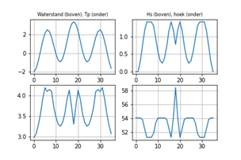
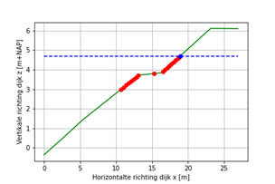
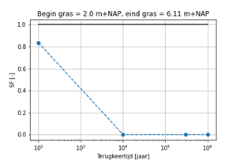
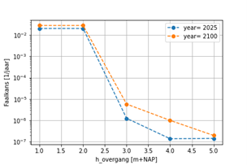
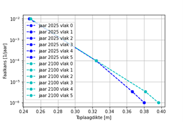

# Preprocessing dijkbekleding

Als onderdeel van de preprocessing worden de volgende stappen uitgevoerd:
- Uitvoeren van Q-variant berekeningen
- Afleiden relatie tussen hoogte overgang en faalkans GEBU
- Afleiden relatie tussen toplaagdikte en faalkans ZST

De afgeleide relaties van hoogte overgang en toplaagdikte met de faalkans kunnen vervolgens worden gebruikt om de effecten van maatregelen te bepalen. Daarnaast worden de kosten bepaald. Zo kunnen bekledingen worden meegenomen in optimalisaties met de veiligheidsrendementmethode.

Deze verschillende stappen worden in de volgende paragrafen nader toegelicht.

##	Uitvoeren van Q-variant berekeningen
Ten behoeven van de Q-variant sommen worden eerst waterstandsberekeningen met Hydra-Ring uitgevoerd (per locatie en per zichtjaar). De waterstandsberekeningen worden uitgevoerd voor vier terugkeertijden: 30/ondergrens, 1/signaleringswaarde, 1/(30 x signaleringswaarde) en 1/(100 x signaleringswaarde). De terugkeertijden zijn geselecteerd zodat een brede range van belastingen gedekt kan worden.

De Q-variant berekeningen (per locatie en per zichtjaar) worden met Hydra-Ring uitgevoerd voor de vier terugkeertijden. Per terugkeertijd worden er verschillende waterstandsniveaus beschouwd: vanaf 0.0 m+NAP tot de waterstand bij de terugkeertijd, met een stap van 1.0 m. De Q-variant berekeningen worden uitgevoerd voor drie modeltypen:
- Golfklap (a = 1.0, b = 0.67, c = 0.0)
- Golfoploop (a = 1.0, b = 1.7, c = 0.3)
- Zuilen (a = 1.0, b = 0.4, c = 0.8)

Effectief worden er per locatie en per zichtjaar: 4 terugkeertijden x aantal waterstandsniveaus x 3 modeltypes Q-variant berekeningen uitgevoerd. De resultaten van de Q-variant berekeningen (golfcondities bij de verschillende waterstandniveaus) worden in de volgende stappen gebruikt.

##	Afleiden relatie hoogte overgang en faalkans GEBU
De resultaten van de Q-variant berekeningen (modeltype ‘golfklap’ en ‘golfoploop’) worden eerst vertaald naar tijdsverlopen van hydraulische belastingen (waterstand, Hs, Tp en golfinvalshoek). Hier wordt de aanpak uit de “Schematiseringshandleiding Grasbekleding” aangehouden. Eerst wordt het tijdsverloop van de lokale waterstand afgeleid. Dat verschilt per watersysteem. De golfcondities uit de Q-variant berekeningen worden geprojecteerd op de waterstandsverlopen om de golfcondities in de tijd te verkrijgen. Een voorbeeld van de tijdsverlopen van hydraulische belastingen wordt in Figuur 1 weergegeven.

Figuur 1 Voorbeeld tijdsverlopen van hydraulische belastingen voor een terugkeertijd; watersysteem ‘kust’.

De tijdsverlopen van hydraulische belastingen (per locatie, per zichtjaar en per terugkeertijd) dienen als input voor berekeningen met DiKErnel. Met DiKErnel wordt de bekleding op golfklap/golfoploop voor verschillende niveaus van de overgang beoordeeld. Hier worden de volgende regels aangehouden:
- Als de maximale waterstand hoger is dan het boven niveau van de grasbekleding, dan wordt de bekleding alleen op golfklap beoordeeld. De berekeningen met DiKErnel worden voor verschillende posities op het buitentalud uitgevoerd (vanaf niveau overgang tot het boven niveau van de grasbekleding met een stap van 10 cm).
- Als de overgang hoger is dan de maximale waterstand, dan wordt de bekleding alleen op golfoploop beoordeeld. In dat geval wordt één berekening met DiKErnel uitgevoerd: namelijk voor het niveau van de overgang.
- Als de maximale waterstand tussen de grenzen van de grasbekleding valt, dan wordt de bekleding op zowel golfklap als op golfoploop beoordeeld. Als het om golfklap gaat, dan worden er sommen met DiKErnel gedaan voor verschillende posities op het buitentalud (vanaf niveau overgang tot de maximale waterstand). De golfoploop berekeningen met DiKErnel worden voor één niveau gedaan: namelijk de maximale waterstand.

Naast de tijdsverlopen van hydraulische belastingen gebruikt DiKErnel ook het dijkprofiel en tan(alfa)  als invoer. Figuur 2 presenteert de te beschouwen posities op het buitentalud voor het geval als de maximale waterstand tussen de grenzen van de grasbekleding valt.

Figuur 2 Voorbeeld van de te beschouwen posities op het buitentalud uitgaande van hoogte overgang = 3 m+NAP en de maximale waterstand (blauw gestipte lijn) die tussen de grenzen van de grasbekleding vaalt; rode punten: golfklap, blauw punt: golfoploop.

Per locatie, per zichtjaar, per niveau overgang en per terugkeertijd resulteren de berekeningen met DiKErnel in een schadegetal op elk van de beschouwde posities. De schadegetallen voor de verschillende posities worden geaggregeerd door het maximum van de schadegetalen te nemen. Deze maximale schadegetal wordt vertaald naar een veiligheidsfactor (SF):

SF = 1/max(schadegetal per positie)

Aangenomen wordt dat de grasbekleding niet aan de belasting voldoet indien SF<1.0.

Effectief wordt er per locatie, per zichtjaar en per niveau overgang een relatie tussen de terugkeertijd en de veiligheidsfactor verkregen. Figuur 3 geeft een voorbeeld van de relatie. De grafiek toont aan dat de grasbekleding (vanaf 1.0 t/m 6.11 m+NAP) niet aan de opgelegde belasting voldoet (SF<1.0). Verder wordt de veiligheidsfactor lager naarmate de belasting hoger wordt (hoge terugkeertijd), dat is conform de verwachtingen.

Figuur 3 Voorbeeld van een relatie tussen de terugkeertijd en de veiligheidsfactor (SF) voor overgang = 1 m+NAP (blauw gestipte lijn); de zwarte lijn geeft SF = 1.0 aan.

Gegeven de relatie tussen de terugkeertijd en de veiligheidsfactor wordt er gezocht naar de terugkeertijd die bij SF = 1.0 hoort: deze terugkeertijd definieert de faalkans van de grasbekleding (per locatie, per zichtjaar en per niveau overgang). Het snijpunt met SF = 1.0 wordt met de bi-sectie methode berekend. In het geval van Figuur 3 wordt het snijpunt met SF = 1.0 bij een terugkeertijd van ca. 50 per jaar gevonden (dat punt ligt buiten de grenzen van de grafiek). Dat betekent dat de faalkans van de bekleding gelijk is aan ca. 1/50 per jaar.

Voor sommige gevallen kan de bi-sectie methode geen resultaten gegeven. Dat gebeurt bijv. als voor de beschouwde terugkeertijden de veiligheidsfactor altijd gelijk is. In dat geval worden de volgende aannames gedaan:
- Als de berekende veiligheidsfactoren altijd hoger zijn dan 1.0 (de bekleding voldoet aan de verschillende belastingen), dan wordt de faalkans van de bekleding gelijk gesteld aan de hoogste beschouwde terugkeertijd. Dat is een conservatieve aanname.
- Als de berekende veiligheidsfactoren altijd lager zijn dan 1.0 (de bekleding faalt voor de verschillende belastingen), dan wordt de faalkans van de bekleding gelijk gesteld  aan 0.5 per jaar. Dat is een conservatieve aanname.

De bovenstaande stappen worden per locatie en per zichtjaar herhaald voor de verschillende niveaus van de overgang. Dat leidt uiteindelijk tot een relatie tussen de overgang en de faalkans van de grasbekleding. Figuur 4 geeft een voorbeeld van een dergelijke relatie.

Figuur 4 Voorbeeld van een relatie tussen de overgang en de faalkans van de grasbekleding.

## Afleiden relatie toplaagdikte en faalkans ZST
Om de relatie tussen de toplaagdikte en de faalkans van de steenbekleding te bepalen worden Steentoetsbestanden uit LBO-1 gebruikt. 

Uit een Steentoetsbestand die bij een bepaalde categoriegrens hoort worden voor een dijkprofiel de toplaagdikte en ratio Hs/(delta x D) afgeleid, die net voldoen aan de categoriegrens. Dat wordt als volgt gedaan:
•	Dvoldoet = huidige toplaagdikte – dikteoverschot
•	ratiovoldoet = Hs/(delta x Dvoldoet)

De ratiovoldoet wordt afgeleid voor elk vlak van de bekleding dat met Steentoets beoordeeld is. Een belangrijke aanname is dat we veronderstellen dat de ratiovoldoet voor de verschillende terugkeertijden gelijk is. Onderbouwing van deze aanname is gegeven in Appendix A.

Vervolgens wordt er gebruikt gemaakt van de Q-variant berekeningen (modeltype ‘zuilen’). De golfhoogtes (Hs) die bij een terugkeertijd horen worden gebruikt om samen met de ratiovoldoet de toplaagdikte die voldoet bij de belasting horend bij deze terugkeertijd te bepalen. Bij een terugkeertijd horen meerdere waarden van Hs (omdat er verschillende waterstandniveaus beschouwd zijn); voor elke Hs wordt de benodigde toplaagdikte als volgt afgeleid:

D(i) = Hs(i)/(delta x ratiovoldoet)

In de bovenstaande formule worden alleen de Hs waarden beschouwd die horen bij het waterstandsniveau die het beschouwd dijkvlak bereikt. De verschillende waarden van de toplaagdikte worden vervolgens geaggregeerd tot één waarde door het maximum van de verschillende toplaagdiktes te nemen:

Dmax = max(D(i))

Deze maximale toplaagdikte wordt aangehouden als de toplaagdikte met de faalkans correspondeert met de beschouwde terugkeertijd vermenigvuldigd met de faalkansbegroting ZST en de langte-effect factor N.

De analyse wordt per locatie herhaald voor verschillende zichtjaren, terugkeertijden en dijkvlakken. Figuur 5 geeft een voorbeeld van de verkregen relaties tussen de toplaagdikte en de faalkans van de steenbekleding.

Figuur 5 Voorbeeld van een relatie tussen de toplaagdikte en de faalkans van de steenbekleding.

Verder wordt het volgende opgemerkt:
- In het geval van een ontwerp, waarin de hoogte van de overgang hoger is dan de aanwezige overgang wordt er een nieuwe steenbekleding aangelegd (tussen de aanwezige bekleding en de nieuwe overgang). In dergelijk geval wordt een relatie aangehouden die hoort bij het bovenste vlak met een geldige steenzetting.

