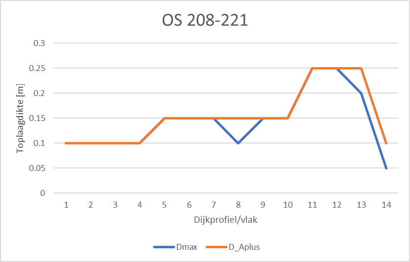
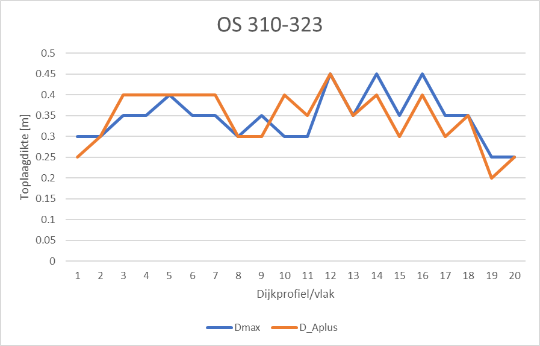

# Validatie dijkbekleding model

De aanpak die voor de steenbekleding wordt gehanteerd is gevalideerd voor enkele dijkprofielen in traject 26-3.

Een Steentoetsbestand uit de LBOI-1, die bij de categoriegrens A hoort, wordt gebruikt om voor verschillende dijkprofielen (en dijkvlakken) Dvoldoet en ratiovoldoet te bepalen.

Dvoldoet = huidige toplaagdikte – dijkoverschot

ratiovoldoet = Hs/(delta x Dvoldoet)

Het wordt aangenomen dat ratiovoldoet ook voor de categoriegrens A+ moet gelden. Door gebruik te maken van de Hs waarden die bij de categoriegrens A+ horen en de ratiovoldoet wordt de toplaagdikte Dmax afgeleid. 

D(i) = Hs(i)/(delta x ratiovoldoet)

Dmax = max(D(i))

In de aanpak wordt aangenomen dat Dmax bij de categoriegrens A+ hoort. Deze ‘voorspelling’ wordt vergeleken met de toplaagdikte uit het Steentoetsbestand bij de categoriegrens A+ hoort (het gaat dan om de toplaagdikte die net aan de categoriegrens A+ voldoet). De vergelijking is in de volgende grafieken te zien. Het is te zien dat Dmax redelijk goed overeenkomt met de toplaagdikte gevonden door Steentoets (DAplus). De nauwkeurigheid van de aanpak is gemiddeld gezien +/- 5 cm.

