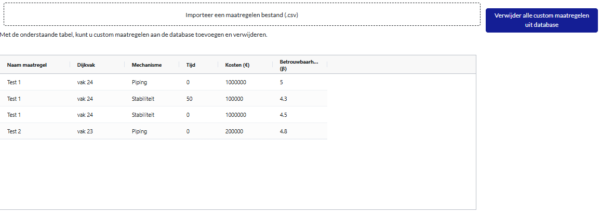

Berekeningen aansturen via het dashboard
========================================

Vanuit het dashboard kunnen nieuwe berekeningen worden aangestuurd. Daarvoor moet eerst een database met resultaten van een basisberekening worden geïmporteerd. Vervolgens kan met het dashboard een nieuwe berekening worden geconfigureerd. De pagina hiervoor is te benaderen door bovenin bij `paginas` te kiezen voor `Draaien optimalisatieberekeningen`. Zie ook onderstaand screenshot.

Aan- en uitzetten van maatregelen
----------------------------------

Via het tabblad `Run Optimize` kan met de knoppen een nieuwe berekening worden geconfigureerd. In onderstaand voorbeeld is bijvoorbeeld aangegeven dat op dijkvak 3 alleen een grondversterking kan worden uitgevoerd, en op dijkvakken 4 t/m 8 geen versterking. Op dijkvak 3 kan ook alleen in het jaar 2030 worden versterkt.

De berekening is `Aangepaste optimalisatie v0.1` genoemd. De berekening kan worden gestart door op de knop `Start optimalisatieberekening` te klikken. De berekening wordt nu gestart en de voortgang is te volgen in de live logging. Een berekening kan enige tijd duren, de voortgang wordt gelogd in een pop-up scherm zoals hieronder weergegeven. Hier is bijvoorbeeld te zien dat er in stap 2 van de berekening een maatregel is gekozen met een BC-ratio van 11381.77.

.. figure:: img/live_logging.png
    :width: 50%
    :align: center

.. tip::
    Met name het importeren van alle gegevens kan even tijd kosten. Daardoor kan het soms even duren voordat er logging verschijnt. Dat betekent echter niet dat er niets gebeurt op de achtergrond.

De duur van de berekening is sterk afhankelijk van de computer waarop deze wordt uitgevoerd, en het aantal maatregelen en dijkvakken dat wordt meegenomen in de berekening. In het algemeen duurt het optimalisatiedeel van de berekeningen wel meer dan 5 minuten per analyse (tot circa 1 uur voor trajecten met veel dijkvakken en maatregelen). Een berekening is klaar als dit wordt aangegeven in het venster, en als er in het tabblad in de browser geen `updating...` meer staat.

.. tip::
    Het draaien van een berekening vanuit het dashboard kan alleen worden uitgevoerd als eerst in ieder geval ``measures`` is doorgerekend omdat er gegevens over de maatregelen beschikbaar moeten zijn. Zie ook `hier <../VRTool/index.html#uitvoeren-van-een-berekening>`_.

Het draaien van aangepaste berekeningen kan handig zijn wanneer:

* Met een specifiek versterkingsjaar moet worden gerekend (voor bepaalde dijkvakken). Het kan dan inzicht geven in de mate waarop de timing van de maatregelen de maatregelen op het betreffende vak of andere vakken beïnvloedt.
* Een specifieke maatregel moet worden uitgezet of afgedwongen. Dit kan bijvoorbeeld zijn omdat een maatregel niet mogelijk is door beperkingen die niet anderszins worden meegenomen, of omdat vanuit omgeving juist een specifiek type maatregel wenselijk is.
* Men wil kijken naar het beperken van de geografische scope door specifieke dijkvakken uit te zetten en daarmee uit te sluiten van versterking.

Werken met custom maatregelen
-----------------------------
Naast het rekenen met de standaard maatregelen is het ook mogelijk om met custom maatregelen te rekenen. Dit kan bijvoorbeeld handig zijn wanneer er een specifieke maatregel moet worden meegenomen die niet in de standaard set zit. Denk aan een specifieke maatwerkoplossing op een bepaald dijkvak. Custom maatregelen kunnen worden ingevoerd in het tabblad ``Custom maatregelen``. Hier is een tabel zichtbaar zoals in onderstaande figuur. In dit geval zijn er 2 custom maatregelen ingevoerd: maatregel `Test 1` op dijkvak 1, en `Test 2` op dijkvak 2.

Voor beide maatregelen zijn kosten & betrouwbaarheid ingevoerd. Voor de kosten geldt dat bij `Test 1` 2 verschillende bedragen zijn ingevoerd. In dat geval neemt de VRTOOL het hoogste bedrag. Voor de betrouwbaarheid wordt de betrouwbaarheid van de maatregel ingevoerd voor verschillende jaren en mechanismen. Daarbij worden de getallen in de tabel geinterpreteerd als in onderstaande figuur. Wanneer niets wordt ingevoerd wordt aangenomen dat de betrouwbaarheid gelijk blijft. Custom maatregelen worden niet gecombineerd met andere maatregelen.

.. figure:: img/custom_measure_concept.png
    :width: 80%
    :align: center

De custom maatregelen zijn terug te vinden door de SQLite te openen in een database viewer. In de tabel ``CustomMeasureDetail`` zijn de ingevoerde waarden te zien. In de tabellen ``MeasureResultMechanism`` en ``MeasureResultSection`` is te zien hoe de betrouwbaarheidsindex en kosten zijn geinterpreteerd. 

.. figure:: img/custom_measure_sqlite.png
    :width: 80%
    :align: center

Bij het toevoegen van custom maatregelen wordt altijd een backup gemaakt van de bestaande database om te voorkomen dat de originele resultaten verloren gaan. Deze zijn terug te vinden in de folder van de originele database.
