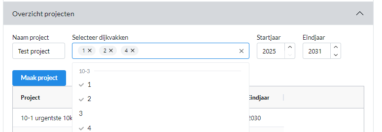
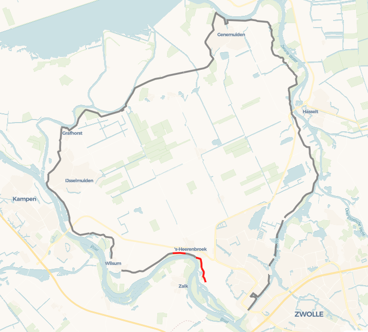
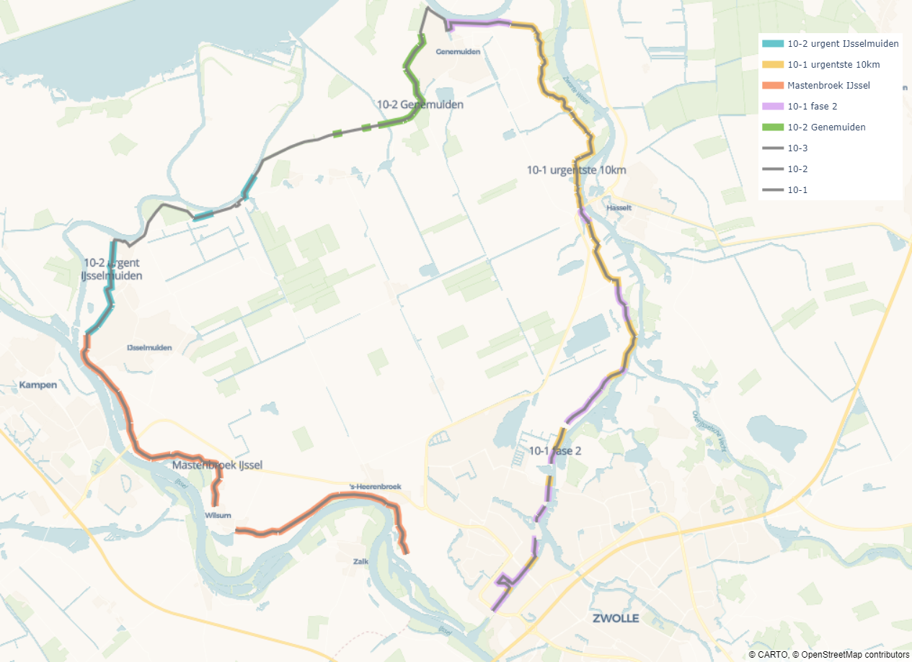
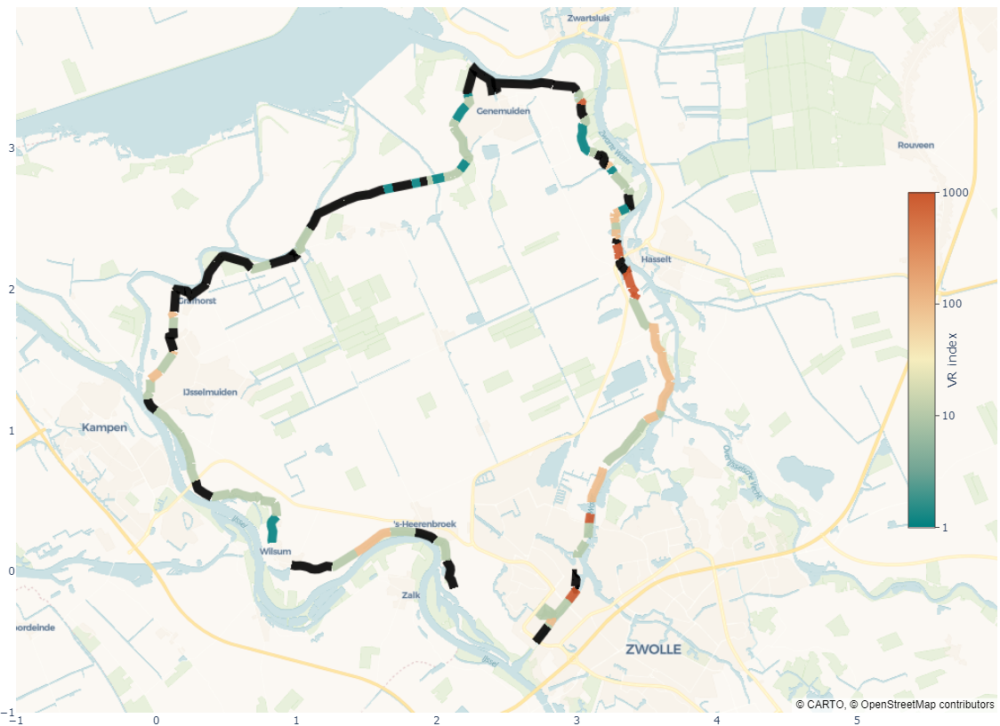
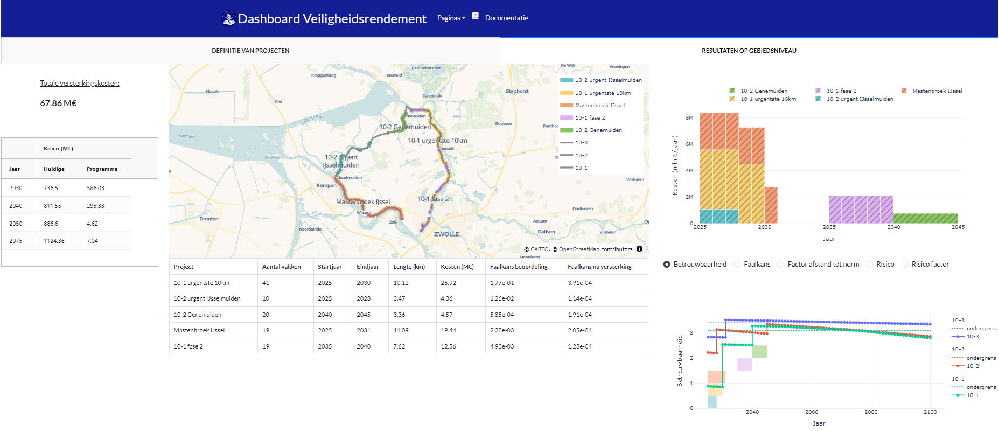
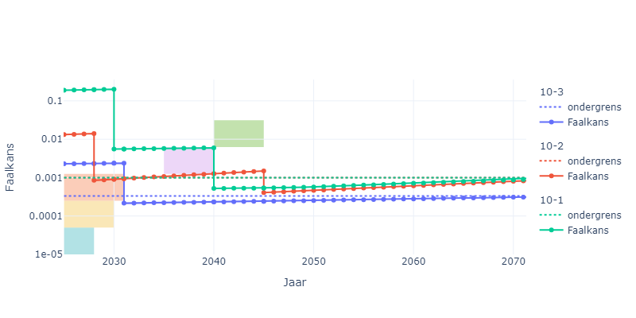
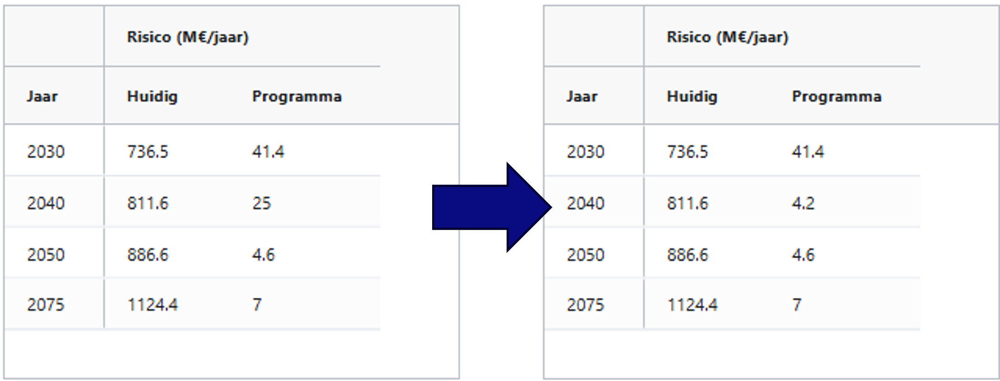

Analyse op gebiedsniveau
=========================

Met het scherm voor een `Analyse op gebiedsniveau` kan voor 1 of meerdere trajecten een programmering worden gemaakt van dijkversterkingsprojecten. Doel daarbij is om inzicht te geven in de kosten (in de tijd) en het verloop van het risico/afstand tot de norm. De basis van de analyse zijn veiligheidsrendementberekeningen. Er zijn twee hoofdpagina's: `Definitie van projecten` en `Resultaten op gebiedsniveau` die hieronder worden toegelicht.

Definitie van projecten
------------------------

Importeren van berekeningen
~~~~~~~~~~~~~~~~~~~~~~~~~~~
Deze pagina is als eerste zichtbaar bij het openen van het scherm voor een analyse op gebiedsniveau. De eerste stap is om 1 of meerdere dijktrajecten te laden (d.m.v. bij de analyse op trajectniveau opgeslagen json-bestanden). Er kan 1 json-bestand per traject worden gebruikt. Wanneer een nieuwe wordt geladen, wordt de oude vervangen.

Het is ook mogelijk om een compleet json-bestand inclusief projectdefinities te laden, dat wordt toegelicht in de volgende paragraaf.[ref?]

In het deel `Geimporteerde berekeningen` is zichtbaar voor welk traject welke berekening beschikbaar is. In dit scherm wordt alleen gerekend met de resultaten van veiligheidsrendement, niet van de berekening op basis van doorsnede-eisen.

.. tip::
    Het is mogelijk om het json-bestand van een andere berekening te laden, ook wanneer er al projecten zijn gedefinieerd. Let dan wel op dat de vakindeling van beide berekeningen hetzelfde is, anders kunnen de projecten niet meer worden gekoppeld aan het traject.

Aanmaken van projecten
~~~~~~~~~~~~~~~~~~~~~~~

Bij `Overzicht projecten` kan een nieuw project worden aangemaakt, of een bestaand project worden aangepast of verwijderd. Dit wordt gedaan door een (unieke) naam toe te voegen voor het project, en dijkvakken te selecteren die onder dit project vallen. Daarnaast moet een startjaar en eindjaar worden opgegeven: de kosten van het project (conform veiligheidsrendement) worden uitgesmeerd over deze periode.

.. tip:: 
    Wanneer een dijkvak wordt geselecteerd wat al in een ander project voorkomt geeft dit een foutmelding. Het is niet mogelijk om een dijkvak in meerdere projecten te hebben. Het vak moet dan eerst uit het andere project worden verwijderd. Of het andere project kan volledig worden verwijderd met de knop 'Verwijder project'.

In onderstaande figuur is een voorbeeld van het maken van een project weergegeven. 

In dit voorbeeld is voor het project `Test project` een drietal dijkvakken geselecteerd in traject 10-3 (zie pop-up). Het project start in 2025 en eindigt in 2031. Wanneer nu op `Maak project` wordt geklikt wordt het project toegevoegd aan de lijst met projecten, óf wordt een foutmelding gegeven als de betreffende vakken al onderdeel zijn van een ander project. Op deze wijze kunnen meerdere projecten worden gedefinieerd. 

Weergave van trajecten en projecten
~~~~~~~~~~~~~~~~~~~~~~~~~~~~~~~~~~~

Aan de rechterkant is een kaart zichtbaar met daarop de geladen trajecten en daar kunnen 4 weergaven worden gekozen die kunnen helpen bij het definieren van projecten. 
Er zijn 4 weergavemogelijkheden:

* Trajecten
* Projecten
* Faalkans 2025
* VR index

Met de keuze voor `Trajecten` worden de geladen trajecten weergegeven, én wordt in rood weergegeven welke dijkvakken zijn geselecteerd bij het project wat wordt aangemaakt. In onderstaand voorbeeld zijn bijvoorbeeld de dijkvakken 1, 2 en 4 op traject 10-3 in rood weergegeven.

Door te kiezen voor `Projecten` worden alle gedefinieerde projecten overzichtelijk weergegeven. 

In bovenstaand voorbeeld zijn de gedefinieerde projecten te zien. Daarbij is ook te zien welke dijkvakken geen onderdeel zijn van een dijkversterking. Wanneer dijkvakken niet worden toegedeeld aan een project worden deze niet versterkt, en blijven dus op hun huidige veiligheidsniveau. Dit kan worden weergegeven door de weergave `Faalkans 2025` te selecteren. Daarbij wordt voor elk vak de faalkans weergegeven in het jaar 2025. Wanneer zwakke vakken niet versterkt worden betekent dit dat het traject onveilig blijft. Het is dus van belang om dergelijke vakken toe te voegen aan een van de projecten om het risico effectief te verlagen.

Die effectiviteit kan ook in beeld worden gebracht middels de `VR index`. In die weergave wordt een index berekend die het veiligheidsrendement per dijkvak weergeeft. Een voorbeeld is te zien in onderstaande figuur.

Hierbij geldt dat hoge waarden corresponderen met een hoog veiligheidsrendement: in dit geval bijvoorbeeld de dijkvakken in de buurt van Hasselt. Zwarte delen zijn delen die niet worden versterkt (in principe hebben deze een heel laag veiligheidsrendement). Omdat het veiligheidsrendement zeker voor de zwakke vakken sterk wordt bepaald door het risico zullen vakken met een hoge VR index meestal ook een hoge faalkans hebben. De wijze van berekenen van de VR index is in hoofdstuk 4 van de handreiking nader toegelicht.

Resultaten op gebiedsniveau
---------------------------

Overzicht van projecten
~~~~~~~~~~~~~~~~~~~~~~~

Wanneer alle gewenste projecten zijn gedefinieerd kan de effectiviteit van het programma worden geanalyseerd in het scherm `Resultaten op gebiedsniveau`. Een overzicht daarvan is gegeven in onderstaande figuur.

In het midden is een kaart zichtbaar met daarop de gedefinieerde projecten. Daaronder is een tabel weergegeven met de projecten, en een aantal eigenschappen: aantal dijkvakken, start- en eindjaar, lengte van de versterking en de kosten op basis van de veiligheidsrendementberekening. De kolommen `Faalkans beoordeling` en `Faalkans na versterking` geven de faalkans in het jaar 2025 weer voor de huidige situatie en na uitvoeren van de versterkingsmaatregelen. Let op: het betreft hier enkel de faalkans van de dijkvakken die onderdeel zijn van het project! 

Informatie over faalkans, risico en cashflow
~~~~~~~~~~~~~~~~~~~~~~~~~~~~~~~~~~~~~~~~~~~~

In het rechterdeel van het scherm wordt informatie gegeven over de kosten van de verschillende projecten in de tijd. Daarbij worden kosten evenredig verdeeld tussen start- en eindjaar. Dit kan helpen bij het bepalen van de capaciteit die nodig is voor de uitvoering van de projecten, en de cashflow die daarbij hoort. Door te schuiven met projecten kan de cashflow beter verdeeld worden in de tijd. In dit geval is er bijvoorbeeld een gat tussen 2031 en 2035, wat zou kunnen worden opgevuld door 1 van de projecten tussen 2025 en 2031 naar achteren te schuiven, of een van de andere projecten naar voren te halen.

In de figuur er onder kan per traject worden gekeken wat het verloop van de veiligheid in de tijd is. Daarbij kan worden gekozen voor een weergave in betrouwbaarheidsindex, trajectfaalkans, afstand tot de norm (hoog getal = onvoldoende veilig) of 2 indicatoren voor het overstromingsrisico. Bij het kiezen voor `Risico` wordt het (niet-verdisconteerde) overstromingsrisico per jaar weergegeven. Bij de `Risico factor` wordt dit gedaan door het risico te delen door het risico wanneer de trajectfaalkans gelijk is aan de ondergrens. In onderstaande figuur is als voorbeeld de faalkans in de tijd weergegeven.

Te zien is dat de faalkans stapsgewijs afneemt tot deze uiteindelijk voor alle trajecten in 2050 voldoet aan de ondergrens. Tegelijkertijd is er nog ruimte om eerder aan de faalkanseis te voldoen. Dit kan bijvoorbeeld door de twee laatst uitgevoerde projecten eerder uit te voeren. 

Linksboven wordt voor de huidige programmering een overzicht gegeven van de totale versterkingskosten en het risico in de jaren 2030, 2040, 2050 en 2075. Dat laatste wordt berekend door het risico van de afzonderlijke trajecten op te tellen. Er wordt dus aangenomen dat het risico van de trajecten onafhankelijk is.

Wat blijkt uit deze programmering is dat het risico relatief lang vrij hoog blijft. Een mogelijkheid om dit te verlagen is om de als laatste uitgevoerde projecten naar voren te halen (voor 2040). In onderstaande figuur is te zien dat dit leidt tot een fors lager risico in 2040: van 25 M€/jaar naar 4.2 M€/jaar.

    
    Links risico bij de originele programmering, rechts het risico bij de aangepaste programmering