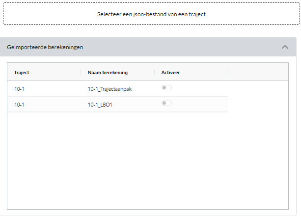
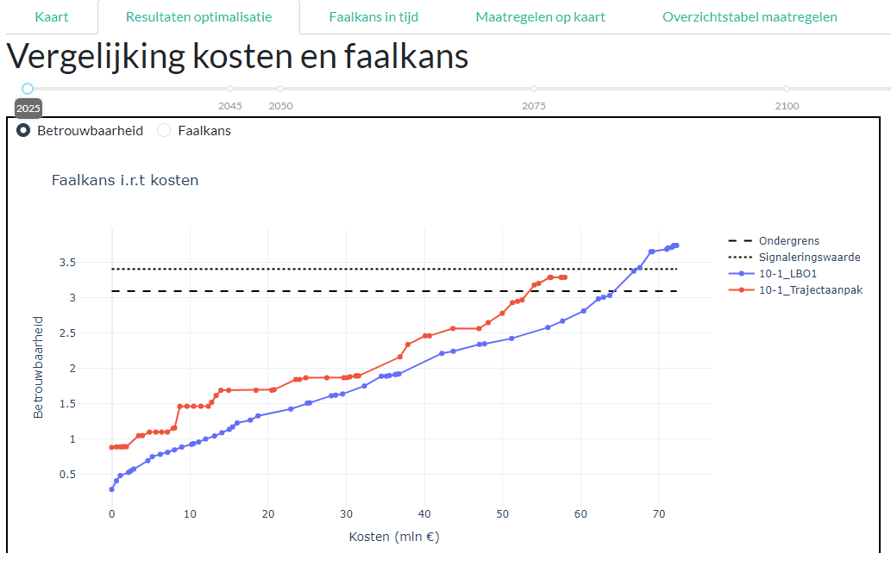
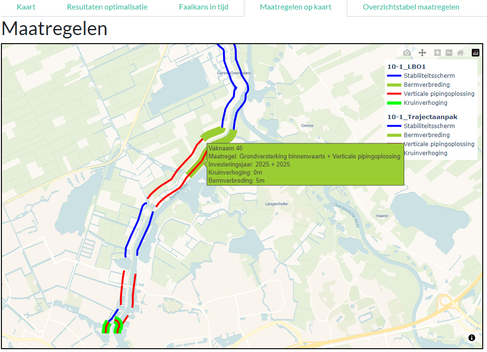
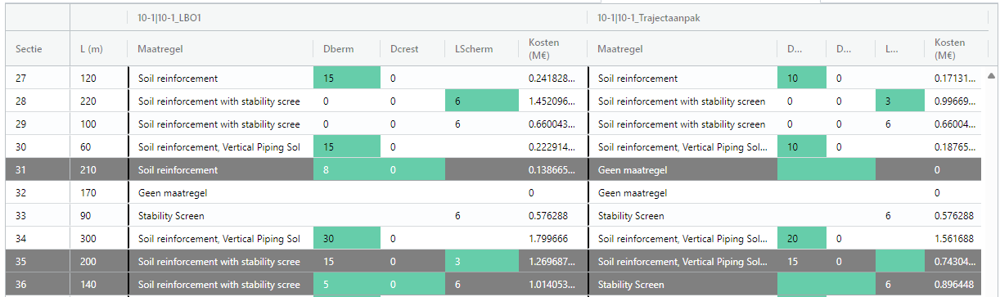

Vergelijken van optimalisatieberekeningen
=========================================

Via het scherm ``Vergelijken berekeningen`` kunnen verschillende berekeningen van hetzelfde (of een ander) traject met elkaar worden vergeleken. Dit kan worden gedaan door 2 of meer ``json``-bestanden die geexporteerd zijn uit de `Analyse per traject<../WeergevenResultaten.html#selectie-instellingen-database>`_ te selecteren. Deze zijn vervolgens zichtbaar in het linkerpaneel.

.. warning::
    Het is mogelijk om berekeningen van verschillende trajecten te vergelijken, maar dit kan leiden tot onverwachte resultaten. Het is daarom aan te raden om enkel berekeningen van hetzelfde traject met elkaar te vergelijken, dat is in principe waar deze pagina voor is gemaakt.

Bovenin het rechterpaneel kan een aantal weergaves worden geselecteerd. Deze weergaves worden hieronder kort toegelicht.

Resultaten optimalisatie
------------------------
Met het scherm ``Resultaten optimalisatie`` kunnen de resultaten van de optimalisatieberekeningen worden vergeleken. Hierbij worden de resultaten van de veiligheidsrendementberekeningen van de verschillende invoerbestanden weergegeven in termen van kosten en betrouwbaarheid/faalkans. Dit is met name zinvol om 2 scenario's (bijv. voor verschillende maatregelen, of verschillende beoordelingsinvoer) te vergelijken op resulterende faalkans en kosten.

.. tip::
    Wanneer er veel verschillende invoerbestanden worden geladen kan de figuur wat onoverzichtelijk worden. Door in de legenda op een van de items te klikken kan deze worden uitgezet. Dit kan helpen om de figuur overzichtelijk te houden en bijvoorbeeld alleen de gewenste lijnen/cases te exporteren.

Faalkans in tijd
----------------
Met het scherm ``Faalkans in tijd`` kan de trajectfaalkans/-betrouwbaarheid van verschillende cases worden weergegeven. Dit kan nuttig zijn bij het bepalen van de snelheid van toename van de faalkans richting de toekomst, en zo extra inzicht geven in wat bijv. een effectieve tijdshorizon voor de versterking is.

Maatregelen op kaart
-------------------
In het scherm ``Maatregelen op kaart`` kunnen de maatregelen van verschillende cases worden weergegeven per dijkvak. Daarbij worden twee cases die geselecteerd worden met de `Activeer`-knop naast elkaar weergegeven. De eerste case wordt aan de waterkant van het traject weergegeven, de tweede aan de landzijde. Een voorbeeld is gegeven in onderstaande figuur.

Met deze kaart kan eenvoudig inzicht worden gekregen in de verschillen tussen de maatregelen van verschillende cases. Zo verkrijgt men een beeld van de invloed van verschillende aannames in scenario's op het type maatregel. 

.. tip::
    Omdat de lijnen een verschuiving betreffen van het originele traject kan de weergave bij korte dijkvakken en veel (scherpe) bochten soms wat merkwaardig ogen (zie hieronder voor een voorbeeld). Door met de muis over de vakken te gaan wordt meer informatie weergegeven wat bij onduidelijkheid de vergelijking kan vergemakkelijken.

    .. image:: img/vergelijken_berekeningen_maatregelen_weergavefout.png
        :width: 80%
        :align: center

Overzichtstabel maatregelen
---------------------------
In het scherm ``Overzichtstabel maatregelen`` wordt een tabel weergegeven met voor 2 berekeningen de maatregelen per dijkvak. Daarbij kan met de activeerknoppen in het linkerpaneel worden gekozen welke berekening moet worden weergegeven. Een voorbeeld is gegeven in onderstaande figuur.

Van boven naar beneden worden op volgorde de verschillende dijkvakken weergegeven. Wanneer een regel als geheel grijs is betekent dit dat er een ander type maatregel is gekozen. Wanneer een cel groen is, betekent het dat de dimensie van de maatregel verschilt. In het voorbeeld is te zien dat op dijkvak 27 in beide berekeningen voor een grondversterking wordt gekozen. In de eerste berekening met 15 meter berm, in de tweede met 10 meter berm. Op dijkvak 31 wordt in berekening 1 een berm aangelegd (8 meter) en in berekening 2 geen maatregel getroffen. In de tabel worden de volgende kolommen weergegeven.

.. csv-table:: Kolommen in tabel met overzicht maatregelen
  :file: tables/kolommen_maatregeltabel.csv
  :widths: 15, 50
  :header-rows: 1

Volgorde dijkvakken
-------------------
In het scherm ``Volgorde dijkvakken`` kan de volgorde van de dijkvakken in de optimalisatie worden weergegeven. Daarbij wordt voor beide berekeningen aangegeven welke dijkvakken als eerste in de optimalisatievolgorde voorkomen. Dit kan helpen bij het bepalen of een ander rekenscenario leidt tot een andere optimale investeringsvolgorde en dus een andere optimale scope van dijkvakken met het hoogste rendement. 