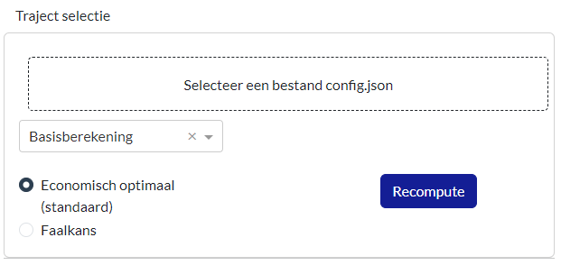
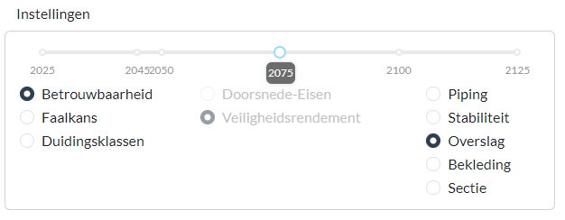
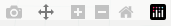
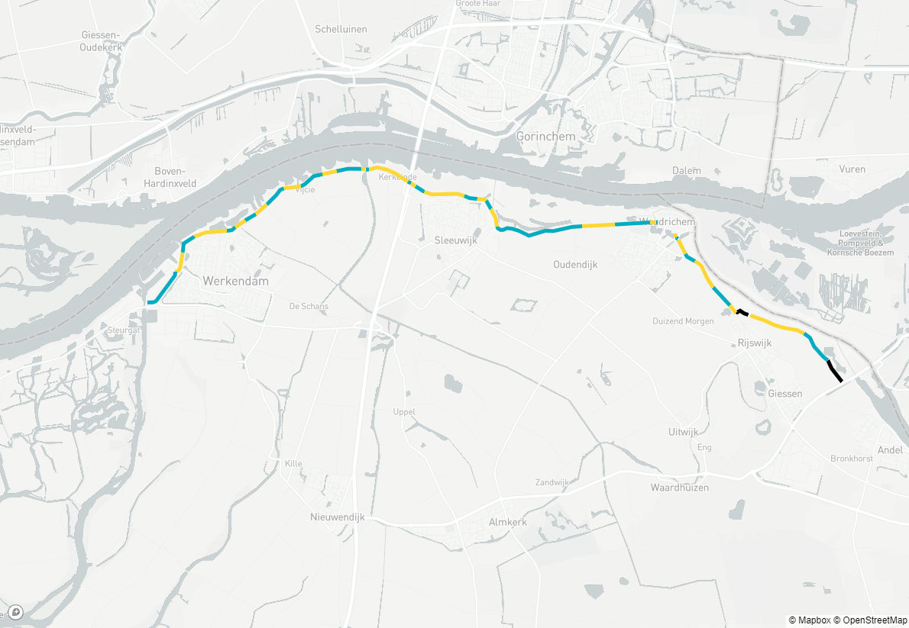
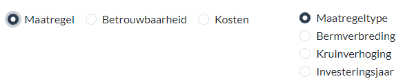
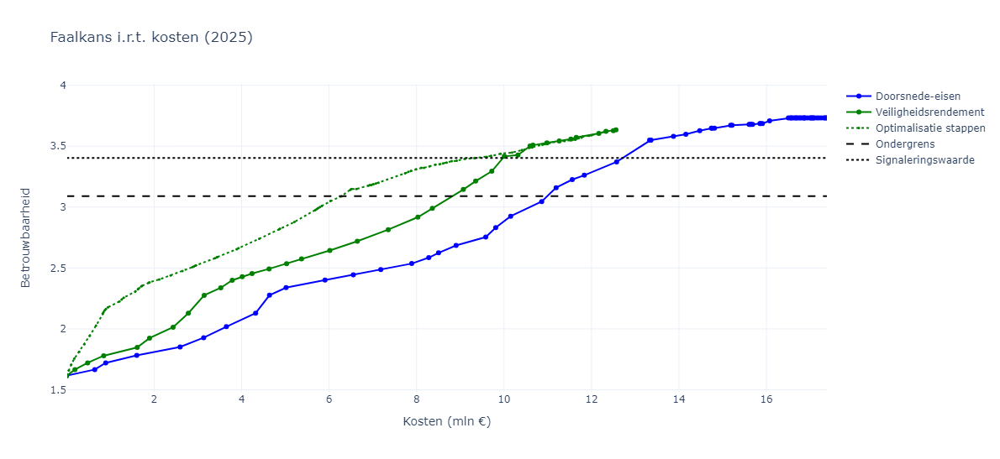
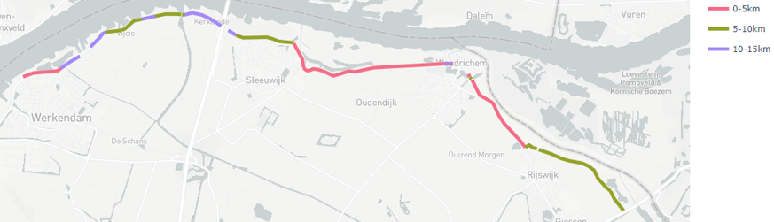
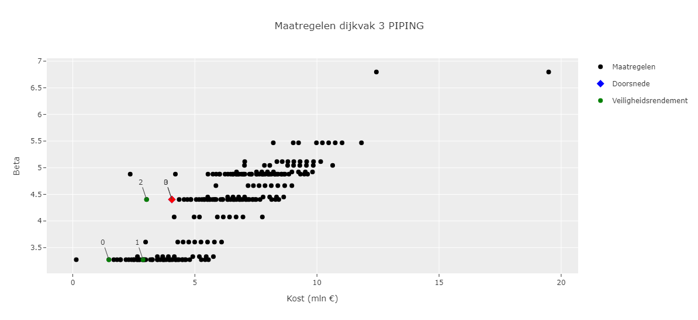

Weergeven van resultaten op trajectniveau
=============================================
Wanneer vanuit het hoofdscherm wordt gekozen voor de pagina `Analyse per traject` kom je op de volgende pagina terecht. Hierin zijn een linkerpaneel en een rechterpaneel zichtbaar. In de volgende paragrafen worden deze nader toegelicht. 

.. figure:: img/Dashboard_inputoutput.png 

Gebruik van het linkerpaneel
----------------------------

Het linkerpaneel wordt gebruikt voor input van gegevens en algemene instellingen van de figuren en kaarten. Op het grote vlak rechts worden de resultaten weergegeven.

In het linkerpaneel worden 2 delen weergegeven:

- Selectie & instellingen database
- Instellingen weergave

Selectie & instellingen database
~~~~~~~~~~~~~~~~

Bij het gedeelte `Selectie & instellingen database` kan een traject worden geladen. Dat kan via de knop `Importeer een configuratiebestand (config.json)`, of door een `config.json` bestand er heen te slepen. Wanneer dit is gedaan worden de resultaten van het traject geladen en weergegeven in het rechterpaneel. Afhankelijk van de grootte van het traject kan dit even duren, in het tabblad in de browser wordt dan `Updating...` weergegeven. Wanneer de vakindeling verschijnt op het startscherm is het traject geladen.

.. tip:: 
    Voor het openen moet in het config.json bestand de padnaam naar de database worden gecontroleerd. Deze verwijzing moet kloppen, en het is belangrijk dat deze in het volgende format in de json staat ``"database_path": "C:/MijnDatabase"``. Dus met forward-slashes en zonder afsluitende /.

Met het dropdown menu kan vervolgens de gewenste berekening worden geselecteerd. Alle berekeningen in de database worden hier automatisch weergegeven. Bij het selecteren van een andere berekening zullen de resultaten opnieuw geupdatet moeten worden (met de knop `Ververs resultaten`).

De laatste optie is het selecteren van ofwel `Economisch optimaal`, ofwel `Faalkans`. Bij de optie `Economisch optimaal` worden de resultaten van de economisch optimale maatregelen weergegeven. In de VRTOOL wordt een hele reeks maatregelen doorgerekend, tot de kosten-batenverhouding kleiner is dan 0.1. Het economisch optimum, de combinatie van maatregelen met minimale totale kosten (versterking + risico) ligt dus al eerder dan dit punt (rond B/C=1). Met deze optie wordt gekozen welke maatregelen moeten worden meegenomen in de weergave. Met `Economisch optimaal` zijn dat alle maatregelen tot het punt dat de totale kosten minimaal zijn.

In sommige gevallen is het wenselijk om de maatregelen weer te geven die voldoen aan een bepaalde kans in een bepaald jaar. Dit kan worden gedaan door `Faalkans` te selecteren. Hierbij kan een betrouwbaarheidsindex (omgerekende faalkans) worden ingevoerd samen met een jaar. Vervolgens wordt het optimalisatiepad 'afgekapt' op het punt waarbij de trajectfaalkans in het opgegeven jaar kleiner is dan de opgegeven faalkans. Door op `Ververs resultaten` te klikken kunnen de resultaten worden geupdatet.

Exporteren van resultaten
~~~~~~~~~~~~~~~~~~~~~~~~~

In het laatste deel van het gedeelte `Selectie & instellingen database` kunnen de resultaten wordeng exporteert in JSON formaat. Hiervoor kan een bestandsnaam worden ingevoerd en op `Opslaan` worden geklikt. Met dit json-bestand kunnen de resultaten worden geimporteerd in bijv. het scherm `Vergelijken berekeningen` en voor analyses op gebiedsniveau. Zo kunnen resultaten voor bijvoorbeeld een specifieke faalkanseis in een specifiek jaar bewaard worden en later hergebruikt.

.. tip::
    Sla de berekeningen na analyse op onder een goed verklaarbare naam. De gegenereerde json-bestanden zijn belangrijk voor vervolgstappen in de analyse. Let daarbij op dat iedere andere instelling voor de faalkans in een specifiek jaar of voor het economisch optimum leidt tot een verschillend bestand.

Instellingen weergave
~~~~~~~~~~~~~~~~~~~~
Het gedeelte `Instellingen weergave` kan worden gebruikt om de weergave van de resultaten aan te passen. Bovenaan staat een slider, de punten hierop zijn alle jaartallen die voorkomen in de database. Door de slider te verschuiven kan bijvoorbeeld worden gekeken naar de faalkans in verschillende jaren. Wanneer de slider tussen twee punten in staat, wordt de faalkans van het voorgaande jaar waarvoor resultaten zijn weergegeven (dus wanneer 2025 en 2045 beschikbaar zijn wordt bij het selecteren van 2043 het resultaat van 2025 weergegeven.

Onder de slider staan links 3 opties voor de weergave van kansen: Betrouwbaarheid, faalkans en duidingsklassen. Hiermee kan de weergave van kansen worden aangepast. NB: de duidingsklassen zijn conceptueel en kunnen beter niet gebruikt worden. 

Daarnaast zijn de opties `Doorsnede-eisen` en `Veiligheidsrendement` gegeven, waarmee kan worden gewisseld tussen de referentievariant en de variant op basis van veiligheidsrendement. Met de opties rechts kan bij het weergeven van de faalkans/betrouwbaarheid worden gewisseld tussen de verschillende mechanismen.

Tabbladen in het dashboard
--------------------------

Op het rechterpaneel is een zestal tabbladen zichtbaar. Deze tabbladen geven inzicht in de rekenresultaten. Van links naar rechts volgen ze grofweg de volgorde van de berekening:

- *Overzicht* geeft een overzicht van de dijkvakken
- *Beoordelingsresultaten* geeft de faalkansen van de huidige situatie
- *Versterkingsmaatregelen* geeft op trajectniveau inzicht in de maatregelen per dijkvak.
- *Resultaten optimalisatie* geeft inzicht in de optimalisatie in termen van kosten en trajectfaalkansen.
- *Prioriteringsinformatie* geeft op hoog niveau inzicht in de urgentie van de verschillende dijkvakken.
- *Maatregelen* biedt de mogelijkheid om de maatregelen per dijkvak nader te bekijken.

De meeste van deze pagina's geven resultaten op kaart weer. Rechtsboven in de kaart wordt een aantal opties weergegeven. Daarmee kan de kaart worden geexporteerd als .png, en kan bijvoorbeeld worden versleept. In de legenda kunnen lagen worden aan en uitgezet door er op te klikken. Zo kan bijvoorbeeld een kaart worden gemaakt met alleen specifieke maatregelen, of alleen versterkingen in een bepaald jaar.

Overzicht
~~~~~~~~~
Op de overzichtspagina (direct zichtbaar bij opstarten) wordt een overzicht gegeven van de dijkvakken. In blauw en geel zijn dijkvakken weergegeven die mee zijn genomen in de analyse. Zwart zijn de dijkvakken die uit staan in de berekening. Op deze pagina kan gecheckt worden of de invoer op vakniveau klopt: zijn de vakgrenzen goed ingevoerd, zijn de vakken die uit staan in de berekening correct?

Beoordelingsresultaten
~~~~~~~~~~~~~~~~~~~~~~
Op de pagina `Beoordelingsresultaten` worden de faalkansen van de huidige situatie weergegeven. Hierbij kunnen in de instellingen links verschillende mechanismen en jaren worden gecontroleerd. Standaard worden de faalkansen als betrouwbaarheidsindex (:math:`\beta`) weergegeven. Er kan ook worden weergegeven als faalkans per jaar of duidingsklasse. De duidingsklassen zijn conceptueel en kunnen beter niet gebruikt worden.

Bij het analyseren van een berekening is het belangrijk om eerst goed naar de beoordelingsresultaten te kijken en deze te vergelijken met de verwachting en de wettelijke beoordeling. Binnen de veiligheidsrendementmethode worden immers faalkansen opnieuw uitgerekend, en voor goede duiding van de resultaten is het van belang om eventuele verschillen scherp in beeld te hebben. De inhoudelijke modellering van de faalmechanismen is terug te vinden in de sectie `Faalkansmodellen <../../Achtergronden/Faalkansmodellen/index.html>`_.

Versterkingsmaatregelen
~~~~~~~~~~~~~~~~~~~~~~~
Op de pagina versterkingsmaatregelen kunnen de resultaten van de optimalisatie en de referentievariant worden bekeken. Door te wisselen tussen Doorsnede-Eisen en Veiligheidsrendement in het linkerpaneel kan voor 1 van beiden worden gekozen. Bovenin het scherm is een aantal instellingen te zien. 

Met de knoppen linksboven kan gewisseld worden tussen weergaven van het type maatregel, de betrouwbaarheid na versterking, en de kosten. Rechts worden, afhankelijk van de gemaakte keuze wisselende knoppen weergegeven. Een overzicht van de combinaties en wat wordt getoond is gegeven in onderstaande tabel.

.. csv-table:: Opties weergave versterkingsmaatregelen
    :file: tables/opties_versterking.csv
    :header-rows: 1
    :widths: 20, 20, 40

Opgemerkt moet worden dat bij de weergave van de maatregelen de slider ook werkt: wanneer bijv 2025 wordt geselecteerd worden alle maatregelen tot en met 2025 weergegeven, wanneer 2050 wordt geselecteerd worden alle maatregelen tot dat jaar weergegeven.

Resultaten optimalisatie
~~~~~~~~~~~~~~~~~~~~~~~~
Op de pagina `Resultaten optimalisatie` worden de resultaten van de optimalisatie vergeleken met die van de referentievariant. Op de verticale as wordt de trajectkans weergegeven, voor de horizontale as kan worden gekozen voor de kosten (LCC) ofwel de versterkte lengte. 

In de weergave zijn 3 lijnen zichtbaar: een groene stippellijn, een groene doorgetrokken lijn en een blauwe doorgetrokken lijn.
De groene stippellijn geeft het pad van de optimalisatie weer: elke stap is een maatregel die wordt genomen. De bepaling hiervan is nader toegelicht bij de achtergronden van het `algoritme <../../Achtergronden/Optimalisatie/Veiligheidsrendement.html>`_ en in onderstaand kader.

    **Weergave van het optimalisatieresultaat**

    De groene stippellijn geeft een weergave van de volgorde van optimale maatregelen. Een voorbeeldresultaat is weergegeven in onderstaande tabel.

    .. csv-table:: Voorbeeld optimalisatiepad
        :file: tables/voorbeeld_optimalisatiepad.csv
        :header-rows: 2
        :widths: 10, 10, 10, 10, 20, 20, 20

    In de stippellijn zijn kosten dus incrementeel: bij stap 4 is er op dijkvak 2 3.3 miljoen € geinvesteerd. De lijn geeft de relatie tussen de som van de kosten (of de versterkte lengte) en de trajectfaalkans weer. De lijn stopt bij het economisch optimum, of bij een opgegeven faalkans. Bij de instelling `economisch optimaal` wordt stap 5 dus niet weergegeven omdat deze maatregel een kosten-batenverhouding ver onder de 1 heeft. Wanneer bijvoorbeeld bij faalkans 1/5000 wordt gekozen wordt stap 4 ook buiten beschouwing gelaten omdat bij stap 3 al aan deze faalkans wordt voldaan.

    Bij de groene doorgetrokken lijn zijn de maatregelen gecombineerd per dijkvak. Voor elk dijkvak worden de stappen van de optimalisatie gecombineerd tot een maatregel. Het eerste dijkvak is het vak wat als eerste voorkomt in het optimalisatiepad, het tweede dijkvak is het vak wat als tweede voorkomt, enzovoorts. In bovenstaand voorbeeld wordt dus (uitgaande van het economisch optimum) eerst een lijnstuk gemaakt met 3.4 M€ aan kosten op dijkvak 1, horend bij een grondversterking met bermbreedte 10 meter en kruinverhoging van 1 meter. Daarna wordt een lijnstuk toegevoegd met 3.3 M€ kosten voor dijkvak 2, horend bij een grondversterking met bermbreedte 8 meter en kruinverhoging van 50 centimeter. De trajectfaalkans bij het eerste punt wordt dan herberekend: bijvoorbeeld na versterking van dijkvak 1 met deze maatregel zal de faalkans kleiner zijn dan 1/1000, maar geen 1/10000. De stippellijn ligt bij een figuur met faalkans en kosten altijd onder of op de doorgetrokken lijn: bij de stippellijn is de faalkans altijd maximaal zo groot als bij de doorgetrokken lijn bij gelijke kosten.

De resultaten van de referentievariant op basis van doorsnede-eisen worden weergegeven door de blauwe lijn. Hierbij wordt in de berekening telkens voor het zwakste vak de maatregel berekend die aan de ontwerpeisen voldoet (zie ook de `achtergronden <../../Achtergronden/Optimalisatie/Referentieaanpak.html>`_). De volgorde van vakken is dus vanaf het zwakste vak naar het sterkste vak. Vaak komt voor dat de lijn doorloopt tot voorbij de norm: dit is omdat de maatregelen die worden genomen puur op basis van doorsnede-eis worden bepaald en er niet naar de trajecteis wordt gekeken. In principe wordt bij versterken op basis van doorsnede-eisen echter de gehele lijn "uitgevoerd".

Prioriteringsinformatie
~~~~~~~~~~~~~~~~~~~~~~~
Op de pagina `Prioritering` wordt samengevat wat de meest aantrekkelijke volgorde van versterken is. Bij veiligheidsrendement worden de vakken gesorteerd op de volgorde dat ze voorkomen in het optimalisatiepad. Bij doorsnede-eisen worden de vakken gesorteerd op basis van het veiligheidstekort. In de figuur wordt weergegeven wat de eerste 5 kilometers zijn die versterkt moeten worden, de kilometers 5-10, enzovoorts. Dit geeft een beeld van de ruimtelijke samenhang van de opgave en kan daarmee input zijn voor het definieren van de scope van een project.

    Voorbeeld van de prioriteringsinformatie zoals weergegeven in het dashboard.

Maatregelen
~~~~~~~~~~~
Op de pagina `Maatregelen` kunnen de beschikbare maatregelen per dijkvak worden bekeken. Na het selecteren van een dijkvak wordt voor alle beschikbare maatregelen de kosten en de faalkans/betrouwbaarheid weergegeven. Met de instellingen in het linkerpaneel kan dit voor een specifiek mechanisme, of voor alle mechanismen samen worden gedaan. De zwarte puntjes zijn de verschillende maatregelen die beschikbaar zijn, in groen zijn de maatregelen weergegeven die in het optimalisatiepad van veiligheidsrendement voorkomen. De blauwe en rode diamanten geven de uiteindelijke maatregelen weer die worden genomen in de referentievariant en de economisch optimale variant. 

    Voorbeeld van de maatregelen voor een geselecteerd dijkvak voor faalmechanisme piping

.. tip::
    In deze weergave geldt voor de gezamenlijke faalkans typisch dat de groene puntjes op het 'front' van de wolk met zwarte punten liggen. Maatregelen met lage kosten en een lage faalkans (hoge :math:`\beta` ) 
    worden gekozen in de optimalisatie. Wanneer een specifiek mechanisme wordt geselecteerd hoeft dit niet het geval te zijn: wanneer bijvoorbeeld de faalkans voor overslag wordt weergeven kosten bermen wel geld, maar hebben deze geen effect op de faalkans voor overslag. In het voorbeeld is er te zien dat er een aantal maatregelen zijn die een lagere pipingfaalkans hebben, deze scoren echter op andere mechanismen minder gunstig en worden daarom toch niet gekozen. 
