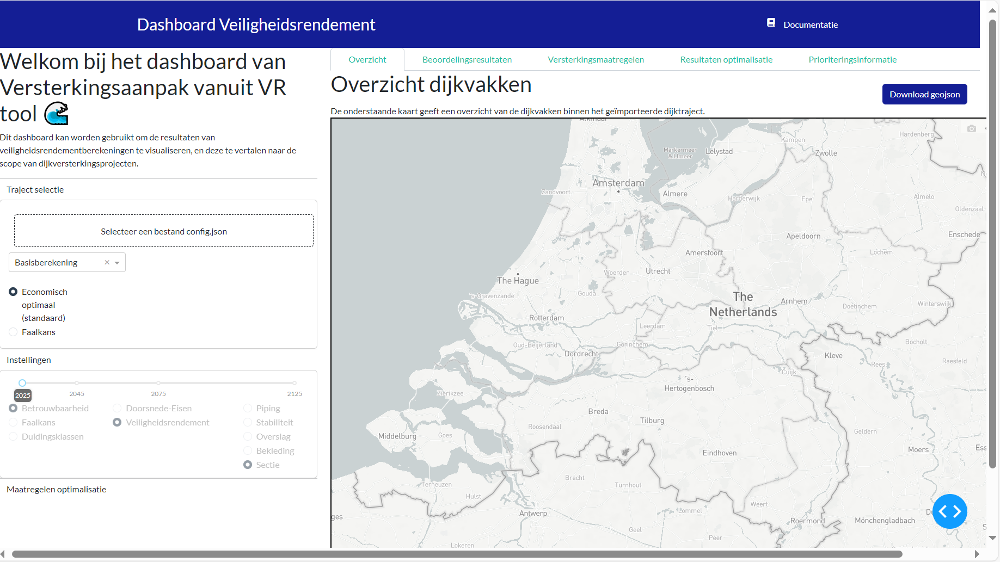
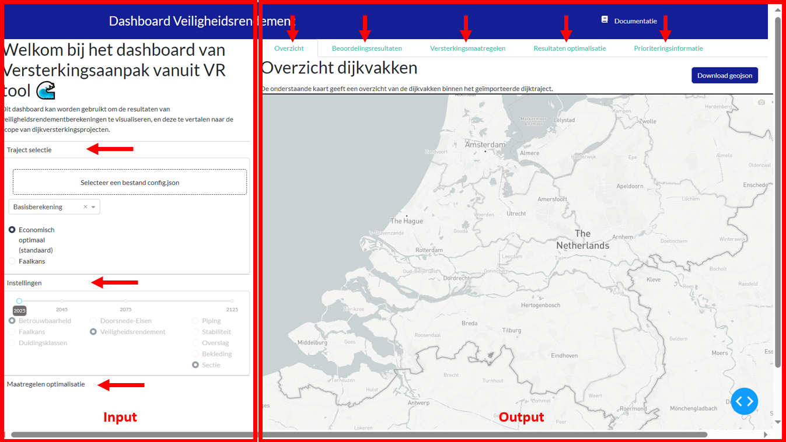

Weergeven van resultaten in het dashboard
=============================================
Hier een aantal beschrijvingen van de verschillende figuren en tabbladen opnemen. 

1 hoofdstuk van maken:

*Tekst komt nog hier*

Deze handleiding geeft een overzicht van wat er in het dashboard te zien is en worden de verschillende functionaliteiten verder uitgelegd. 

- deze handleiding neemt je mee in hoe het dashboard gebruikt kan worden
- linker kant input, en rechter kant output
 -plaatje input-
3 thema's:
- selecteren van een traject
- instellingen waarmee je input aangeeft
- tabbladen, verschillende tabbladen waar we naar verschillende dingen kijken

**Dashboard starten en introductie**
Run in Anaconda Prompt ``python -m src.index`` om het dashboard te starten. Het dashboard verschijnt nu automatisch in de browser. Mocht dit niet gebeuren, kopieer dan de url (http://127.0.0.1:8050/) en open deze in je browser.

*toevoegen hoe je van startpagina naar trajectpagina gaat*

Het dashboard ziet er nu als volgt uit:

Het dashboard kent een logische opbouw met aan de linkerkant alle input (Traject selectie, Instellingen en Maatregelen optimalisatie) en aan de rechterkant alle output (de tabbladen: Overzicht, beoordelingsresultaten, versterkingsmaatregelen, Resultaten optimalisatie, prioriteringsinformatie en *Maatregelen).

In de volgende paragrafen worden 

**Selecteren traject**

Omdat we tijdens de *Tutorial* gebruik hebben gemaakt van dijktraject 24-3, zullen we dit traject hier als voorbeeld gebruiken om resultaten mee weer te geven.

klik op ``Selecteer een bestand config.json`` en navigeer naar de folder met waar de gedownloade bestanden van dijktraject 24-3 zijn opgeslagen.

*NB. Deze bestanden zijn gedownload tijdens het doorlopen van de Tutorial. Mocht u deze stap zijn overgeslagen dan zijn deze bestanden te downloaden via deze [link](https://github.com/Deltares-research/VrtoolDocumentation/raw/main/vrtool_docs/Bestanden/Tutorial/24-3.zip). 

selecteer en open het ``config.json`` bestand. De resultaten worden nu geladen.

- Economisch optimaal 
- Faalkans

weergeven resultaten overkoepelend:
 - uitleg logische volgorde van tabbladen. 
 - aan en uitzetten labels in legenda
 - visualisatie of plot downloaden als .png (figuur)
 - uitleg hoe nu verder
**instellingen**

**tabbladen** 
verschillende tabbladen
- overzicht
- beoordelingsresultaten
- versterkingsmaatregelen
- Resultaten optimalisatie
- prioriteringsinformatie

**figuren opslaan geojson**