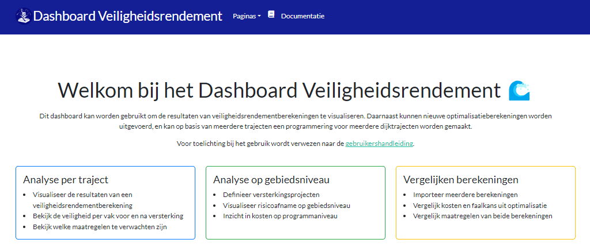

Werken met het dashboard
=======================================

Na het rekenen met de VRTOOL kan de database met resultaten worden geimporteerd in het dashboard. Met dit dashboard kunnen resultaten worden weergegeven en geanalyseerd, en kunnen nieuwe optimalisatieberekeningen met nieuwe instellingen worden uitgevoerd. Wanneer het dashboard wordt geopend verschijnt eerst de startpagina:

De 4 mogelijke pagina's in het dashboard zijn:

- `Weergeven van resultaten in het dashboard <WeergevenResultaten.html>`_
- `Berekeningen aansturen via het dashboard <BerekeningenMetDashboard.html>`_
- `Vergelijken van optimalisatieberekeningen <VergelijkenOptimalisatieberekeningen.html>`_
- `Programmeren van versterkingen op 1 of meerdere trajecten (volgt dit najaar) <ProgrammerenVersterkingen.html>`_

.. toctree::
   :hidden:   
   :maxdepth: 1

    Weergeven van resultaten in het dashboard <WeergevenResultaten>
    Berekeningen aansturen via het dashboard <BerekeningenMetDashboard>
    Vergelijken van optimalisatieberekeningen <VergelijkenOptimalisatieberekeningen>
    Programmeren van versterkingen op 1 of meerdere trajecten (volgt dit najaar) <ProgrammerenVersterkingen>
