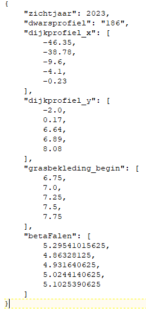

Bekledingen
===========

Voor bekledingen worden middels Hydra-Ring eerst golfrandvoorwaarden bepaald. Vervolgens worden deze voor de aanwezige gras- en steenbekleding middels DiKernel vertaald naar informatie over de faalkans van de bekleding. Achtergronden bij dit model zijn te vinden op de pagina `Betrouwbaarheid dijkbekleding <../../Achtergronden/Faalkansmodellen/Dijkbekleding.html>`__.

Structuur van het invoerbestand van de berekeningen voor dijkbekleding
-----------------------------------------------

De basis voor het genereren van berekeningen voor dijkbekledingen
is het invoerbestand ``Bekleding_default.csv``. Dit bestand is terug te vinden
in: ``C:\Veiligheidsrendement\.env\Lib\site-packages\preprocessing\default_files``.

Doel van de workflow is om voor elk dijkvak de relatie tussen faalkans en bekledingparameters af te leiden voor de jaren 2023 en 2100. 

Het invoerbestand ``Bekleding_default.csv`` heeft de volgende kolommen die ingevuld moeten worden:

Dit bestand heeft de volgende kolommen die ingevuld moeten worden:

.. csv-table:: Kolommen in invoerbestand bekledingen
  :file: tables/bekleding_kolommen.csv
  :widths: 15, 15, 50
  :header-rows: 1

.. topic:: Aandachtspunten

   * Het invoeren van `begin_bekleding` is niet verplicht, maar wel aan te bevelen. Deze wordt gebruikt om de minimale waterstand voor de berekeningen voor de belasting te bepalen.  Wanneer deze niet wordt ingevoerd wordt kan dit leiden tot onnodig veel (vaak onzinnige) berekeningen.

Het vullen van het invoerbestand
-------------------------------
Bij het vullen van het invulbestand moet bij elke doorsnede de benodigde informatie worden ingevuld. Daarbij moet voor elke locatie in `Bekleding.csv` een corresponderende waterstandsberekening zijn (dus zelfde doorsnedenaam) in het `HR_default.csv`-bestand. Bij de berekeningen voor de belasting wordt namelijk gebruik gemaakt van de waterstandsberekeningen.

De berekeningen voor bekledingen zijn tijdrovend door het grote aantal parametrisaties: het is aan te bevelen om bekledingen alleen mee te nemen wanneer de verwachting is dat dit relevant is voor het eindresultaat. Het is prima mogelijk om op een traject bijvoorbeeld voor 3 van de 40 vakken de bekleding mee te nemen. 

.. topic:: Overige aandachtspunten bij het vullen van het bestand

   * In de kolom `region` kan kust, meren of rivieren worden ingevuld. Dit is van belang voor de berekening van de grasbekleding omdat daarbij een verschillend waterstandsverloop wordt gehanteerd. Daaraan gerelateerd is het van belang om de `gws` en `getij_amplitude` op juiste wijze in te vullen. Voor de rivieren zijn beide parameters niet van belang.

   * De Steentoetsbestanden moeten het versienummer in de bestandsnaam hebben. Momenteel kunnen Steentoetsbestanden met de versies `17.1.2.1`, `17.1.1.1`, `19.1.1` en `20.1.1` worden gelezen. 

   * `begin_grasbekleding` moet overeenkomen met waar in de Steentoetsbestanden toplaagtype 20.0 (gras) begint. Deze moet in de bestanden ook zijn ingevuld anders kan het profiel niet goed worden geinterpreteerd.

Draaien van de workflow voor het bepalen van de faalkans van bekledingdelen
--------------------------------
Het berekenen van de faalkans van de bekleding bestaat uit 2 stappen:

* Het bepalen van de belasting op de bekleding middels Hydra-Ring

* Het bepalen van de faalkans van de bekleding middels DiKernel en een benaderingsmethode op basis van Steentoets

Het bepalen van de belasting gaat middels het volgende commando:
::

   python -m preprocessing bekleding_qvariant --config_file {config_bestand}

Let op: bij deze stap wordt voor elke doorsnede de belasting op de bekleding bepaald voor de jaren 2023 en 2100, voor golfklap, golfoploop en zuilen, en voor verschillende kansen en waterstanden. Dit is een tijdrovende stap, zeker voor meer complexe watersystemen. 

Na afronding van de berekening voor een locatie wordt een bestand `Qvar_{locatie}` weggeschreven in de map `output_map_bekleding`. 

.. tip:: 
   Mocht een berekening vastlopen of worden onderbroken dan kan de berekening niet opnieuw worden gestart omdat de `output_map_bekleding` leeg moet zijn. Het advies is om dan de resulterende `.json` bestanden elders op te slaan. Om tijd te besparen kan dan (tijdelijk) het `bekleding.csv` bestand worden aangepast door alle al berekende locaties te verwijderen. Met zorgvuldig kopieren en plakken kan zo flink tijd worden bespaard.

Na het uitvoeren van de berekeningen voor de belasting kan dit worden vertaald naar relaties tussen de hoogte van de overgang en de faalkans (voor graserosie buitentalud (GEBU)) en de faalkans van verschillende steenzettingen voor stabiliteit zetsteen (ZST). Dit gebeurt met het volgende commando:

::

   python -m preprocessing bekleding_gebu_zst --config_file {config_bestand}

Uitvoer van deze stap zijn bestanden `GEBU_{locatie}_{zichtjaar}` en `ZST_{locatie}_{zichtjaar}`. Een voorbeeld voor GEBU is in onderstaande figuur weergegeven. Hier is te zien dat voor elke `grasbekleding_begin` (d.w.z. hoogte van de overgang) een betrouwbaarheidsindex `betaFalen` wordt bepaald. 

Voor ZST ziet het bestand er vergelijkbaar uit, met het verschil dat voor elk steenbekledingdeel een aparte relatie wordt bepaald. Voor bekledingdelen die niet uit steenzettingen bestaan worden NaN waarden weggeschreven.

.. tip:: 
   Naast de bestanden wordt voor beide mechanismen een groot aantal figuren gegenereerd. Het is raadzaam deze door te nemen om te controleren of de berekeningen correct zijn uitgevoerd. De berekeningen voor bekledingen zijn complex, en daarmee ook foutgevoelig. Goede kwaliteitscontrole is daarom belangrijk.