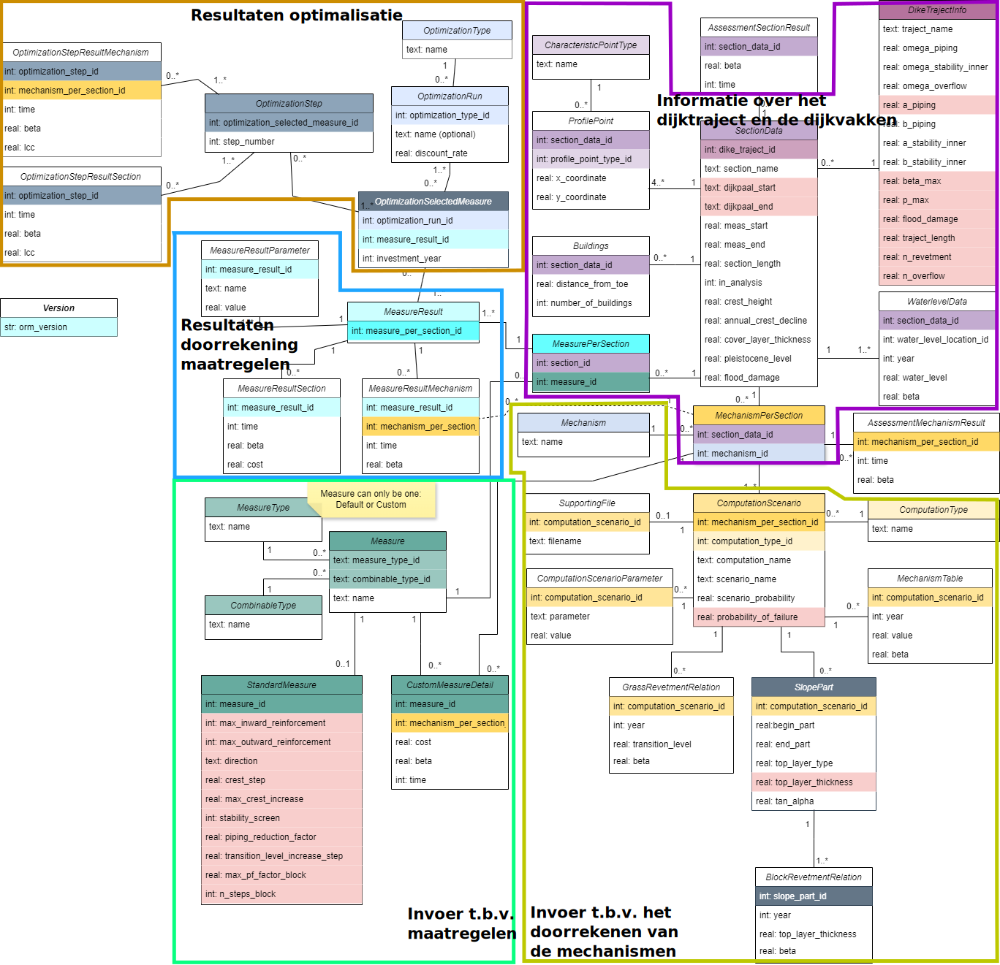

Genereren database
==================

Met de workflow ``maak_database`` kan een invoerdatabase voor de VRTOOL worden gegenereerd. Daarbij moeten de met de overige workflows gegenereerde bestanden als invoer worden opgegeven. Wanneer de voorgaande workflows niet goed zijn uitgevoerd is het niet mogelijk om een goede database te maken. 

.. tip::
   Als het niet lukt om een database te maken, kijk dan goed in het logbestand waar en of er fouten zijn opgetreden. Het logbestand wordt weggeschreven in de map waar de database wordt aangemaakt, en heeft de naam ``write_database.log``.
   
De workflow kan worden aangeroepen met het volgende commando:

::

   python -m preprocessing maak_database --config_file {config_bestand}

Een database kan alleen worden aangemaakt als de daarvoor bestemde directory leeg is. Naast een database wordt ook de geojson van de vakindeling weggeschreven, alsmede een config.json bestand voor de VRTOOL.

.. tip::
   Bij het maken van de vakindeling is een bestand weggeschreven met de naam `configuratie_maatregelen.csv` (zelfde map als de vakindeling). Met dit bestand kan worden geconfigureerd welke maatregelen in de database worden gekoppeld aan de dijkvakken. Door in dit bestand maatregelen op TRUE/FALSE te zetten kan zo bijvoorbeeld een buitenwaartse grondversterking worden meegenomen, of andere maatregelen worden uitgezet.

Structuur van de database
-------------------------
De structuur van de database is onderstaand weergegeven. De database is in SQLite formaat en kan worden geopend met bijvoorbeeld DB Browser for SQLite. Dit is te downloaden via `deze link <https://sqlitebrowser.org/>`_.

De structuur van de database is in onderstaande figuur weergegeven. De tabellen zijn grofweg op te delen in 5 delen:

* **Informatie over het dijktraject en de dijkvakken** hier staan algemene gegevens over het dijktraject, en de dijkvakspecifieke eigenschappen zoals bebouwing en het dijkprofiel.
* **Invoer t.b.v. het doorrekenen van de mechanismen** Dit gedeelte bevat gegevens over de mechanismen en rekenscenario's die moeten worden meegenomen in het bepalen van de (huidige) veiligheid. Daarnaast bijvoorbeeld ook de gegevens van de bekledingdelen, en eventuele verwijzingen naar stix-bestanden. Resultaten van de berekeningen hiermee zijn te vinden in de tabellen `AssessmentMechanismResult`en `AssessmentSectionResult`.
* **Invoer t.b.v. maatregelen** Hier zijn de basisparameters van de maatregelen te vinden, waarbij in CustomMeasureDetail de invoer van custom maatregelen staat (zie ook `Toevoegen van maatregelen <../Postprocessing/BerekeningenMetDashboard.html>`_).
* **Resultaten doorrekening maatregelen** Hier staan alle resulterende waarden van stap 2 van de VRTOOL berekening: kosten en betrouwbaarheid na het treffen van de verschillende maatregelen.
* **Resultaten optimalisatie** hier staan de resultaten van de optimalisatieberekening, zoals de totale lcc & het totale risico, en de volgorde van de maatregelen. 

