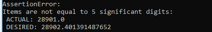

Vakindeling
===========

De basis van een veiligheidsrendementberekening is één vakindeling die
voor alle faalmechanismen gebruikt wordt. Als eerste wordt een
invoerbestand gevuld, waarna de workflow voor het maken van de
vakindeling kan worden gedraaid.

Structuur van het invoerbestand van de vakindeling
-----------------------------------------------

De basis voor het genereren van de vakindeling is het invoerbestand
``Vakindeling.csv``. Dit bestand is, ervan uitgaande dat de standaardinstallatieinstructies gevolgd zijn terug te vinden in:
``C:\Veiligheidsrendement\.env\Lib\site-packages\preprocessing\default_files``.Doel van deze workflow is een ``geojson`` bestand te creeren waarin alle vakken geografisch zijn gerepresenteerd. Dit bestand is ook invoer voor andere workflows. Dit bestand wordt in de mappenstructuur weggeschreven in ``intermediate_files\vakindeling\

Het invoerbestand ``Vakindeling.csv`` heeft de volgende kolommen die
ingevuld moeten worden:

.. csv-table:: Kolommen in invoerbestand vakindeling
  :file: tables/vakindeling_kolommen.csv
  :widths: 15, 15, 50
  :header-rows: 1

.. topic:: Aandachtspunten

  * Bij het opgeven van een koppeling in de kolommen ``piping``, ``stabiliteit`` etc. hoeven deze nog niet te zijn ingevuld voor deze workflow. Echter, bij het maken van de database moet het gegenereerde ``geojson`` bestand wel alle benodigde informatie bevatten.

  * De kolommen pleistoceendiepte en deklaagdikte zijn met versie 0.5.1 van de preprocessor toegevoegd. Oude invoerbestanden zonder deze kolommen werken nog steeds, maar alleen als de kolommen aanwezig zijn in het csv-bestand van stabiliteit waar ze voorheen stonden.

  * Invullen van de kolommen pleistoceendiepte en deklaagdikte is optioneel, maar wanneer deze niet worden ingevuld wordt standaard 25 respectievelijk 7 meter aangehouden. Dit leidt tot relatief zware maatregelen. Voor een nauwkeurige kostenschatting wordt aanbevolen om deze waarden expliciet in te vullen. Daarbij moet geredeneerd worden vanuit een verwachtingswaarde (dus de dikte/diepte die op het grootste deel van het vak aanwezig is).

Het vullen van het invoerbestand
-------------------------------

In onderstaande figuur is met een voorbeeld voor stabiliteit
geillustreerd hoe de koppeling tussen doorsnedes en de vakindeling moet
worden ingevoerd. Merk op dat het mogelijk is voor meerdere vakken
dezelfde doorsnede te hanteren (een voorbeeld in de figuur is de
dikgedrukte doorsnede ``ET_VOLDOET``). Deze hoeft dan slechts 1x genoemd
te worden in het STBI invoerbestand, maar kan bij meerdere vakken worden
gebruikt. 

.. figure:: img/Filling_Vakindeling_stbi.PNG
    :alt: Voorbeeld van het vullen van het invoerbestand van de vakindeling
    :align: center

Belangrijk bij het genereren van de vakindeling zijn met name de
``m_start`` en ``m_eind`` parameters. Wanneer de lengte van het traject
(dus de maximale ``m_eind``) teveel afwijkt (grofweg >1 meter) van de
lengte van de shape uit het Nationaal Basisbestand Primaire
Waterkeringen wordt een foutmelding gegeven.

.. topic:: Aandachtspunten 

  * De separator in de csv files moet een komma zijn, en het teken voor decimalen een punt. 

  * De m_eind en m_start van alle vakken moeten op elkaar aansluiten

  * In principe is het beter om vakken niet té klein te maken. Vaak zorgt dit voor onnodig veel rekentijd, en niet voor een beter resultaat. In de regel is het advies geen vakken kleiner dan pakweg 300 meter te maken, tenzij er sprake is van lokale zwakke plekken.

  * Voor een betrouwbare analyse moeten met name de zwakkere vakken en de vakken met verwachte dure maatregelen (bijv. veel bebouwing) goed worden onderscheiden. Als geen maatregelen worden verwacht, of vakken redelijk homogeen zijn (met name voor de belangrijkste mechanismen) kunnen deze samen worden gevoegd zonder dat de kwaliteit van de berekening er onder lijdt.

Draaien van de workflow voor het genereren van een vakindeling
-------------------------------

De gebruiker kan de workflow als volgt aanroepen vanuit de Anaconda
Prompt (activeer eerst environment):

::

   python -m preprocessing vakindeling --config_file {config_bestand}

Daarbij moet ``{config_bestand}`` verwijzen naar de locatie van het ``preprocessing.config`` bestand. 

Voor deze workflow zijn de volgende waarden in dat bestand van belang:

.. list-table::
   :header-rows: 1

   * - Parameter
     - Omschrijving
   * - traject_id
     - Naam van het traject
   * - vakindeling_csv_path
     - Pad naar het invoerbestand van de vakindeling. Deze moet eventueel nog worden aangepast.
   * - vakindeling_geojson
     - Pad naar de map waar de geojson van de vakindeling moet worden opgeslagen. Hier wordt ook automatisch een kaart van de vakindeling gegenereerd.
   * - traject_shapefile
     - Default wordt deze niet gebruikt, maar hier kan een alternatieve shape van het traject worden ingevoerd. Standaard wordt de shape uit het Nationaal Basisbestand Primaire Waterkeringen gebruikt.
   * - flip_traject
     - In sommige gevallen is de vakindeling in de tegenovergestelde richting van de shapefile gedefinieerd. Door hier ``True`` te kiezen kan deze worden omgedraaid.

Na het genereren van de vakindeling is het altijd belangrijk deze goed te controleren: de vakindeling is een belangrijke basis voor de volgende workflows.

Mogelijke foutmeldingen
~~~~~~~~~~~~~~~~~~~~~~~

Foute trajectlengte
^^^^^^^^^^^^^^^^^^^

Een foutmelding die vaak voorkomt is wanneer de totale lengte van het
traject niet overeenkomt met het NWBP. Daarvoor wordt gekeken naar de
hoogste M-waarde, en de lengte van de shape uit het Nationaal
Basisbestand Primaire Waterkeringen. Deze moeten ongeveer (op de meter
nauwkeurig) overeenkomen.

*Let op*: de totale trajectlengte moet afgerond op 5 cijfers (dus bij
een lengte van >10000 meter afgerond op 1 meter) niet korter zijn dan de
verwachte trajectlengte, maar mag zeker niet langer zijn. Dus rond
altijd de verwachte lengte af naar beneden. Onderstaand is een voorbeeld
van een foutmelding weergegeven wanneer de lengte in vakindeling.csv te
kort is. Wanneer er een klein verschil is in trajectlengte is het advies
om de waarde op basis van de foutmelding in het csv-bestand aan te
passen: een meter meer of minder heeft geen invloed op de resultaten.
Bij grote verschillen is wel raadzaam om de ligging van de vakken op
basis van het NBPW en de shape die als bron voor de M-waarden is
gebruikt te vergelijken.

