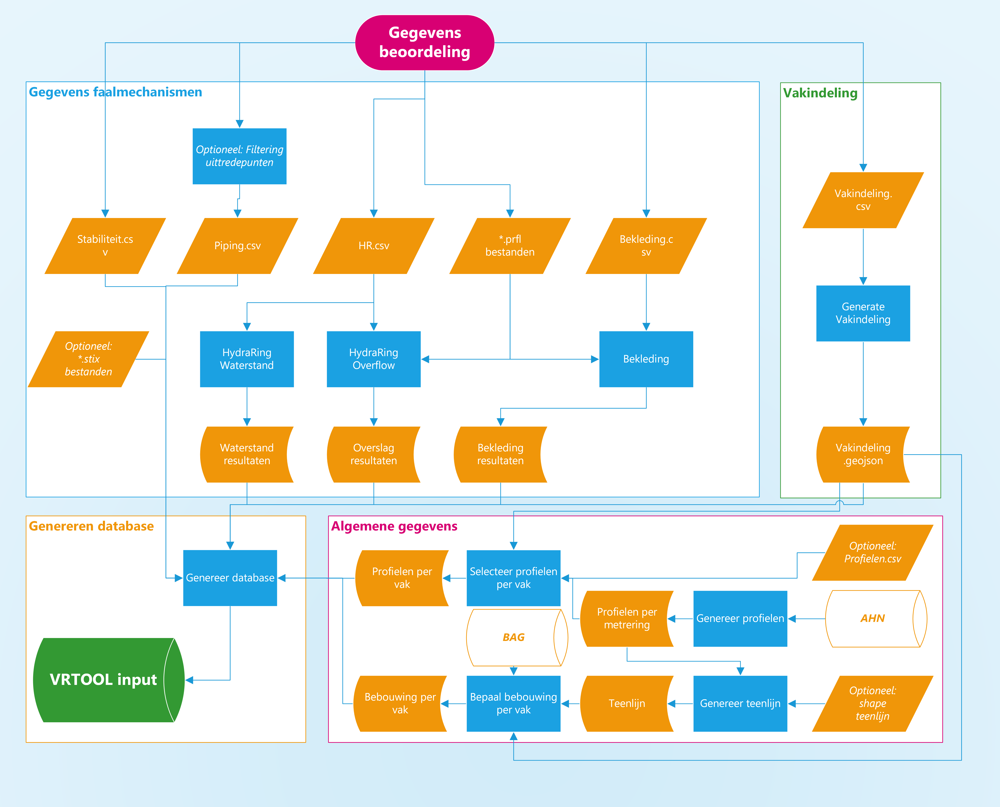
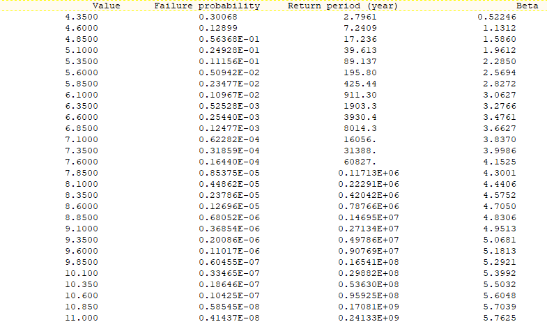

***************
Preprocessing
***************

Met de preprocessing worden gegevens over het dijktraject vertaald naar een invoerdatabase voor de VRTOOL, zodat een veiligheidsrendementberekening kan worden gemaakt. De preprocessing bestaat uit vier onderdelen, zie de figuur hieronder. Meer informatie over elk onderdeel wordt hieronder gegeven.

1. Gegevens faalmechanismen (in blauwe kader)
2. Vakindeling (in groene kader)
3. Algemene gegevens (in roze kader)
4. Genereren database (in gele kader)

Voor onderdelen 1 en 2 zijn gegevens van de beoordeling nodig. Onderdeel 3 wordt op basis van open data uitgevoerd. De oranje parallelogrammen geven de standaard invoerbestanden weer, de blauw rechthoeken zijn de verschillende workflows van de preprocessor weergegeven. Oranje 'cilinders' geven tussenuitvoer van de verschillende workflows weer.

   
Alle workflows (de blauwe rechthoeken in de figuur hierboven) worden op dezelfde manier uitgevoerd, dit is verder uitgelegd op de pagina `werken met de preprocessor <werken_met_preprocessor.html>`_.

.. toctree::
   :hidden:
   :maxdepth: 1

   werken_met_de_preprocessor
--------------------------

De basis voor berekeningen met de veiligheidsrendementmethode is een uniforme vakindeling voor alle faalmechanismen. De gewenste vakindeling kan worden gegenereerd door op basis van een invoerbestand (``vakindeling.csv``) de bijbehorende workflow te draaien.

.. raw:: html

   
Workflow vakindeling

.. toctree::
   :maxdepth: 1

   Vakindeling

2. Gegevens faalmechanismen
--------------------------------

Er zijn momenteel vier faalmechanismen die meegenomen worden in de veiligheidsrendementmethode: overslag, bekleding, piping en stabiliteit. Voor elk mechanisme moet één invoerbestand ingevuld worden, zie oranje parallellogrammen in de figuur hierboven. Naast deze faalmechanismen moeten ook frequentielijnen van de waterstand worden bepaald, deze berekening gebruikt hetzelfde invoerbestand als overslag. Voor het afleiden van de invoer voor waterstand, overslag en bekleding moet, naast het invullen van een invoerbestand, ook een workflow worden gedraaid (blauwe rechthoeken). Invoer van piping en stabiliteit kan direct worden vertaald naar de invoerdatabase voor de VRTOOL.

Meer informatie over het invullen van de invoerbestanden en het runnen van de workflows wordt per workflow toegelicht.:

.. raw:: html

   
Workflows faalmechanismen

.. toctree::
   :maxdepth: 1

   Waterstand
   Overtopping
   Bekleding
   Macro
   Piping

3. Algemene gegevens
--------------------------

Voordat de veiligheidsrendement methode toegepast kan worden is, naast de bovengenoemde gegevens, ook meer informatie nodig over de dijkprofiel, teenlijn en bebouwing. Deze informatie wordt met enkele workflows afgeleid uit open databronnen zoals het BAG en AHN4.

.. raw:: html

   
Workflows algemene gegevens

.. toctree::
   :maxdepth: 1

    Afleiden dijkprofielen <Dijkprofielen>
    Afleiden teenlijn <Teenlijn>
    Afleiden bebouwing per dijkvak <Bebouwing>

4. Genereren database
--------------------------

Het laatste onderdeel van de preprocessing is om alle informatie van de vorige onderdelen te verzamelen in een sql invoerbestand. Dit wordt aan de hand van een python script gedaan. Deze grootte invoerbestand wordt vervolgens gebruikt bij het toepassen van de veiligheidsrendement methode.

.. raw:: html

   
Workflow genereren database

.. toctree::
   :maxdepth: 1

   Genereren_database