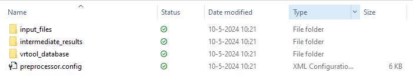

Werken met de preprocessor
================================

Opstarten van de preprocessor
-----------------------------
Alle workflows (de blauwe rechthoeken in de overzichtsfiguur) gebruiken dezelfde stappen. Om workflows uit te voeren moet eerst Anaconda Prompt worden opgestart en het environment worden geactiveerd.
Het activeren van een environment kan door het volgende command in Anaconda in te voeren. 

.. code-block:: bash

    conda activate C:/Veiligheidsrendement/.env/

.. note::
    **Let op:**
    Vervang ``"C:/Veiligheidsrendement"`` met de locatie van de map waar de verschillende bestanden zijn neergezet.
    
    Als je het environment een andere naam hebt gegeven, vervang ``".env"`` dan door de naam die je aan het environment gegeven hebt.

Aanmaken van een mappenstructuur
---------------------------------

De tweede stap is om een werkmap te maken voor de preprocessor. Dat gebeurt met een aparte workflow ``maak_project``. Hierin wordt automatisch een complete mappenstructuur aangemaakt waarmee de preprocessor uit de voeten kan. Dit is te doen via het volgende commando:

.. code-block:: bash

    python -m preprocessing maak_project --project_folder {projectfolder} --traject_id {traject_id}

Bij ``{projectfolder}`` moet de locatie van de map worden ingevuld waar de mappenstructuur moet worden aangemaakt, bijvoorbeeld ``"C:/Veiligheidsrendement/preprocessor_werkmap"``. Bij ``{traject_id}`` moet het traject worden ingevuld, bijvoorbeeld ``"24-3"``.

.. note::
    **Tip** 
    Voor de verschillende workflows kan met ``python -m preprocessing workflow_naam --help`` een overzicht van de invoerparameters worden opgevraagd. 

De mappenstructuur die wordt aangemaakt ziet er als volgt uit:

   Mappenstructuur t.b.v. de preprocessor

De structuur van de werkmap
___________________________

In de map ``input_files`` zijn 5 submappen aangemaakt:

* ``bag_gebouwen``: hierin kan een geopackage van de Basisadministratie Adressen en Gebouwen (BAG) worden geplaatst. Deze is te downloaden vanaf de website van `PDOK <https://service.pdok.nl/lv/bag/atom/downloads/bag-light.gpkg>`_. Let op: dit is een zeer groot bestand (ca. 7 GB), dus het kan even duren.
* ``default_files``: hierin worden automatisch de standaardinvoerbestanden neergezet. Deze kunnen worden aangepast op basis van de gegevens van het traject.
* ``HR_databases``: hier kunnen de hydraulische databases worden geplaatst voor 2023 (WBI) en 2100 (ontwerpdatabases). Deze zijn `hier <https://fbwvl.stackstorage.com/s/cQJwECwRv88jqsc/nl>`_ te downloaden. Elke map moet 1 database bevatten (combinatie van HRD, HLCD-bestand en .config bestand zoals aangeboden op de website).
* ``prfl``: hier kunnen de `*.prfl`-bestanden worden geplaatst ten behoeve van de workflows voor overloop/overslag en bekleding.
* ``steentoets``: indien van toepassing kunnen hier de Steentoetsbestanden uit de beoordeling worden geplaatst.

In de map ``intermediate_results`` worden de resultaten van de workflows opgeslagen. Hierin zijn 6 submappen aangemaakt. De inhoud hiervan wordt bij de betreffende workflows nader toegelicht.

In de map ``vrtool_database`` wordt de database weggeschreven die nodig is voor de VRTool. 

Het ``preprocessing.config``-bestand bevat de configuratie van de preprocessor. Hierin kunnen de locaties van de verschillende bestanden worden aangepast. In de basis is het advies dit niet te doen, tenzij dit uitdrukkelijk staat vermeld in de documentatie van de betreffende workflow. 

.. tip:: 
    * Wanneer paden worden aangepast in het ``preprocessing.config``-bestand, zijn er 2 mogelijkheden: 
        
        1. Invoeren van een *relatief* pad ten opzichte van de map waarin de preprocessor wordt uitgevoerd. Deze wordt dan automatisch gecombineerd met de ``project_dir``.

        2. Invoeren van een *absoluut* pad, bijvoorbeeld ``C:\Veiligheidsrendement\basisadministratiegebouwen\bag-light.gpkg``.

    * Wanneer aan meerdere dijktrajecten wordt gewerkt kan het handig zijn om voor het ``bag_gebouwen``-bestand een aparte locatie te gebruiken om onnodig gebruik van schijfruimte te voorkomen.

Uitvoeren van de workflows
----------------------------
Nadat de mappenstructuur is aangemaakt en de benodigde bestanden zijn geplaatst, kunnen de verschillende workflows worden uitgevoerd. Workflows zijn uit te voeren via de commandline, net als bij het aanmaken van de mappenstructuur. Daarbij geldt dat altijd alleen het configuratiebestand als invoerparameter moet worden opgegeven, bijvoorbeeld:

.. code-block:: bash

    python -m preprocessing vakindeling --config_file C:/Veiligheidsrendement/preprocessor_werkmap/100-1/preprocessing.config

Wanneer een workflow wordt uitgevoerd wordt logging weggeschreven naar de commandline én naar een logbestand. Dit logbestand wordt opgeslagen naast de resultaten van de workflow in de map ``intermediate_results``. Het is aan te raden om deze logbestanden te bekijken wanneer er iets misgaat, omdat hier vaak meer informatie in staat over de oorzaak van het probleem.

.. tip::
    Bij het openen van het logbestand is eerst algemene informatie te vinden en de parameters die zijn gebruikt als invoer. Daarna worden comments met INFO, WARNING en ERROR-niveau weggeschreven. Deze zijn te herkennen aan de voorvoegsels ``[INFO]``, ``[WARNING]`` en ``[ERROR]``. Het is aan te raden om deze berichten goed door te nemen, omdat ze vaak belangrijke informatie bevatten over de uitvoering van de workflow. Het kan bijvoorbeeld voorkomen dat er bij het afleiden van profielen enkele profielen niet goed kunnen worden weergegeven. Een voorbeeld is hieronder weergegeven:

    .. figure:: img/logging_warning_example.png
       :alt: Logbestand met warnings
       :align: center

       Voorbeeld van een logbestand met WARNING-niveau berichten
    Hier is bijvoorbeeld te zien dat bij profile_0009 geen profiel kon worden afgeleid. Zo kan makkelijk worden gecontroleerd of dit mogelijk gevolgen heeft voor de resultaten.

In totaal zijn er 8 workflows, meer informatie over de invoerparameters per workflow is te vinden via onderstaande links: 

- `Vakindeling <Vakindeling.html>`_
- `Overslag <Overtopping.html>`_
- `Waterstand <Waterstand.html>`_
- `Bekleding <Bekleding.html>`_
- `Dijkprofielen <Dijkprofielen.html>`_
- `Teenlijn <Teenlijn.html>`_
- `Bebouwing <Bebouwing.html>`_
- `Genereren database <Genereren_database.html>`_

