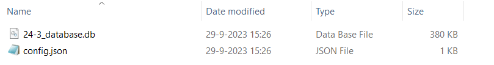
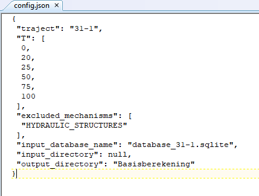

Uitvoeren van een berekening
=====================

De VRTool kan worden aangeroepen met de CLI vanuit Miniforge (of Anaconda) en het volgende commando:

.. code-block:: bash

   python -m vrtool {desired_run} {config_file} 

Vervang ``{desired_run}`` met de gewenste berekening. Hierbij kan worden gekozen voor één van de drie stappen van de veiligheidsrendementberekening, of alle drie tegelijk: 

- ``assessment``: hiermee wordt alleen de beoordeling/projectie van de huidige veiligheid uitgevoerd 
- ``measures``: hiermee worden de maatregelen per dijkvak doorgerekend 
- ``optimization``: hiermee wordt alleen de optimalisatie van maatregelen voor dijktrajecten uitgevoerd 
- ``run_full``: hiermee worden alle drie de stappen doorgerekend

Vervang ``{config_file}`` met het pad naar het gewenste config bestand (.json) uit de preprocessor, zie foto hieronder. Beide bestanden worden automatisch gegenereerd via de preprocessor, zie `Genereren database <../Preprocessing/Genereren_database.html>`__.

Configuratiebestand
========================
Het config bestand bevat de instellingen voor de berekening. Na het genereren met de preprocessor ziet het config bestand er als volgt uit:

De belangrijkste instellingen zijn:

- ``traject``: de naam van het traject
- ``T``: de jaren waarvoor berekeningen voor de faalkans worden uitgevoerd (t.o.v. het startjaar)
- ``excluded_mechanisms``: mechanismen die niet worden meegenomen in de berekening. Standaard moet hier `HYDRAULIC_STRUCTURES` staan (dit wordt niet ondersteund). Soms staat hier ook `REVETMENT` bij (voor trajecten zonder bekleding). Het is ook mogelijk die toe te voegen om met een beperkt aantal mechanismen te rekenen. Let wel: dit is niet in alle gevallen ondersteund en kan tot crashes leiden.
- ``input_database_name``: de naam van de te gebruiken invoerdatabase.
- ``input_directory``: de map waarin de invoerdatabase en config bestand staan. Standaard staat deze op `null`. Let op: bij het invullen van een padnaam moet deze gebruik maken van forward slashes (`/`) in plaats van backslashes (`\`). Daarnaast moet hij niet eindigen op een slash. Dus bijvoorbeeld `C:/Gebruiker/MijnTraject/MijnBerekening`.
- ``output_directory``: map waarin extra resultaten worden opgeslagen. Dit wordt bij een toekomstige release uitgefaseerd.

Er zijn meer instellingen mogelijk via het configbestand, zoals het aanpassen van de discontovoet, de stapgroottes van kruinverhogingen en bermverbredingen en diverse rekeninstellingen. Normaliter is het aanpassen hiervan echter niet nodig, neem contact op als dat wenselijk is.

Advies werkwijze
================
Voor het draaien van de VRTOOL is het raadzaam om eerst alleen de assessment te draaien. Deze is doorgaans snel klaar, en geeft een eerste indruk of de database correct is en doorgerekend kan worden. Het kan dan ook zinvol zijn om de resultaten in het dashboard te laden en te controleren of deze correct zijn. 

Na deze (optionele) check kan met ``run_full`` de volledige berekening worden uitgevoerd. Dit kan enige tijd duren, afhankelijk van de grootte van het traject en de complexiteit van de maatregelen.	Grofweg kan worden aangenomen dat een traject met 50 dijkvakken rond de 20 minuten duurt, met bekledingen zal dat wat langer zijn omdat er dan meer mechanismeberekeningen nodig zijn, en meer maatregelen. De beoordeling is doorgaans binnen enkele seconden klaar, het doorrekenen van de maatregelen duurt relatief vaak het langst. In het command window wordt met progress bars aangegeven hoe ver de verschillende stappen gevorderd zijn.

Wanneer de berekening is afgerond kunnen de resultaten worden ingeladen in het dashboard. Hierin kunnen de resultaten worden weergegeven en kunnen nieuwe berekeningen worden gestart met andere instellingen. Zie `de pagina's over het dashboard <../Postprocessing/WeergevenResultaten.html>`__ voor meer informatie.

Beoordelen van resultaten
=========================
.. tip:: 
   Met de VRTOOL wordt een complexe optimalisatieberekening uitgevoerd. Het is daarom van belang om de resultaten goed te controleren. Een aantal controlepunten geven we hieronder:

   * **Optimalisatiepad**: een veiligheidsrendementberekening bepaalt een optimale volgorde van maatregelen. Dat betekent dat de verwachting is dat de relatieve veiligheidstoename van de maatregelen in verhouding tot de kosten afneemt gedurende de berekening. Daarbij geldt wel dat de verwachting is dat de veiligheid blijft stijgen. Wanneer dit niet het geval is kan dit betekenen dat de berekening is vastgelopen in een lokaal optimum. Daarbij kan het zijn dat het algoritme geen geschikte maatregelen kan vinden terwijl deze er nog wel zijn, of dat deze niet aanwezig zijn in de database. Een lokaal optimum is in het dashboard te herkennen aan een zeer horizontale lijn, vaak op een betrouwbaarheid onder de norm. Een voorbeeld is gegeven in onderstaande figuur.
   [FIGUUR INVOEGEN]
   Een belangrijke controle is dan ook om te controleren of de maatregelen die beschikbaar zijn afdoende zijn. Een tweede check kan worden gedaan door te kijken naar de betrouwbaarheid van de verschillende dijkvakken na versterking (tabblad `Versterkingsmaatregelen > Betrouwbaarheid`). Wanneer de betrouwbaarheid van een dijkvak onder de norm ligt kan dit betekenen dat er geen geschikte maatregelen zijn om het vak veiliger te maken. In het tabblad `Maatregelen` kan dit eventueel gecheckt worden voor het betreffende vak.
   Wanneer bovenstaande aan de orde is zijn ook de resultaten voor eventuele andere vakken onbetrouwbaar. De berekening moet dan opnieuw worden uitgevoerd. Daarbij kan er voor worden gekozen om het betreffende vak uit te zetten, of om de maatregelen/invoer voor dat vak aan te passen. Wat het beste is hangt af van de specifieke situatie.
   * **Kosten & betrouwbaarheid maatregelen**: Een belangrijke check is ook om gevoel te krijgen voor de betrouwbaarheid (en kosten) van verschillende maatregelen. Advies is om voor enkele maatgevende/belangrijke vakken te checken of deze in lijn zijn met de verwachting. Met name voor stabiliteit binnenwaarts kan dit belangrijk zijn. Vaak zal worden gerekend met de standaard vuistregel (zie `de achtergrondpagina <../..Achtergronden/Faalkansmodellen/Binnenwaartse_macrostabiliteit.html>)`_. Wanneer de inschatting is dat deze niet klopt kan het zinvol zijn om de berekening te herhalen met D-Stability. Hetzelfde geldt voor vakken die extreem duur uitvallen, ook dan kan het zinvol zijn om voor die vakken met D-Stability te rekenen.

