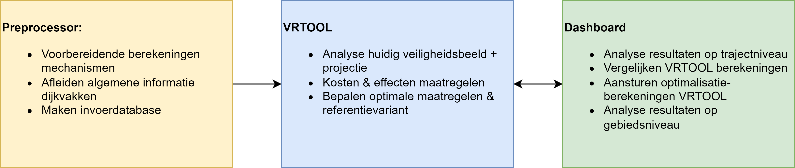

Gebruikershandleiding
=======================================

In deze sectie is informatie te vinden over het werken met de tooling voor veiligheidsrendement. Op de pagina `Preprocessing <Preprocessing/index.html>`_ is meer informatie te vinden over het werken met de preprocessor. Met de preprocessor worden gegevens voorbereid om te kunnen rekenen met de veiligheidsrendementmethode. 

Na het voorbereiden van de gegevens kunnen berekeningen worden uitgevoerd met de VRTOOL, het rekenhart van de methode. Dat staat verder beschreven op de pagina `Rekenen met de VRTOOL <VRTool/index.html>`_. 

Wanneer een berekening is uitgevoerd kunnen de resultaten worden weergegeven in het dashboard. Met het dashboard kunnen verschillende analyses worden uitgevoerd en nieuwe berekeningen worden gestart met andere instellingen. Dat is beschreven op de pagina `Vakindeling <Postprocessing/index.html>`_.

.. toctree::
   :hidden:

   Preprocessing/index
   VRTool/index
   Postprocessing/index

