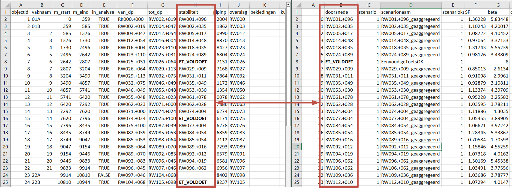
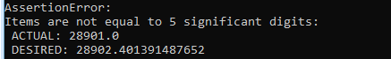

# Vakindeling

De basis van een veiligheidsrendementberekening is één vakindeling die voor alle faalmechanismen gebruikt wordt. Als eerste wordt een invoerbestand gevuld, waarna de workflow voor het maken van de vakindeling kan worden gedraaid.

## Vullen van het invoerbestand van de vakindeling

De basis voor het genereren van de vakindeling is het invoerbestand `Vakindeling.csv`. Dit bestand is terug te vinden in: ```.\VRSuiteUtils-main\preprocessing\default_files``` in de folder met de uitgepakte installatie voor de [preprocessing](..\Installaties\VRUtils.md). Doel van deze workflow is een `geojson` bestand te creeren waarin alle vakken geografisch zijn gerepresenteerd. Dit bestand is ook invoer voor andere workflows.

Het invoerbestand `Vakindeling.csv` heeft de volgende kolommen die ingevuld moeten worden:


| Kolom       	     |           	| Beschrijving                                                                                                                                                                                 	                                                                                                                                                                                |
|-------------------|-----------	|-------------------------------------------------------------------------------------------------------------------------------------------------------------------------------------------------------------------------------------------------------------------------------------------------------------------------------------------------------------------------------|
| objectid    	     | Verplicht 	| Unieke identifier (moeten verschillende getallen zijn)                                                                                                                                       	                                                                                                                                                                                |
| vaknaam     	     | Verplicht 	| Nummer/naam van het dijkvak (moet uniek zijn, kan identiek zijn aan OBJECTID)                                                                                                                     	                                                                                                                                                                           |
| m_start     	     | Verplicht 	| startpunt op lijn van traject                                                                                                                                                         	                                                                                                                                                                                       |
| m_eind      	     | Verplicht 	| eindpunt op lijn van traject                                                                                                                                                          	                                                                                                                                                                                       |
| in_analyse  	     | Verplicht 	| Vak meenemen in analyse of niet (TRUE/FALSE)                                                                                                                                                 	                                                                                                                                                                                |
| van_dp      	     | Optioneel 	| Begrenzing dijkpaalnummers                                                                                                                                                                   	                                                                                                                                                                                |
| tot_dp      	     | Optioneel 	| Begrenzing dijkpaalnummers                                                                                                                                                                   	                                                                                                                                                                                |
| stabiliteit    	  | Optioneel 	| Moet overeen komen  met een waarde in de kolom `doorsnede` bij [Stabiliteit_default.csv](Macro.md). Hiermee wordt aangegeven welke doorsnede bij welk vak hoort. Let op: bij het maken van de vakindeling is deze invoer optioneel, maar bij het maken van een [database](Genereren_database.md) moeten alle doorsneden (indien een relevant mechanisme) in het `geojson` bestand zijn ingevuld.     	                     |
| piping          	 | Optioneel 	| Moet overeen komen met een waarde in de kolom `doorsnede` bij [Piping_default.csv](Piping.md). Hiermee wordt aangegeven welke doorsnede bij welk vak hoort. Let op: bij het maken van de vakindeling is deze invoer optioneel, maar bij het maken van een [database](Genereren_database.md) moeten alle doorsneden (indien een relevant mechanisme) in het `geojson` bestand zijn ingevuld.                              |
| overslag      	   | Optioneel 	| Moet overeen komen met een waarde in de kolom `doorsnede` bij [HR_default.csv](Overtopping.md). Hiermee wordt aangegeven welke doorsnede bij welk vak hoort. Let op: bij het maken van de vakindeling is deze invoer optioneel, maar bij het maken van een [database](Genereren_database.md) moeten alle doorsneden in het `geojson` bestand zijn ingevuld.    	 |
| bekledingen    	  | Optioneel 	| Moet overeen komen  met een waarde in de kolom `doorsnede` bij [Bekleding_default.csv](Bekleding.md). Hiermee wordt aangegeven welke doorsnede bij welk vak hoort. Let op: bij het maken van de vakindeling is deze invoer optioneel, maar bij het maken van een [database](Genereren_database.md) moeten alle doorsneden (indien een relevant mechanisme) in het `geojson` bestand zijn ingevuld.   

| kunstwerken 	     | Optioneel 	| *Optie om Kunstwerken te berekenen nog niet beschrikbaar*                                                                                                                                                                                                                                                                                                                     |
| opmerkingen 	     | Optioneel 	| extra opmerkingen, moet altijd de laatste kolom zijn.                                                                                                                                                         |

In onderstaande figuur is met een voorbeeld voor stabiliteit geillustreerd hoe de koppeling tussen doorsnedes en de vakindeling moet worden ingevoerd. Merk op dat het mogelijk is voor meerdere vakken dezelfde doorsnede te hanteren (een voorbeeld in de figuur is de dikgedrukte doorsnede `ET_VOLDOET`). Deze hoeft dan slechts 1x genoemd te worden in het STBI invoerbestand, maar kan bij meerdere vakken worden gebruikt.


Belangrijk bij het genereren van de vakindeling zijn met name de `m_start` en `m_eind` parameters. Wanneer de lengte van het traject (dus de maximale `m_eind`) teveel afwijkt (grofweg >1 meter) van de lengte van de shape uit het Nationaal Basisbestand Primaire Waterkeringen wordt een foutmelding gegeven.

**Let op:** 
- De separator in de csv files moet een komma zijn, en het teken voor decimalen een punt.
- De m_eind en m_start van alle vakken moeten op elkaar aansluiten

### Draaien van de workflow voor het genereren van een vakindeling
De gebruiker kan de workflow als volgt aanroepen vanuit de Anaconda Prompt (activeer eerst environment):

```
python -m preprocessing vakindeling {input arguments}
```


Vervang daarbij "{input arguments}" met de bijbehorend inputs van een vakindeling: ```--input_naam1 "input_1" --input_naam2 "input_2" etc.```


De input parameters van de workflow vakindeling zijn: 

| Input naam       	      | 	           | Beschrijving                                                                                                                                                                                 	                                                                                                                                                                                                                                                                                                                                               |
|-------------------------|-------------|----------------------------------------------------------------------------------------------------------------------------------------------------------------------------------------------------------------------------------------------------------------------------------------------------------------------------------------------------------------------------------------------------------------------------------------------------------------------------------------------------------------------------------------------|
| --traject_id    	       | Verplicht 	 | Hier geef je aan om welk traject het gaat. Dit is een string, bijvoorbeeld ‘38-1’.                                                                           	                                                                                                                                                                                                                                                                                                                                                                               |
| --vakindeling_csv     	 | Verplicht 	 | Link naar de CSV met de vakindeling.                                                                                                               	                                                                                                                                                                                                                                                                                                                                                                                         |
| --output_folder     	   | Verplicht 	 | Link naar de map waar de trajectshapefile (inclusief een afbeelding in PNG) terecht moet komen.                                                                                                                                                       	                                                                                                                                                                                                                                                                                      |
| --traject_shape    | Optioneel 	 | Link naar de trajectshapefile. Let op: voer deze alleen in als de gebruikte shapefile afwijkt van de shapefile in het Nationaal Bestand Primaire Waterkeringen (NBPW). Als je deze optie niet gebruikt, wordt de shapefile uit het NBPW gebruikt. Deze invoer is optioneel, en dient enkel gebruikt te worden wanneer de gebruikte trajectshape afwijkt van de trajectshape in NBPW.                                                                                                                                                       	 |
| --flip  	           | Optioneel 	 | Soms staat de shapefile in het NBPW in de tegenovergestelde richting van je vakindeling. Met andere woorden: de vakindeling begint aan de 'verkeerde' kant van de shapefile. Als dit het geval is, kan de shapefile worden omgedraaid door deze optie op True te zetten.                                                                                                                                              	                                                                                                                      |


**Let op:** deze regel is vanuit elke directory te runnen, je hoeft dus niet eerst naar een bepaalde folder te gaan.

Om meer informatie over de code te krijgen, gebruik je: 
``` python -m preprocessing vakindeling --help ```

### Voorbeeld van code om de vakindeling te runnen 

```
python -m preprocessing vakindeling --traject_id “38-1” --vakindeling_csv “c:\VRM\test_vakindeling_workflow\Vakindeling 38-1.csv” --output_folder “c:\VRM\test_vakindeling_workflow\result\”
```

### Mogelijke foutmeldingen

#### Foute trajectlengte
Een foutmelding die vaak voorkomt is wanneer de totale lengte van het traject niet overeenkomt met het NWBP. Daarvoor wordt gekeken naar de hoogste M-waarde, en de lengte van de shape uit het Nationaal Basisbestand Primaire Waterkeringen. Deze moeten ongeveer (op de meter nauwkeurig) overeenkomen.

*Let op*: de totale trajectlengte moet afgerond op 5 cijfers (dus bij een lengte van >10000 meter afgerond op 1 meter) niet korter zijn dan de verwachte trajectlengte, maar mag zeker niet langer zijn. Dus rond altijd de verwachte lengte af naar beneden. Onderstaand is een voorbeeld van een foutmelding weergegeven wanneer de lengte in vakindeling.csv te kort is. Wanneer er een klein verschil is in trajectlengte is het advies om de waarde op basis van de foutmelding in het csv-bestand aan te passen: een meter meer of minder heeft geen invloed op de resultaten. Bij grote verschillen is wel raadzaam om de ligging van de vakken op basis van het NBPW en de shape die als bron voor de M-waarden is gebruikt te vergelijken.




