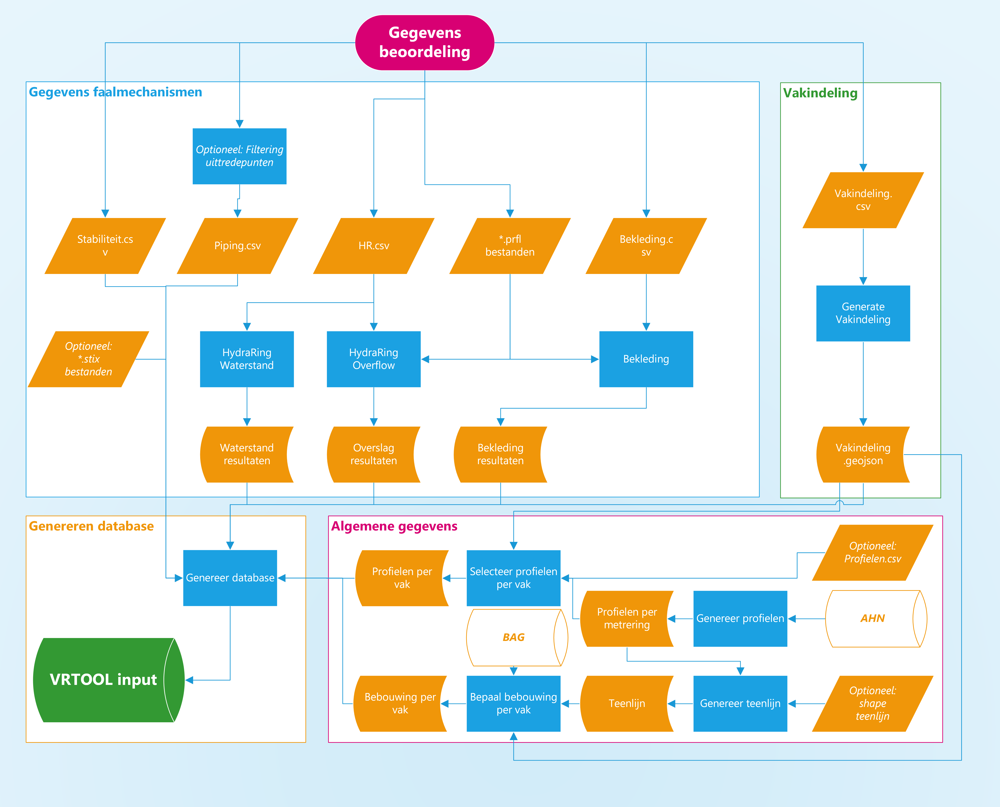

***************
Preprocessing
***************

Met de preprocessing worden de gegevens voor het maken van een veiligheidsrendementberekening voorbereid. De preprocessing bestaat uit vier onderdelen, zie de  figuur hieronder. Meer informatie over elk onderdeel wordt hieronder gegeven.

1. Gegevens faalmechanismen (in blauwe kader)
2. Vakindeling (in groene kader)
3. Algeme gegevens (in roze kader)
4. Genereren database (in gele kader)

Voor onderdelen 1 en 2 zijn gegevens van de beoordeling nodig.

1. Gegevens faalmechanismen
--------------------------------

Er zijn momenteel vier faalmechanismen die meegenomen worden in de veiligheidsrendement methode: overslag, bekleding, piping en stabiliteit. Voor elk mechanisme moet één invoerbestand ingevuld worden, zie oranje parallellogrammen in de figuur hierboven. Naast deze faalmechanismen is ook één berekening nodig om de waterstanden te bepalen, deze berekening gebruikt dezelfde invoerbestand als overslag. Bij de berekeningen voor waterstand, overtopping en bekleding moet, naast het invullen van een invoerbestand, ook een python script gerund worden, zie blauwe rechthoek hierboven.

Meer informatie over het invullen van de invoerbestanden en het runnen van de python scripts wordt per berekening uitgelegd, zie hieronder:

.. toctree::
   :maxdepth: 1

   Waterstand
   Overtopping
   Bekleding
   Macro
   Piping

2. Vakindeling
--------------------------

De veiligheidsrendement methode heeft een vakindeling nodig. Deze wordt gebruikt bij alle faalmechanismen. De gewenst vakindeling kan aangegeven worden door een invoerbestand in te vullen (oranje parallellogram in figuur hierboven) en vervolgens een python script te runnen (blauw rechthoek hierboven).

.. toctree::
   :maxdepth: 1

   Vakindeling

3. Algeme gegevens
--------------------------

Voordat de veiligheidsrendement methode toegepast kan worden zijn, naast de bovengenomende gegevens, ook meer informatie nodig over de dijkprofiel, teenlijn en bebouwing. Dit is belangrijk om de dijkprofiel aan te passen bij verschillende maatregelen, en om een juiste inschatting te maken van de kosten. Deze informatie wordt aan de hand van python script automatisch opgehaald. Zie hieronder voor meer informatie over hoe je de script kan laten draaien.

.. toctree::
   :maxdepth: 1

   Dijkprofielen
   Teenlijn
   Bebouwing

4. Genereren database
--------------------------

Het laatste onderdeel van de preprocessing is om alle informatie van de vorige onderdelen te verzamelen in een sql invoerbestand. Dit wordt aan de hand van een python script gedaan. Deze grootte invoerbestand wordt vervolgens gebruikt bij het toepassen van de veiligheidsrendement methode.