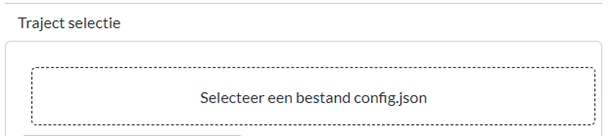

# Tutorial VRTool & Dashboard

Deze tutorial bevat een introductie om kennis te maken met het rekenen met de VRTool en resultaten weer te geven in het dashboard.
Voor deze tutorial wordt gebruikt gemaakt van een casus (dijktraject 24-3). Dit betreft een casus uit fase 1, waarbij een selectie van vakken wordt doorgerekend. 

 *NB: de preprocessing, het genereren van de juiste bestanden van een traject, gaat vooraf aan het rekenen met de VRTool. In deze tutorial zijn de hierboven gedownloade bestanden een eindresultaat van de preprocessing.*

## Rekenen met VRTool

1. Download de bestanden via deze [link](https://github.com/Deltares-research/VrtoolDocumentation/raw/VRTOOL-341/Tutorial-VRToolDashboard/vrtool_docs/Bestanden/Tutorial/24-3.zip) en pak ze uit in de folder ``"C:\Veiligheidsrendement\Tutorial"`` (gebruik hiervoor dezelfde folder die tijdens de [Installaties](../Installaties/index.rst) is gemaakt).

In de map staan nu de volgende bestanden:
- ``config.json``: Dit bestand bevat instellingen voor de berekening met de VRTOOL
- ``24-3_database.db``: De invoer en uitvoer van de betreffende berekening
- ``24-3.geojson``: Hiermee kunnen de resultaten op kaart weergegeven worden

2. Open [Anaconda Prompt](https://www.anaconda.com/download) en roep de VRTool aan met de volgende commando: 
``python -m vrtool {desired_run} {MODEL_DIRECTORY}``. 

Vervang ``{desired_run}`` met de gewenste berekening. Hierbij kan worden gekozen voor één van de drie stappen van de veiligheidsrendementberekening of alle drie tegelijk:

- ``assessment``: Hiermee wordt alleen de beoordeling/projectie van de huidige veiligheid uitgevoerd.
- ``measures``: Hiermee worden de maatregelen per dijkvak doorgerekend.
- ``optimization``: Hiermee wordt alleen de optimalisatie van maatregelen voor dijktrajecten uitgevoerd.
- ``run_full``: Hiermee worden alle drie de stappen in een keer doorgerekend.

vervang ``{MODEL_DIRECTORY}`` met de folder met daarin de database (.db) en het config bestand (.json). (waarschijnlijk  ``"C:\Veiligheidsrendement\Tutorial"``). 

Bijvoorbeeld:
```
python -m vrtool run_full C:\Veiligheidsrendement\Tutorial
```

*NB: De berekening kan enkele minuten duren afhankelijk van welke desired_run er gekozen is. Het spreekt voor zich dat de run_full het langst duurt.*

## Gebruik van het dashboard

Nu de VRTool de verschillende berekeningen heeft uitgevoerd kunnen we de rekenresultaten laten zien met het Dashboard.

3.  Run in Anaconda Prompt ``python -m src.index`` om het dashboard te starten. Het dashboard verschijnt nu automatisch in de browser. Mocht dit niet gebeuren, kopieer dan de url (http://127.0.0.1:8050/) en open deze in je browser. (Mocht dit niet werken omdat je nog niet alle packages hebt geinstalleerd, volg dan eerst de [installatieinstructis](../Installaties/index.rst).)

4. Afhankelijk van de folder waarin de bestanden zijn uitgepakt moet de padnaam in het ``config.json`` aanpassen. Open het ``config.json`` bestand in ``Notepad`` of ``Textpad``. Je ziet nu een tekstbestand met bij ``input_directory`` de padnaam (''C:/..../...''). Deze padnaam moet gelijk zijn aan de map waar ``config.json`` staat. Kopieer de padnaam waar de database staat (waarschijnlijk ''C:\Veiligheidsrendement\Tutorial'') en pas dit bij input_directory aan. Let op dat je ``/`` gebruikt in plaats van ``\``. Er moet geen ``/`` op het eind van de padnaam staan.


5. Ga nu naar de browser waar het Dashboard geopend is. Sleep het ``config.json`` bestand naar het vak ''Traject selectie''. De resultaten worden nu geladen. 



Uiteindelijk ziet het dashboard er als volgt uit:


**Oefenvraag dashboard**

>Welk dijkvak heeft in 2050 voor de beoordeling een β van 3.5 voor stabiliteit?
    <details>
    <summary>klik hier om het antwoord te zien</summary>
     <p style="background-color: blackgrey; color: black;">dijkvak 24.</p>
    </details>

In de [gebruikershandleiding](../Gebruikershandleiding/Postprocessing/index.html) wordt meer uitleg gegeven over de verschillende tabbladen in het dashboard en hoe er verder mee gewerkt kan worden. Daar valt ook meer te vinden over het [rekenen met de VRTOOL](../Gebruikershandleiding/VRTool/index.html).