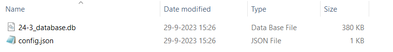

# Rekenen met de VRTOOL

De VRTool kan op twee manieren worden gedraaid:
* Op basis van de [preprocessor](../Installaties/VRUtils.md). Deze bevat altijd de laatste VRTOOl release, zie hiervoor [hoe je met de preprocessing kan werken](../Preprocessing/werken_met_preprocessor.md).
* Op basis van de [VRTool](../Installaties/VRTool.md) zelf, dan moet deze als aparte package worden geinstalleerd. 
    
In beide gevallen kan de VRTool daarna worden aangeroepen met de CLI van Anaconda en de volgende commando: 
```
python -m vrtool {desired_run} {MODEL_DIRECTORY}
```

Vervang ```{desired_run}``` met de gewenste berekening. Deze zijn te kiezen uit één van de drie stappen van de [veiligheidsrendementberekning](Opzet%20van%20een%20berekening.md) of alle drie tegelijk: 
- ```assessment```: hiermee wordt alleen de beoordeling/projectie van de huidige veiligheid uitgevoerd
- ```measures```: hiermee wordt alleen de maatregelen per dijkvak doorgerekend
- ```optimization```: hiermee wordt alleen de optimalisatie van maatregelen voor dijktrajecten uitgerekend
- ```run_full```: hiermee worden alle drie stappen doorgerekend

Vervang ```{MODEL_DIRECTORY}``` met de path naar de database (.db) en config bestand (.jsn) uit de preprocessor, zie foto hieronder. Beide bestanden worden automatisch gegenereerd via de preprocessor, zie [Genereren database](../Preprocessing/Genereren_database.md). 



# Belangrijke instellingen 
* Dit aanvullen na afronding van issue VRTOOL-261.*

# Advies werkwijze

* Draai eerst assessment workflow en controleer de invoer voor de beoordeling + projectie.
* Draai daarna de run_full workflow: dan wordt het hele traject doorgerekend met maatregelen in 2025 (en 2045 (nog bekijken voor v0.1)).
* Laad de database met resultaten in het [dashboard](../Postprocessing/WeergevenResultaten.md) en werk hierin verder. Het Dashboard kan apart [nieuwe optimalisaties aanroepen](../Postprocessing/BerekeningenMetDashboard.md).

# Beoordelen van resultaten
Vullen we later aan:
    * Hoe herken je een lokaal optimum? (a.d.h.v. investeringspad wat 'blijft hangen')
    * Is de betrouwbaarheid van maatregelen realistisch?
    


