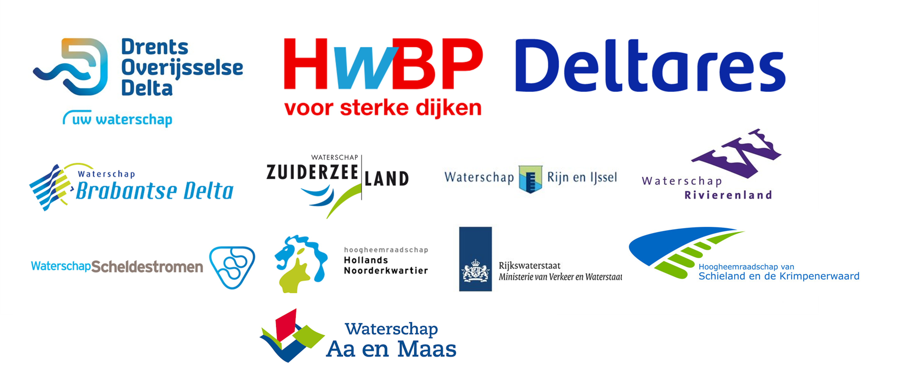

=============================================
Versterkingsaanpak vanuit Veiligheidsrendement
=============================================

Wat doen we in het project?
----------------------------
Versterkingsaanpak vanuit Veiligheidsrendement is een project in het kader van de HWBP kennis & innovatieagenda. Binnen het project werken waterschappen en Deltares aan de toepassing van de veiligheidsrendementmethode voor het vertalen van beoordelingsresultaten naar een versterkingsopgave. Daarmee het een bouwsteen voor het programmeren van dijkversterkingsprojecten, en geeft het in een vroeg stadium inzicht in de te verwachten opgave.

Waarom veiligheidsrendement?
----------------------------
Uit de ervaringen binnen het project blijkt de veiligheidsrendementmethode een aantal voordelen biedt:

* In het algemeen blijken versterkingsvarianten qua kosten aanzienlijk gunstiger uit te vallen dan versterking op basis van doorsnede-eisen (conform OI2014).
* Door direct na een beoordeling deze analyses uit te voeren wordt snel inzicht verkregen in de te verwachten opgave, wat waardevol is voor het aanscherpen van het veiligheidsbeeld en onderbouwen van de trajectaanpak.
* Door over meerdere trajecten de methodiek toe te passen kan een beheerder veiligheidsrendement gebruiken om het onderdeel veiligheid van zijn dijkversterkingsprogramma nader te onderbouwen. Dat zorgt voor consistentie, helderheid en transparantie.

Hoe ga je aan de slag?
----------------------------
Deze website geeft de handleiding voor het gebruik van de tooling die is ontwikkeld voor de analyses. Voor meer context over mogelijke toepassingen wordt verwezen naar de `Handreiking Veiligheidsrendement <https://deltares-research.github.io/VrtoolDocumentation/Docs/Handreiking.pdf>`_.

De tooling voor veiligheidsrendement is ontwikkeld in Python en bestaat uit 3 onderdelen:

* Het vertalen van de beoordeling naar invoer (preprocessing) gebeurt met VRUtils.
* Het uitvoeren van berekeningen wordt gedaan met het rekenhart VRTOOL
* Het analyseren van resultaten wordt gedaan middels een dashboard.

Geadviseerd wordt om de `installatieinstructies <Installaties/index.html>`_ zorgvuldig te doorlopen en daarna de `tutorial <Tutorials/index.html>`_ te volgen. Dit geeft aan de hand van een voorbeeldcase snel inzicht in de werkwijze en welke resultaten te verwachten zijn. Om daarna met een eigen casus aan de slag te gaan kunnen de instructies en tutorial voor de preprocessing worden gebruikt.

Voor vragen kan contact worden opgenomen met Deltares:

* Wouter Jan Klerk (wouterjan.klerk@deltares.nl)
* Stephan Rikkert (stephan.rikkert@deltares.nl)
* Eduard Jas (eduard.jas@deltares.nl)

.. toctree::
   :hidden:
   
   Installaties/index
   Tutorials/index
   Gebruikershandleiding/index
   Achtergronden/index
